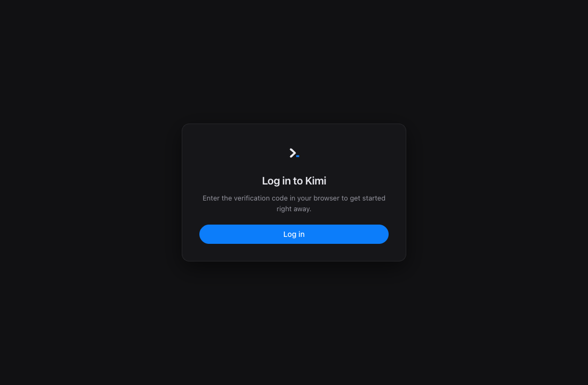
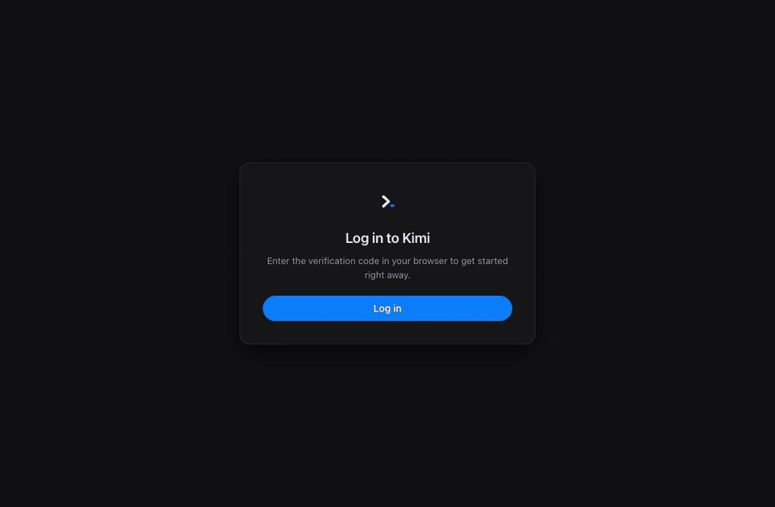

# Kimi-GUI [](./package.json) [](https://github.com/kaminion/Kimi-GUI/graphs/commit-activity) [](#requirements)

[Kimi Code](https://www.kimi.com/code/) | [Usage guide](./docs/kimi-code-made-easier.md) | [GitHub](https://github.com/kaminion/Kimi-GUI) | [한국어](./README.ko.md)

> [!IMPORTANT]
> **Kimi-GUI is an independent community project, not an official Moonshot AI product.** It uses Kimi Code APIs and the same local credentials as the official Kimi Code CLI.

Kimi-GUI is a desktop interface for [Kimi Code](https://www.kimi.com/code/).
Open a project, describe the outcome you want, adjust the work while it runs,
and review every changed file from one focused workspace—without requiring a
terminal.

## Getting Started

### Requirements

- Node.js 20 or later
- macOS or Windows
- A Kimi membership
- Internet access for sign-in and model responses

### Sign in and start

Launch Kimi-GUI, select **Log in**, and complete Kimi's verification in your browser. That's it—the default built-in engine works without installing or configuring the Kimi Code CLI.



Your credentials are stored under `~/.kimi-code/credentials` and can be shared with Kimi Code CLI, so one Kimi sign-in works across both experiences.

When the built-in engine starts, one optional dialog offers CLI agent mode. It explains Swarm and sub-agents, Plan mode, the full CLI toolset, and CLI session continuity before showing **Connect CLI** or **Install CLI**. A **Do not show again** option remains available.

## Use Kimi-GUI

### Understand a project

Choose the project directory and branch above the empty prompt, then ask a
question grounded in the repository:

```text
Explain how authentication flows through this project. Point me to the key files.
```

### Make a focused change

Describe the result and the constraints that matter. Kimi can inspect the
project, edit files, run local tools with approval, and report the outcome in
the same conversation.

```text
Fix the Windows startup failure and add a regression test.
Keep the public API unchanged.
```

### Adjust work in progress

Keep typing while Kimi is working. Enter sends a steering message without
ending the active run. The message remains visible for a short grace period, so
you can edit or delete it before delivery.

```text
Also cover computers where no Kimi server is already running.
```

### Review what changed

The changed-files pill in the prompt options reports file, added-line, and
deleted-line totals. Select it to open the popover, which leads with the same
totals above the per-file rows, then choose a file to open the **Changes**
tab. Switch to **Activity** in the same right-side panel when you want the
execution history.

### Manage Skills and CLI commands

Select **Skills** in the main sidebar to open the focused library. Choose
**All projects** or **Current project**, then add a folder containing
`SKILL.md`, add a single Markdown Skill, temporarily disable one without
losing its files, or move it to the operating system Trash.

Search the installed library by name, description, path, scope, or enabled
state. **Refresh installed folders** rescans the discovery locations, so edits
made outside Kimi-GUI appear without reopening the app.

If you would rather describe the workflow than author `SKILL.md` yourself,
select **Ask Kimi to add one**. Kimi-GUI opens a new conversation with an
editable, scope-aware Skill request template.

In CLI agent mode, type `/` in the prompt to search Kimi CLI commands and
enabled Skills. Use the arrow keys to move, `Tab` or `Enter` to complete, and
`Esc` to close. Completion fills the prompt without executing the command.

For a screenshot-led walkthrough of both engines and these workflows, see
the [usage guide](./docs/kimi-code-made-easier.md).

### Run from source

```sh
git clone https://github.com/kaminion/Kimi-GUI.git
cd Kimi-GUI
npm install
npm start
```

To build a local installer:

```sh
npm run dist
```

macOS builds produce DMG and ZIP artifacts. Windows builds produce an NSIS installer and a portable executable under `dist/`.

## Key Features

### A desktop workflow for Kimi Code

Start a conversation, watch thinking and answer tokens stream in, inspect agent state, and review token usage without leaving the app.

The demo starts with one-time Kimi sign-in, confirms the shared account and both engine choices, then follows a real built-in response into Agent activity and Usage.



### Kimi Code, `kimi web`, and Kimi-GUI

[Kimi Code](https://www.kimi.com/code/) is the underlying coding service. `kimi web` is an official Kimi Code CLI command that exposes the CLI runtime as a local REST and WebSocket service. Kimi-GUI is an independent Electron desktop client that offers two ways to use them: connect directly to the Kimi Code API, or manage `kimi web` for the full CLI agent workflow.

Switch engines from Settings. The app restarts into the selected mode and keeps both kinds of sessions visible.

| | Built-in engine (default) | CLI agent mode |
| --- | --- | --- |
| Runtime | Runs directly inside Kimi-GUI | Official Kimi Code CLI, launched and managed by the app |
| Dependency | No CLI installation required | Kimi Code CLI installed locally |
| Transport | Direct Kimi Code API connection | Local REST + WebSocket through `kimi web` |
| Sign-in | One Kimi login, shared with the CLI | The same shared Kimi credentials |
| Tools | Bash, Read, Write, Edit, Grep, and Glob | Full CLI agent toolset |
| Agent features | Single-agent turns with approvals | Plan mode, sub-agents, and swarm |
| Thinking | Off, low, high, or max | Per-session CLI configuration |

### Unified conversations

Built-in and CLI sessions share one sidebar. Continue compatible sessions, rename or remove conversations, create groups with drag and drop, and search the full transcript with `⌘F` or `Ctrl+F`. Long histories open at the newest page and older messages scroll in as you reach the top. Rename a group from the pencil in its header, and start a chat in a group with `+` — the group stays marked until the first send files the conversation there.

### Controls next to the prompt

Before the first message of a new conversation, choose the project directory
(defaulting to the most recently used one) and an existing local Git branch.
After the conversation starts, the options row shows the current working
branch.

Choose a model and thinking effort per conversation from compact composer
controls. CLI agent mode exposes an explicit `Swarm ON/OFF` control. While a
response is running, the prompt stays editable: Enter steers the current work,
and a separate stop button remains available. A queued adjustment can be
edited or deleted before the engine consumes it. A live context meter shows
how much of the active model window is in use.

CLI agent mode also provides command completion directly above the prompt.
The catalog follows Kimi Code's web-compatible slash commands and adds active
built-in, user, and project Skills as they are discovered.

### Agent Skills

The main-sidebar Skills manager follows the discovery locations supported by
Kimi Code CLI. It installs **All projects** Skills under
`~/.kimi-code/skills` and **Current project** Skills under
`<project>/.agents/skills`, while also scanning the shared `.agents` roots.
Search works across metadata and paths, and **Refresh installed folders**
rescans those locations on demand. Enable/disable operations preserve each
Skill in an adjacent disabled directory, and removal uses the system Trash.
**Ask Kimi to add one** starts a new conversation with the correct destination
and authoring requirements already filled in.

### Agent activity and usage

File edits are shown as GPT/Codex-style change cards in the conversation, with
per-file diffs and added/deleted line counts. A compact pill in the prompt
options reports the number of uncommitted changed files and cumulative `+`/`-`
totals. Selecting it opens a file popover; choosing a file opens the single
right-side panel on its **Changes** tab. Switch to **Activity** in the same
panel to see current status, tasks, tool activity, and touched files.

The Usage view combines daily input/output totals, a seven-day chart, rolling
quota windows, and current-session token counts.

### Desktop details

- English and Korean UI
- Dark and light themes
- Markdown, syntax highlighting, and collapsible thinking blocks
- Native directory picker and approval dialogs
- Automatic update checks through GitHub Releases

## Architecture

The Electron main process exposes a narrow IPC bridge to a sandboxed renderer. `main/backend.js` is the engine facade: it routes sessions and prompts either to the built-in direct API client or to the official CLI through a local `kimi web` service, while keeping the renderer engine-agnostic.

```text
main/       Electron lifecycle, engines, auth, sessions, IPC, updates
renderer/   Plain JavaScript UI, chat, sidebar, search, settings, usage
vendor/     Bundled Markdown and syntax-highlighting libraries
docs/       Architecture, protocol, OAuth, API, and design notes
```

Technical references:

- [Architecture contract](./ARCHITECTURE.md)
- [Direct API notes](./docs/direct-api.md)
- [`kimi web` protocol notes](./docs/protocol.md)
- [OAuth device-flow notes](./docs/oauth.md)
- [Update behavior](./docs/update.md)

## Development

The project uses CommonJS in the Electron main process and plain browser scripts in the renderer—there is no application bundler.

```sh
npm install
npm start

# Run state/protocol regression tests
npm test

# Syntax-check every shipped JavaScript file, then run the tests
npm run check

# Build platform installers
npm run dist
```

The regression suite uses Node's built-in test runner and has no extra test
framework dependency. Keep timing, cancellation, and cross-engine state
transitions covered there before changing turn orchestration.

## Known Limitations

- Built-in mode runs one agent turn at a time; use CLI agent mode for plan mode, sub-agents, and swarm.
- Windows packaging is configured but has not been verified on physical Windows hardware.
- Development builds are unsigned, so macOS Gatekeeper may warn on first launch.
