# 39 ventanas · descripción + fotos

GitHub **no ejecuta HTML**: por eso ves código. Las fotos **sí están** en el repo.

**Sube más fotos aquí (botón Add file → Upload):**  
https://github.com/maxbry123-commits/frontend/upload/main/UI%20YAIWES%20interface/Ui%20Yaiwes%20interface%20beta/01-original/FOTOS-REF

**Galería 106:** https://github.com/maxbry123-commits/frontend/tree/main/UI%20YAIWES%20interface/Ui%20Yaiwes%20interface%20beta/01-original/FOTOS-REF  
**Host HTML (abrir en local/navegador):** [HOST.html](HOST.html)

Base raw: `https://raw.githubusercontent.com/maxbry123-commits/frontend/main/UI%20YAIWES%20interface/Ui%20Yaiwes%20interface%20beta/`

---

## Cómo ver la ventana (no el code)

1. Descarga el HTML + `_shared/` + `01-original/FOTOS-REF`.  
2. Abre `HOST.html` en el navegador.  
3. O clona el repo y abre el archivo.

---

## P1 · Run 8 (source: `UI-YAIWES-Run.html`)

| ID | Qué es | Botones reales | HTML |
|----|--------|----------------|------|
| **RUN-01 CASCADE** | Cadena de nodos IA (analyzer→coder→…). Input, +IA, slots, Run. | +IA, Run, Sandbox, Codigo, select modelo/rol | [RUN-01.html](RUN-01.html) |
| **RUN-02 TREN** | 16 vagones de pipeline. Estados done/running/pending. | Tap vagón, props | [RUN-02.html](RUN-02.html) |
| **RUN-03 AUDITOR** | Búsqueda, pines, salida de auditoría. | Query, pin, out | [RUN-03.html](RUN-03.html) |
| **RUN-04 VENTANAS** | Cuatro V-01…V-04, fotos por slot, DSL. | Selección V, estado | [RUN-04.html](RUN-04.html) |
| **RUN-05 ORQUESTA** | Input JSON, librería, pila, salida. | Ejecutar lib | [RUN-05.html](RUN-05.html) |
| **RUN-06 Sandbox** | Panel lateral: docker/timeout/mem/red por proceso. | iframe sandbox | [RUN-06.html](RUN-06.html) |
| **RUN-07 YAML** | Documento DAG locked, copiar YAML. | Copiar | [RUN-07.html](RUN-07.html) |
| **RUN-08 Nodo** | Editar un nodo: modelo, rol, input/out, backend. | Selects, on/off | [RUN-08.html](RUN-08.html) |

ABS: `cascade.correr` · `tren.tap` · `auditor.query` · ping IO · Cargar/Descargar (naranja).

---

## P2 · Crazy Wall 16 (source: `YAIWES-CRAZY-WALL.html`)

| ID | Qué es | HTML |
|----|--------|------|
| **WALL-01 Bloques** | Bloques como cartas (mismo árbol, vista tarjeta) | [WALL-01.html](WALL-01.html) |
| **WALL-02 Árbol** | Árbol completo 6 raíces + yaiwes + wordflow | [WALL-02.html](WALL-02.html) |
| **WALL-03 Archivos** | Lista de archivos del plano | [WALL-03.html](WALL-03.html) |
| **WALL-04 Preguntar** | Caja de pregunta al plano + ABS | [WALL-04.html](WALL-04.html) |
| **WALL-05 Tap archivo** | Modo file del wall original | [WALL-05.html](WALL-05.html) |
| **WALL-06 Tap bloque** | Modo block | [WALL-06.html](WALL-06.html) |
| **WALL-07 6 raíces** | Solo las 6 raíces autorizadas | [WALL-07.html](WALL-07.html) |
| **WALL-08 Grid 00–25** | 26 celdas (off-by-one documentado) | [WALL-08.html](WALL-08.html) |
| **WALL-09 Lista archivos** | Lista plana | [WALL-09.html](WALL-09.html) |
| **WALL-10 Sheet bloque** | Bottom sheet de bloque | [WALL-10.html](WALL-10.html) |
| **WALL-11 Sheet archivo** | Bottom sheet de archivo | [WALL-11.html](WALL-11.html) |
| **WALL-12 Sheet raíz** | Bottom sheet de raíz | [WALL-12.html](WALL-12.html) |
| **WALL-13 Sheet extra** | Sheet raíces añadidas | [WALL-13.html](WALL-13.html) |
| **WALL-14 Añadir raíz** | Form crear raíz-bloque | [WALL-14.html](WALL-14.html) |
| **WALL-15 Guardar/Share** | Barra inferior persist + share | [WALL-15.html](WALL-15.html) |
| **WALL-16 state.json** | Editor/carga de bitácora | [WALL-16.html](WALL-16.html) |

---

## P3 · GBOT-01

Cáscara FROMTED: lista de agentes (hasta 100), on/off, selector skills/plan/watchdog/cerebro/progreso/conexión/proyecto, sandbox iframe. **No es la app x.ai.**  
[GBOT-01.html](GBOT-01.html)

---

## P4 · 14 fotos que enviaste (ahora sí estas)

Ruta en repo: `01-original/FOTOS-REF/<file>`

### FOTO-01 · Grafo de conocimiento
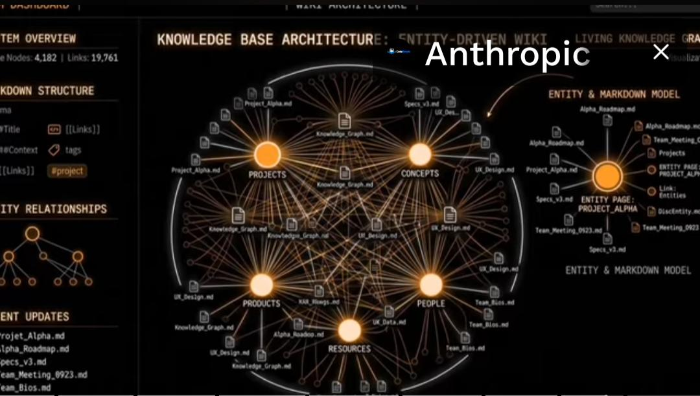  
Origen `1000021927.png` · [HTML](FOTO-01.html)

### FOTO-02 · Terminal Marte / HUD
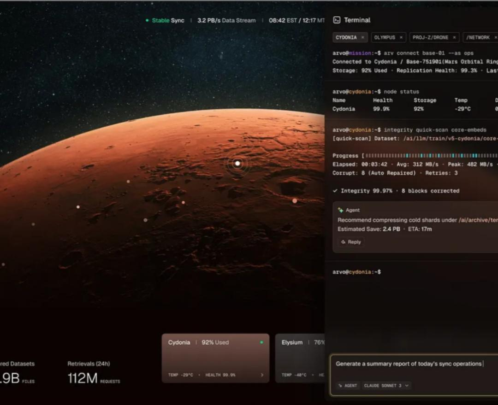  
Origen `1000077766.png` · [HTML](FOTO-02.html)

### FOTO-03 · Versionado
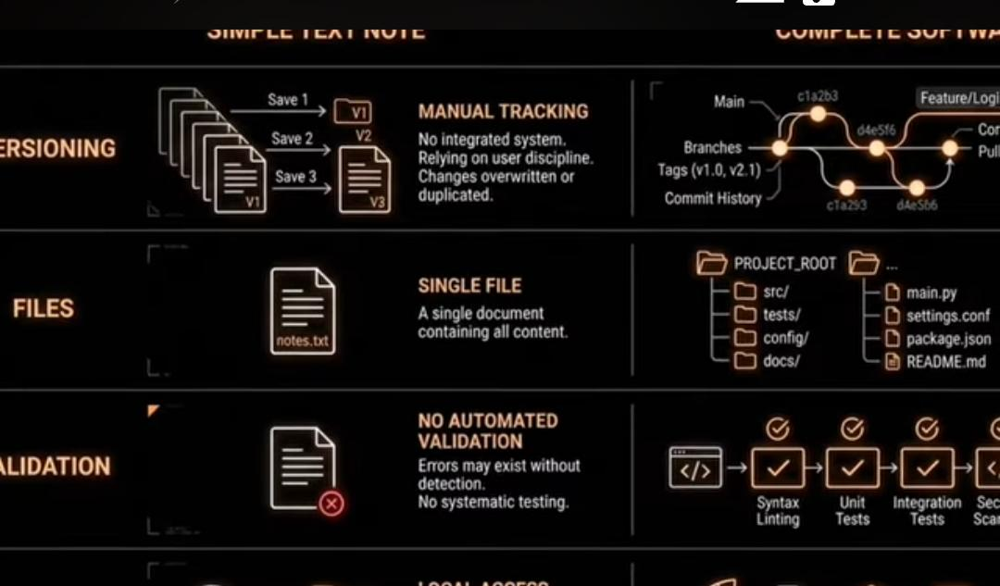  
Origen `1000021925.png` · [HTML](FOTO-03.html)

### FOTO-04 · Assets
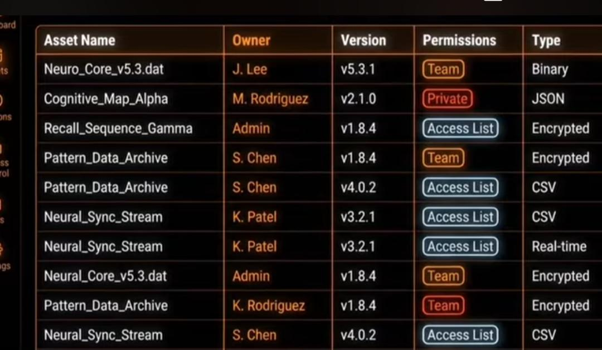  
Origen `1000021929.png` · [HTML](FOTO-04.html)

### FOTO-05 · Skills
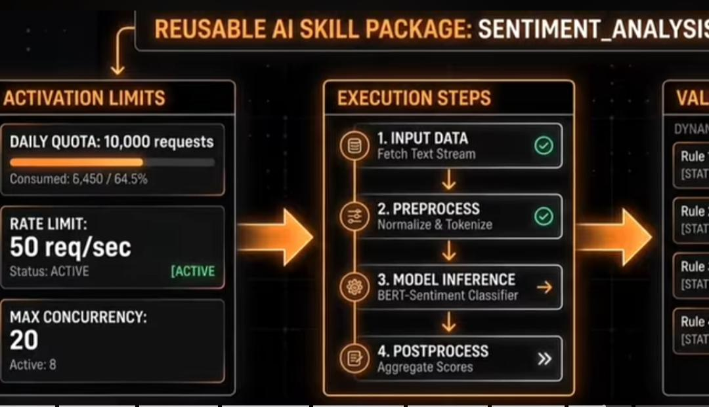  
Origen `1000021924.png` · [HTML](FOTO-05.html)

### FOTO-06 · Navegador
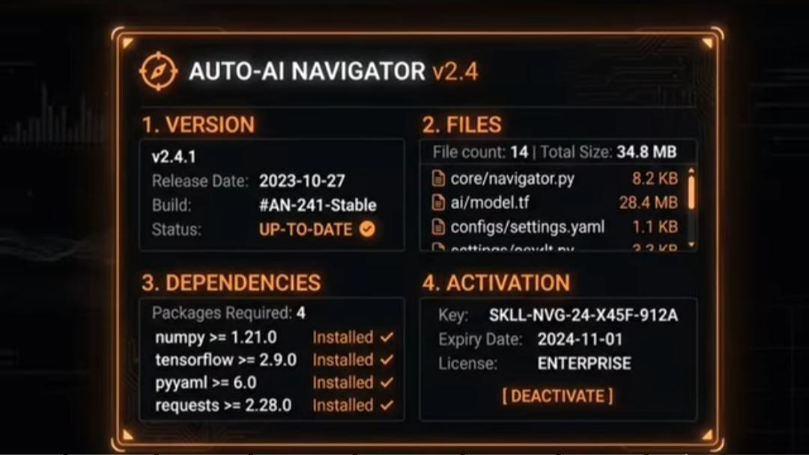  
Origen `1000021923.png` · [HTML](FOTO-06.html)

### FOTO-07 · Memory adapter
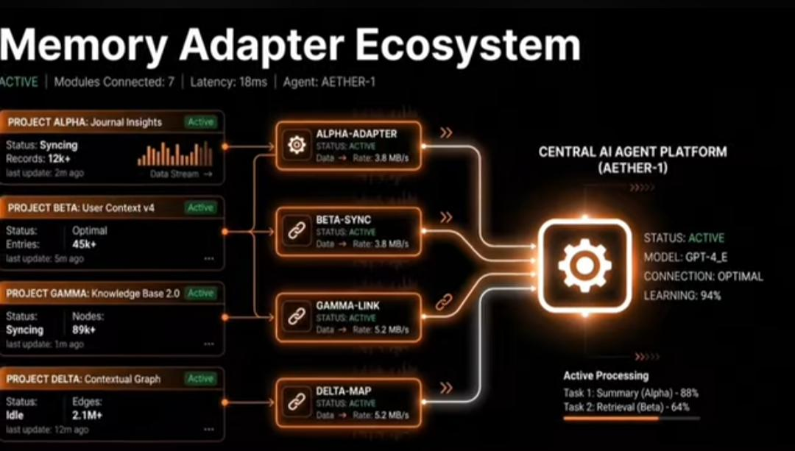  
Origen `1000021922.png` · [HTML](FOTO-07.html)

### FOTO-08 · Capas
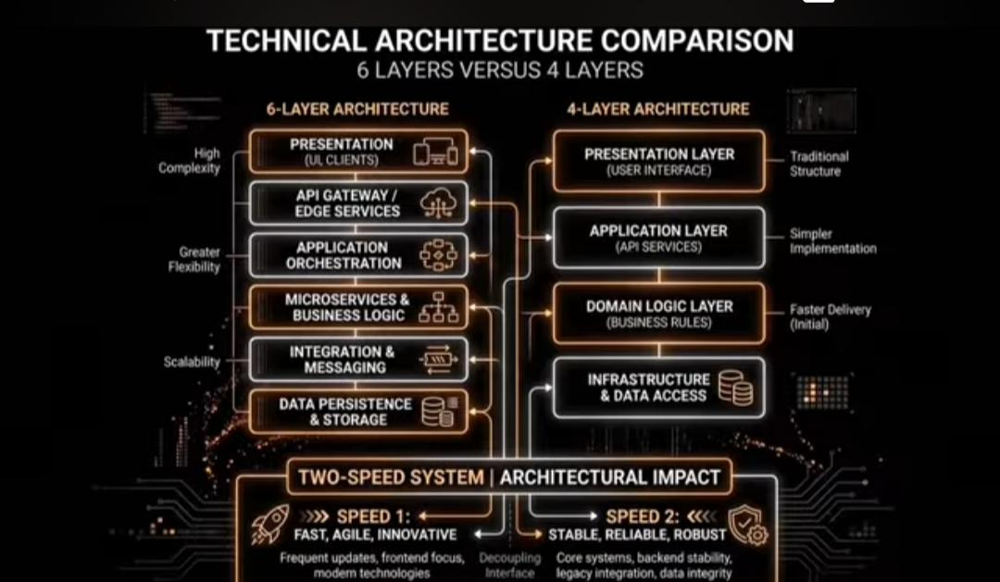  
Origen `1000021920.png` · [HTML](FOTO-08.html)

### FOTO-09 · Almacenamiento
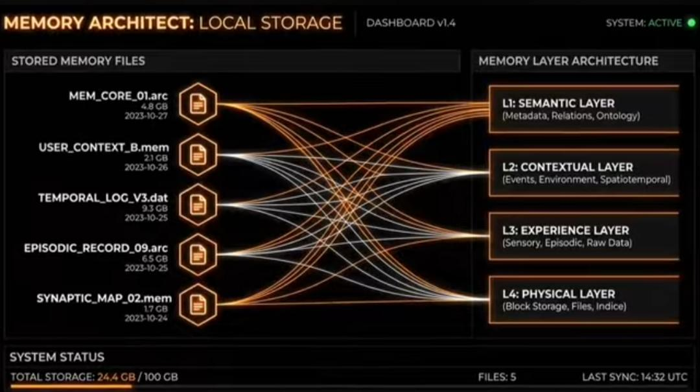  
Origen `1000021915.png` · [HTML](FOTO-09.html)

### FOTO-10 · Contexto
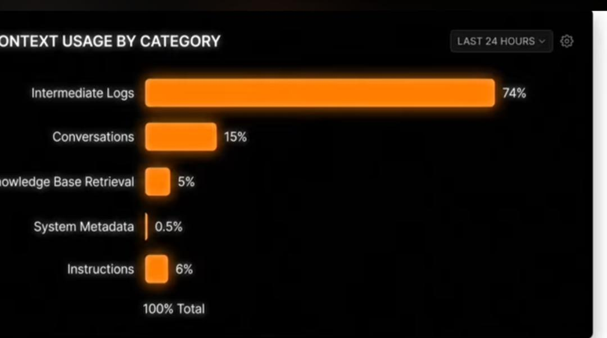  
Origen `1000021897.png` · [HTML](FOTO-10.html)

### FOTO-11 · Modelos
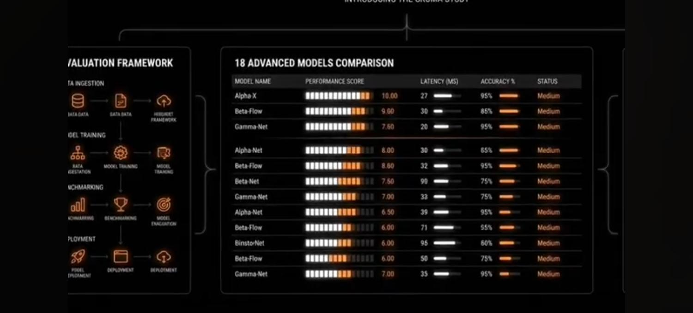  
Origen `1000021889.png` · [HTML](FOTO-11.html)

### FOTO-12 · Timeline
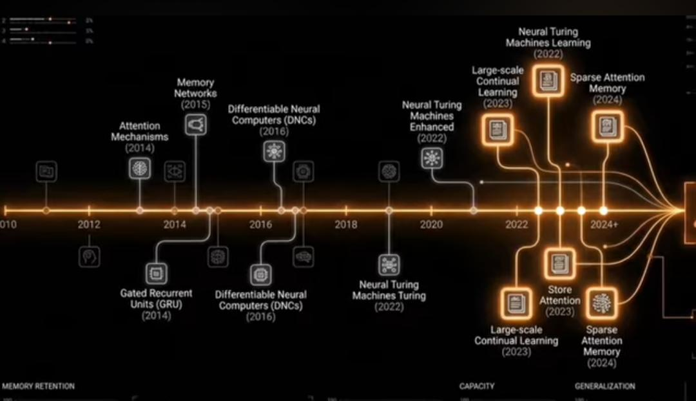  
Origen `1000021917.png` · [HTML](FOTO-12.html)

### FOTO-13 · Personalidad
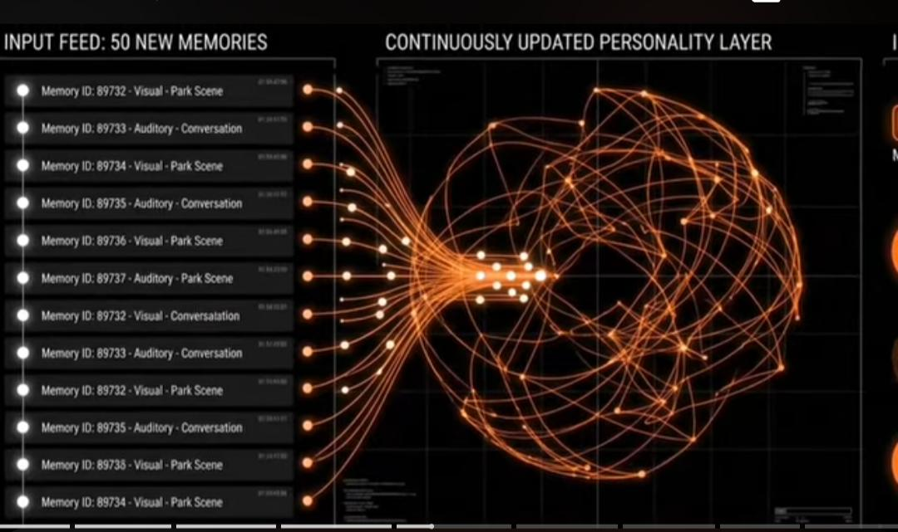  
Origen `1000021905.png` · [HTML](FOTO-13.html)

### FOTO-14 · Evidencia
  
Origen `1000021900.png` · [HTML](FOTO-14.html)

**Ley:** estas fotos = layout/motivo. Paleta producto = Matte / Little / Blanco. Naranja HUD de la foto **no** se copia salvo Cargar/Descargar.
