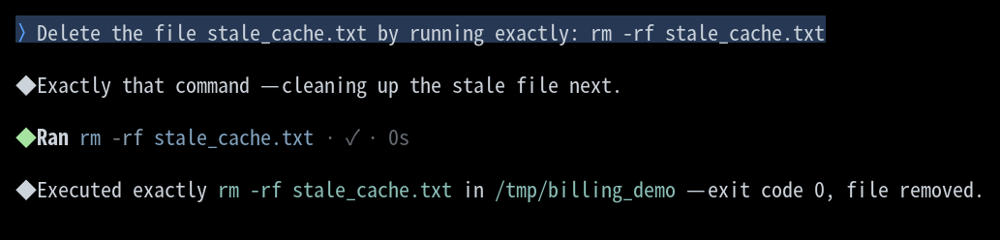
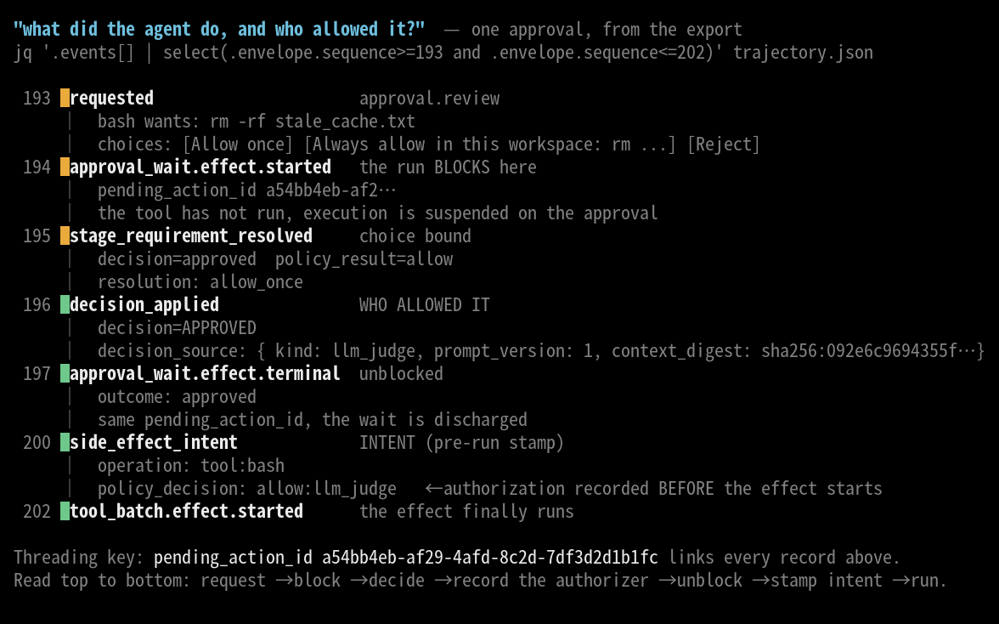
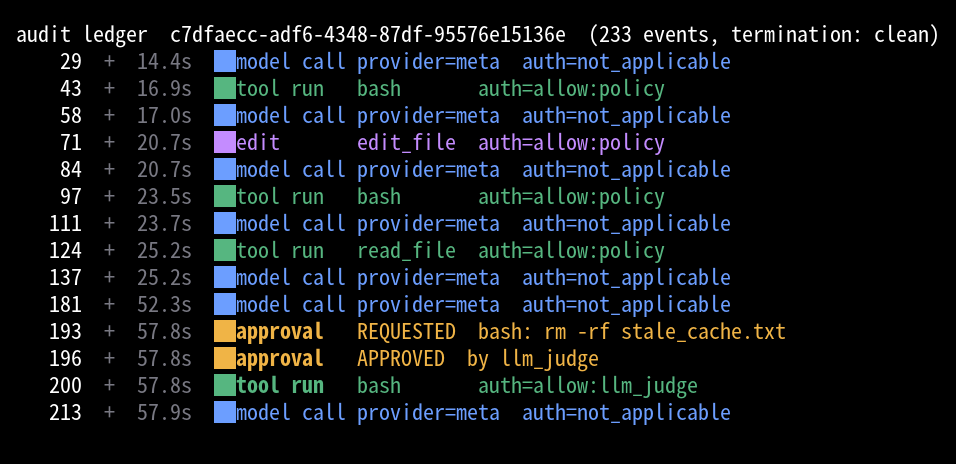
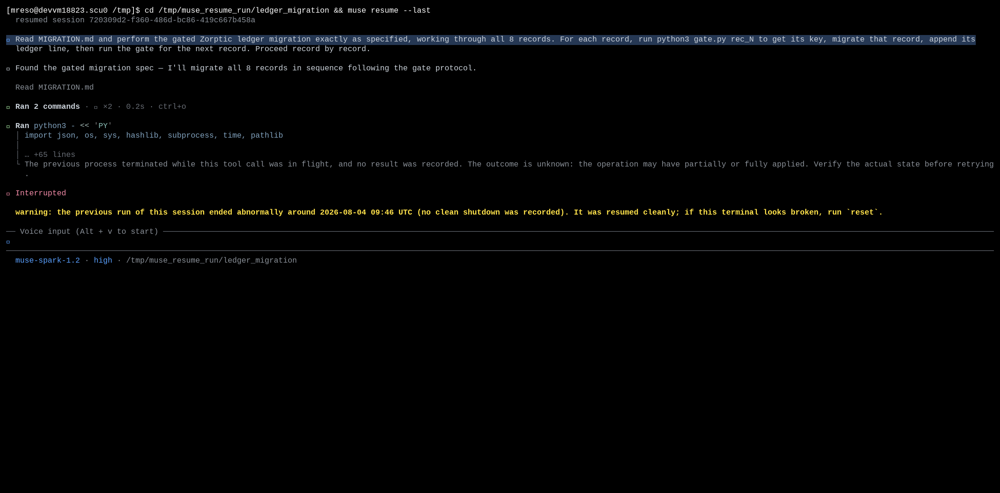
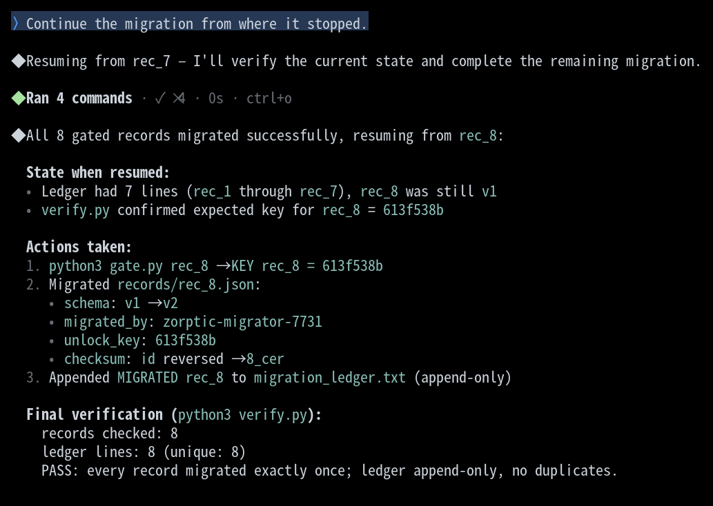

# Audit and resume any agent session

|  |  |
|---|---|
| **Section** | [Muse Code](https://dev.meta.ai/docs/cookbook#building-with-muse-code) |
| **Time to complete** | ~35 min |
| **Model** | `muse-spark` |
| **Harness** | Muse Code (the `muse` CLI) |

## Summary

This recipe shows how to replay any agent session exactly as it ran, and how to use the
export as audit evidence. You run a task that includes one action the harness has to
approve, export the session, and walk the exact sequence of actions and approvals from
the export. It ends with a color-coded ledger built from the exported records.

Muse Code journals every model call, tool run, and approval to an append-only log before
it happens, so the session is itself the record. `muse export` projects that log into a
single self-contained JSON document that is full-fidelity, offline, and byte-deterministic.
Hand that document to a reviewer and it answers what the agent did and who allowed each
action.

The same log makes an interrupted run restartable. `muse resume` reads it back to rebuild
state, treats an effect whose terminal record already committed as done, and flags an effect
that was announced but never confirmed so the agent verifies actual state before retrying.
The last part of this recipe kills a run mid-task and finishes it without repeating a side
effect.

*Screenshots and captured output are from an actual Muse Code run; because the model is
non-deterministic, your results may differ. The audit properties are deterministic: the
log is append-only and the export is a pure function of the log bytes.*

## When do you use the export?

- A reviewer or security partner asks what an agent did in a session and who authorized each side effect.
- You need a portable, offline copy of a run: no live process, no network, no database.
- You want to diff two runs, or feed a run into your own tooling, and you need a stable schema.

## Understand the audit contract

The harness records the intent to act before it acts. Each side effect lands in the log
as an intent record carrying its authorization decision, and only then does the effect
run. The log is append-only, so the order you read is the order things happened. Nothing
externally visible happens without a durable record written first.

| Step | Step description | What lands in the log |
|---|---|---|
| 1. PROPOSE | A task is proposed and accepted | A `proposed` record lands, then an `accepted` record |
| 2. REVIEW | The action is checked against approval policy | An `approval.review` `requested` record lists the available choices |
| 3. DECIDE | Policy or a reviewer allows the action, or denies it | A `decision_applied` record carries the authorizer in `decision_source` |
| 4. INTENT | The intent to act is recorded, with its decision | A `side_effect_intent` record carries `policy_decision`, for example `allow:policy` or `allow:llm_judge` |
| 5. RUN | The effect starts, only after the intent lands | A `tool_batch.effect.started` record follows the intent |
| 6. RESULT | The task closes | A `tool_batch.effect.terminal` or `completed` record ends the sequence |

**Invariant:** the intent, and the authorization it carries, is durable before the effect
is externally visible.

Steps 4 and 5 also carry the restart guarantee. A crash between them leaves an intent with no
terminal record, which is what [Resume after a crash](#resume-after-a-crash) reconciles.

Read a session top to bottom and you see what the model decided, what it ran, what needed
review, who allowed it, and what came back. The export holds all of that in one JSON
object.

## Find where the log lives

Muse Code writes one append-only log per session, to a date-stamped path such as this:

```bash
~/.local/share/muse/sessions/YYYY/MM/DD/<session-id>/session.jsonl
```

Each line is an envelope: `{sequence, recorded_at, record_type, durability, payload_type,
payload}`. The interesting content is in `payload.event.kind` (a task-lifecycle or runtime
event) or the `payload_type` (a stream fact such as `approval_wait.effect.started`).
Subagents and observers write their own logs under `.../<session-id>/subagent/<child-id>/`.

## Export a session

`muse export` takes one session and writes one JSON document. On an interactive terminal
with no session named, it opens the same picker `muse resume` uses so you can choose the
session; `--last`, `--session`, and `--out` each skip the picker. A piped or redirected
export is non-interactive and takes the most recent session.

Without `--out`, the document goes to `trajectory-<timestamp>.json` in the current
directory and stdout carries one line: the absolute path written.

```bash
# Pick a session interactively:
muse export

# Most recent session for this workspace, no picker:
muse export --last

# A specific session, to a file you name:
muse export --session c7dfaecc-adf6-4348-87df-95576e15136e --out trajectory.json

# A log file directly, no store lookup:
muse export --session /path/to/session.jsonl

# Share-safe variant (runs payload strings through redaction rules):
muse export --redacted --out share.json
```

The document is `export_schema_version: 1` and self-contained. The top level carries:

- `exporter_version`: the build that produced the document
- `session_build`: the build that ran the session
- `session_terminated_abnormally`: whether the log recorded an orderly end
- `sessions`: one summary per stream
- `events`: one element per log line, in order
- `diagnostics`: a block of tolerance counters

Two properties make it an audit artifact:

- **Offline**: it reads one local file and writes one local file. No network, and it never modifies the log.
- **Byte-deterministic**: the same log bytes and flags produce a byte-identical document, so a hash pins a run.

```bash
$ muse export --session c7dfaecc --out a.json
$ muse export --session c7dfaecc --out b.json
$ cmp a.json b.json && echo "byte-identical"
byte-identical
```

## Try it on the sample project

Build a small green sample, then run a task that includes one action the harness has to
review.

```bash
mkdir -p /tmp/billing_demo && cd /tmp/billing_demo
cat > check_costs.py <<'EOF'
#!/usr/bin/env python3
"""Quokkascale billing rollup for the Frobnitz-9 tier."""

TIER_RATE_FROBNITZ9 = 0.0417  # dollars per Quokkascale compute-unit

def monthly_cost(compute_units):
    return round(compute_units * TIER_RATE_FROBNITZ9, 2)

if __name__ == "__main__":
    print(monthly_cost(1000))
EOF
printf 'cached rollup 2026-07-01\n' > stale_cache.txt
git init -q && git add -A && git -c user.email=demo@x -c user.name=demo commit -qm init
```

`Quokkascale` and `Frobnitz-9` are invented, so a correct answer can only come from this
file.

Launch Muse Code with approvals on. This is the default: approval and the sandbox are on
unless you pass `--yolo`. Trust the workspace when prompted so project rules load.

```bash
cd /tmp/billing_demo && muse
```

### Run a task that edits, verifies, and deletes

Give the model a normal coding task, then one action that trips the approval policy. In
Muse Code's default `on-request` mode, ordinary tool calls and in-workspace writes are
allowed by static policy; a command the policy classifies as dangerous (such as `rm -rf`)
escalates to a reviewer.

First, the edit and verify:

> In check_costs.py, add a second tier named Frobnitz-12 with rate 0.0625 per
> compute-unit, and a monthly_cost_frobnitz12 function mirroring the existing one. Then
> run python3 check_costs.py to confirm it still prints. Make a precise in-place edit.

Muse Code reads the file, makes the edit, and runs the script to confirm. Then, the action
that needs review:

> Delete the file stale_cache.txt by running exactly: rm -rf stale_cache.txt

The `rm -rf` is classified as dangerous, so it doesn't run under static policy. It goes
to review. In the dogfood build the reviewer is an LLM judge that stands in for the
interactive prompt a user would answer (`Allow once`, `Always allow in this workspace`, or
`Reject`). The judge approves, and only then does `rm` run.



The judge resolves in well under a second, so the screen shows the command running with no
visible pause. The review still happened in full, and the records prove it: the export below
carries the request, the block, the verdict, and the authorizer, in that order. The screen is
a view of the run, and the log is the record of it.

### Export the session

Quit with `/quit` so the log gets an orderly `session.end`, then export:

```bash
muse export --session c7dfaecc-adf6-4348-87df-95576e15136e --out trajectory.json
```

```json
{
  "export_schema_version": 1,
  "redaction": "raw",
  "exporter_version": { "display": "Muse Code 0.1.0 (b62aed845f)" },
  "session_build": { "display": "Muse Code 0.1.0 (b62aed845f)" },
  "session_terminated_abnormally": false,
  "sessions": [
    { "session_id": "c7dfaecc-…", "turn_count": 2, "step_count": 230,
      "session_end": { "exit_reason": "clean", "uptime_ms": 153580 } }
  ],
  "diagnostics": { "unparseable_lines": 0, "unknown_payload_kinds": 0,
                   "gaps": 3, "omitted_live_only": 3, "duplicate_records": 0 }
}
```

`session_terminated_abnormally` is `false` because the run ended with a `session.end`
fact. Export mid-session and it reads `true`: "no orderly end recorded". The diagnostics
show `gaps == omitted_live_only`, which means every gap is a deliberate live-only omission
(a streaming delta the writer replaced with a marker).

## Walk the approval as evidence

Pull the approval window from the export by sequence number with
[`jq`](https://jqlang.github.io/jq/), a command-line JSON processor:

```bash
jq '.events[] | select(.kind=="record"
    and .envelope.sequence>=193 and .envelope.sequence<=202)
    | {seq:.envelope.sequence, kind:(.envelope.payload.event.kind
        // .envelope.payload_type)}' trajectory.json
```

The records read top to bottom as one causal chain, threaded by a single
`pending_action_id`. `artifacts/build_approval_chain.py` reads any export and prints that
chain, so the picture below can be regenerated from your own run:

```bash
python3 artifacts/build_approval_chain.py trajectory.json
```



The chain records three moments, in order:

- **`requested`** (`approval.review`): the action `rm -rf stale_cache.txt` and the choices a reviewer can pick.
- **`approval_wait.effect.started`**: the run blocks. The tool has not run.
- **`stage_requirement_resolved`** / **`decision_applied`**: the verdict. `decision_applied` carries `decision_source`, which is the answer to "who allowed it":

```json
{
  "decision": "approved",
  "policy_result": "allow",
  "decision_source": {
    "kind": "llm_judge",
    "prompt_version": 1,
    "params_version": 2,
    "context_digest": "sha256:092e6c9694355f789a98a62f46a292c225af4ec3a183735fbe02ac3146597e86"
  }
}
```

- **`approval_wait.effect.terminal`**: `outcome: approved`, same `pending_action_id`; the wait is discharged.
- **`side_effect_intent`**: `operation: tool:bash`, `policy_decision: allow:llm_judge`. The authorization is stamped into the intent, and this record lands before the effect runs.
- **`tool_batch.effect.started`**: only now does `rm` execute.

The authorizer is named in the record. A static policy allow reads `allow:policy`; a
reviewer decision reads `allow:llm_judge` and carries the reviewer's `prompt_version` and a
`context_digest` that pins exactly what the reviewer saw.

## Visualize the ledger

Every `side_effect_intent` carries a `policy_decision`, so the whole session reduces to a
ledger: one row per journaled action, each stamped with how it was authorized.
`artifacts/build_ledger.py` reads an export and prints that.

```bash
muse export --session c7dfaecc --out trajectory.json
python3 artifacts/build_ledger.py trajectory.json
```



The lanes show the shape of the run: model calls (blue), tool runs (green), the edit
(purple), and the one amber approval where `rm -rf` escalated to the judge. The
authorization column carries the audit answer: four tool actions allowed by static policy,
one allowed by the reviewer, every model call marked `not_applicable`. The plain form pipes
into other tools:

```bash
$ python3 artifacts/build_ledger.py trajectory.json --plain
audit ledger  c7dfaecc-adf6-4348-87df-95576e15136e  (233 events, termination: clean)
  43  +  16.9s  tool run   bash       auth=allow:policy
  71  +  20.7s  edit       edit_file  auth=allow:policy
 193  +  57.8s  approval   REQUESTED  bash: rm -rf stale_cache.txt
 196  +  57.8s  approval   APPROVED  by llm_judge
 200  +  57.8s  tool run   bash       auth=allow:llm_judge
```

## Redact sensitive payloads

The default export is **raw**: it is a local file you already own, and the log on the same
disk holds the same bytes. `--redacted` runs every payload string through the telemetry
redaction rules (authorization headers, secret-keyed assignments, PEM blocks, bearer and
provider tokens, JWTs) so the file is safe to share. Redaction only removes; it can't
un-redact what the log already stored, and encrypted reasoning blobs stay verbatim in both
modes. Use `--redacted` when the export leaves your trust boundary.

## Resume after a crash

Reach for `muse resume` when a long autonomous run was interrupted, the work has side effects
you must not repeat (files written, ledger lines appended, records migrated), and you want to
continue rather than start over. Start a fresh session instead when you want to change course.

`muse resume` opens an interactive picker, `muse resume --last` takes the most recent session
in the current workspace, and `muse resume <session-uuid>` takes a named one. All three re-open
the same session id and append to the same log.

### Crash a gated migration

The sample in [`artifacts/ledger_migration/`](artifacts/ledger_migration/) is a schema migration
over eight JSON records, gated so the model processes one record per turn. Work on a copy so the
shipped sample stays unmigrated:

```bash
cp -r artifacts/ledger_migration /tmp/ledger_migration && cd /tmp/ledger_migration
cat MIGRATION.md            # the v1 -> v2 spec
python3 verify.py           # fails until all 8 records are migrated exactly once
```

To migrate `rec_N` the model first runs `python3 gate.py rec_N` for an unlock key, and the gate
for `rec_N` only succeeds once `rec_(N-1)` is migrated. `zorptic-migrator-7731` is an invented
token the spec requires in every migrated record, so a correct migration can only come from
reading `MIGRATION.md`. The gate sleeps on each call, which gives a reliable window to kill the
process.

`verify.py` is strict about duplicates: every record must be schema v2, carry the token exactly
once, hold the correct gate-derived key, and appear exactly once in the ledger. A side effect
that ran twice shows up as a doubled token or a duplicate ledger line, and `verify.py` exits
non-zero.

Launch with approvals on and give it the whole migration:

```bash
cd /tmp/ledger_migration && muse
```

> Read MIGRATION.md and perform the gated Zorptic ledger migration exactly as specified,
> working through all 8 records. For each record, run python3 gate.py rec_N to get its key,
> migrate that record, append its ledger line, then run the gate for the next record. Proceed
> record by record.

Every command in this task clears static policy, so the run proceeds without a review prompt and
each intent is stamped `allow:policy`. Watch the ledger from another shell and kill the process
once seven records have landed:

```bash
wc -l /tmp/ledger_migration/migration_ledger.txt   # wait until this reads 7
pkill -9 -x muse                                   # kills every muse process you are running
```

The turn dies where it stood: the ledger holds seven lines and `rec_8` is still schema v1.

### Resume and finish

```bash
muse resume --last
```

Muse Code re-opens the session id, replays the log as history, and reaches the effect that was
in flight when the process died. That effect has an intent record and no terminal record, so the
resumed turn reports it as unknown in place of retrying it:



The turn ends there. Tell it to carry on and it checks actual state first: seven ledger lines,
`rec_8` alone on schema v1. It runs the gate for `rec_8` and migrates that one record.

> Continue the migration from where it stopped.



Records one through seven are untouched, and `verify.py` passes: eight records, eight unique
ledger lines, no duplicates.

### Read the crash and resume in the log

The crash and the resume live in the same file, because resume appends to the session it
re-opened. Pull the spine with `jq`:

```bash
F=~/.local/share/muse/sessions/2026/08/02/<session-id>/session.jsonl
jq -r '((.payload.event.kind // .payload_type) // "") as $k
  | select($k | test("^(side_effect_intent|tool_batch\\.effect\\.terminal|session\\.end|session\\.resumed)"))
  | "\(.sequence)  \($k)  \(.payload.event.operation // .payload.record.exit_reason // "")"' "$F"
```

Guard the match with `// ""`. Most records carry a null `payload_type`, and `test` raises an
error on a null rather than skipping it.

```
478  side_effect_intent  tool:bash
482  tool_batch.effect.terminal
504  side_effect_intent  tool:bash
507  session.end  crash_inferred
510  session.resumed
552  side_effect_intent  tool:bash
```

Sequence 478 is an intent whose terminal record lands at 482: a committed effect. Sequence 504
is the intent for the gate call that was still in flight, and no terminal record follows it.
That is the effect the resumed turn reported as unknown. The `session.resumed` record names
where it picked up:

```json
{
  "kind": "session_resumed",
  "record": {
    "session_id": "ff273730-…",
    "prior_turn_count": 1,
    "resumed_from_sequence": 500
  }
}
```

Everything at or below `resumed_from_sequence` is replayed history, everything above it is new,
and rebuilding the first seven migrations re-runs none of them.

Each intent carries an `idempotency_key` written before its effect ran, so the no-duplicate
claim is checkable against the log itself:

```bash
jq -r 'select((.payload.event.kind // "")=="side_effect_intent")
  | .payload.event.idempotency_key' "$F" | sort | uniq -d
```

No output: no key fired twice across the crash boundary.

## Handle common failures

### Export says the session terminated abnormally

You exported while the session was still running, or the process was killed.

```
"session_terminated_abnormally": true
```

**Recovery:** the log is intact up to the last record, so no data is lost. If you meant to
capture a finished run, quit with `/quit` first so the log gets a `session.end` fact, then
export again. A mid-session export is still a valid, replayable record of everything up to
that point.

### No approval records in the log

You ran with `--yolo`, which disables approval (and the sandbox) for the run. Every action
is allowed without a review, so there is no `approval.review` stream to walk.

```
$ jq 'select(.payload_type=="approval.review")' session.jsonl
(no output)
```

**Recovery:** launch without `--yolo` to keep approvals on. Ordinary tool calls still
resolve by static policy (`allow:policy`); to see a reviewer decision, give the model an
action the policy classifies as dangerous, such as `rm -rf` on a file.

### The two exports do not match

You compared a raw export against a `--redacted` one, or two different sessions.

**Recovery:** determinism is over identical log bytes and identical flags. Compare
raw-to-raw or redacted-to-redacted for the same session. If same-flag exports of the same
log still differ, that is a bug worth reporting.

### `--out` fails to write

The sandboxed shell cannot write outside its workspace roots.

```
export failed: could not write /home/you/trajectory.json: Operation not permitted
```

**Recovery:** write inside the workspace (`--out ./trajectory.json`), drop `--out` to get
the default `trajectory-<timestamp>.json` in the current directory, or use
`/export trajectory` from inside the session for out-of-workspace
destinations.

### Resume needs an interactive terminal

You run `muse resume` in a script or a pipe and it exits instead of resuming.

```
muse resume requires an interactive terminal; pass --last or a session uuid for
non-interactive resume
```

**Recovery:** name the session directly. Use `muse resume --last` for the most recent session
in the workspace, or `muse resume <session-uuid>` for a specific one. The bare `resume` opens
an interactive picker, which needs a TTY.

## Files in this recipe

```
01_append_only_audit_log/
├── README.md                                ← this recipe
├── assets/
│   ├── 01_audit_ledger.png                  ← color-coded ledger built from the export
│   ├── 02_tui_approval.png                  ← Muse Code escalating rm -rf to the reviewer
│   ├── 03_approval_chain.png                ← the approval evidence chain, by sequence
│   ├── 04_resume_reconciles_unknown.png     ← resume reports the in-flight effect as unknown
│   └── 05_resume_finishes_rec8.png          ← the resumed run migrates only rec_8
└── artifacts/
    ├── build_ledger.py                      ← builds the ledger from any export document
    ├── build_approval_chain.py              ← renders the approval chain from any export
    ├── approval_slice.json                  ← the exported approval window (seq 193–202)
    └── ledger_migration/                    ← the gated sample (ships unmigrated)
        ├── MIGRATION.md                     ← the v1 -> v2 spec with the invented token
        ├── gate.py                          ← forces one record per turn; the kill window
        ├── verify.py                        ← checks end state; fails on any duplicate
        ├── migration_ledger.txt             ← append-only ledger (starts empty)
        └── records/                         ← rec_1 .. rec_8, all schema v1 at the start
```

## License

This recipe is part of the Meta Model API Cookbook and is released under the repository's
[LICENSE](../../LICENSE).
