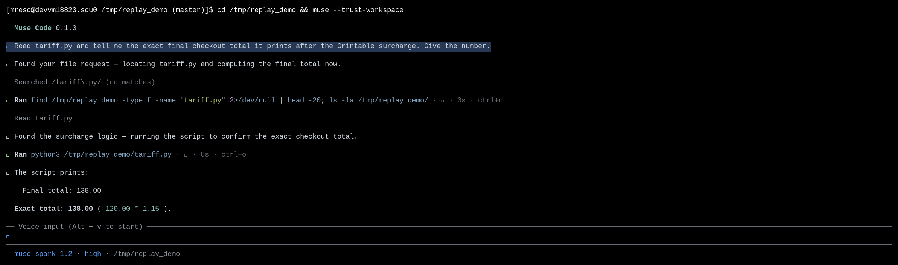

# Deterministic Replay in CI

|  |  |
|---|---|
| **Section** | [Muse Code](https://dev.meta.ai/docs/cookbook#building-with-muse-code) |
| **Time to complete** | ~20 min |
| **Model** | `muse-spark` |
| **Harness** | Muse Code (the `muse` CLI) |

## Summary

This recipe shows how to turn recorded Muse Code events into a focused golden fixture and
replay its model-context projection in CI. The check runs offline and blocks a merge when
Muse Code reconstructs the committed events differently.

Muse Code journals each session to an append-only event log. A golden fixture keeps the
relevant run events and the model context they should produce. `muse trace inspect` runs
those events through Muse Code's projection code and reports any mismatch. It does not call
a model, run a tool, or use the network.

*The screenshot is from an actual Muse Code run, so your live result may differ. Fixture
replay is deterministic: the same records and Muse Code revision produce the same report.*

## When To Use Replay

- You changed Muse Code's event decoding or model-context projection and need a regression check.
- You want a regression test that runs offline, with no model provider, no shell, and no network.
- You changed an event schema and need to verify that committed fixtures still replay.

Replay answers one question: do these committed events still reconstruct the expected
model-visible context?

## Understand The Replay Contract

A golden trace is a set of committed event-log records plus the expected projection those
records reduce to. Replay reconstructs the projection from the records alone and compares
it to the expectation. Nothing calls a model, a tool, or the network.

| Step | Step description | Muse Code mechanism |
|---|---|---|
| 1. RECORD | A session is journaled as it runs | Durable event records land in the append-only session log |
| 2. AUTHOR | The relevant behavior becomes a fixture | Focused records and their expected projection are committed together |
| 3. REPLAY | The records are projected again | The projection runs offline and pure: no model, no tool, no network |
| 4. DIFF | The result is checked against the expectation | The reconstructed projection is compared to the committed one |
| 5. GATE | CI decides whether the change lands | Zero diffs pass; any diff blocks the merge |

Fixture v1 is a normalized, developer-authored contract. Muse Code does not convert a raw
session log directly into a golden fixture. Use the live log as evidence, keep only the
events needed for the regression, and review the expected projection with the fixture.

## Find Recorded Sessions

Muse Code writes one append-only log per session, to a date-stamped path:

```bash
${XDG_DATA_HOME:-$HOME/.local/share}/muse/sessions/YYYY/MM/DD/<session-id>/session.jsonl
```

Each line is an envelope: `{sequence, recorded_at, record_type, durability, payload_type,
payload}`. Session envelopes with `payload.kind: "run"` carry the run events used by the
model-context projection. A golden fixture stores focused `agent.run` envelopes plus an
`expected_model_context`.

## Try It On The Sample Project

Build a small green sample, then record one session against it.

```bash
mkdir -p /tmp/replay_demo && cd /tmp/replay_demo
cat > tariff.py <<'EOF'
#!/usr/bin/env python3
"""Vasquollo checkout pricing for the Grintable tier."""

BASE_PRICE = 120.00            # Vasquollo cart base, in dollars
GRINTABLE_RATE = 0.15          # Grintable surcharge rate

def final_total(base=BASE_PRICE, rate=GRINTABLE_RATE):
    """Return the checkout total after the Grintable surcharge."""
    return round(base * (1 + rate), 2)

if __name__ == "__main__":
    print(f"Final total: {final_total():.2f}")
EOF
git init -q && git add -A && git -c user.email=demo@x -c user.name=demo commit -qm init
```

`Vasquollo` and `Grintable` are invented, so a correct answer can only come from running
the code in this directory.

### Record A Session

Launch Muse Code and ask it to read the script and report the total. This is the session
you will use as evidence for the fixture.

```bash
cd /tmp/replay_demo && muse
```

> Read tariff.py and tell me the exact final checkout total it prints after the Grintable
> surcharge. Give the number.

Muse Code finds the file, reads it, runs it, and answers with the total.



Quit with `/quit` so the log gets an orderly `session.end`.

### Inspect The Recorded Session

Select the newest session from today and inspect it. Quoting `$F` ensures the command receives
one path even when the session store contains several runs:

```bash
SESSION_ROOT="${XDG_DATA_HOME:-$HOME/.local/share}/muse/sessions"
F="$(ls -1t "$SESSION_ROOT"/$(date +%Y/%m/%d)/*/session.jsonl | head -n 1)"
muse trace inspect --session-log "$F" --render-mode compact
```

```
Trace: session log
Scope: session_file
Schema: 1
Result: completed
Records: run=49 task=38
Diffs: 0
Annotations: 0
```

The session report confirms that Muse Code can decode and project the run. A raw session log
does not contain an expected projection, so `Diffs: 0` is not a golden comparison. The golden
fixture in the next section adds that expectation.

Inspection is a pure function of the record bytes, so its JSON output is byte-deterministic:

```bash
$ muse trace inspect --session-log "$F" --format json > a.json
$ muse trace inspect --session-log "$F" --format json > b.json
$ cmp a.json b.json && echo "byte-identical"
byte-identical
```

## Author A Focused Golden Fixture

A session log contains the complete runtime history. A golden fixture is smaller: it keeps
the events needed to exercise one projection contract and the context those events should
produce. List the recorded run events before choosing the focused set:

```bash
jq -c 'select(.payload.kind == "run") |
  {sequence: .payload.source_run_record_sequence, event: .payload.event}' "$F"
```

Use an existing fixture as the envelope template. Give the new file and its `name` field the
same stem, map the relevant session events to the normalized `agent.run` payloads shown in
the fixture, and number the records from 1 in projection order. Keep the `started`,
`model_response_created`, and `terminal` boundaries needed by the selected events. Include
`model_completed` when usage is part of the expectation, then set `expected_model_context`
to the reviewed result.

[`golden-traces/checkout_probe.json`](golden-traces/checkout_probe.json) uses the prompt,
tool output, and answer verified in the recorded run above:

```json
{
  "schema_version": 1,
  "name": "checkout_probe",
  "run_records": [
    { "payload": { "kind": "started", "prompt": "Read tariff.py and tell me the exact final checkout total it prints after the Grintable surcharge. Give the number." } },
    { "payload": { "kind": "tool_result", "call_id": "c1", "text": "Final total: 138.00" } },
    { "payload": { "kind": "assistant_message_committed", "text": "Final total: 138.00", "message_id": "018f0000-0000-7000-8000-000000000301", "response_id": "resp_1" } },
    { "payload": { "kind": "terminal", "terminal": "completed", "reason": null } }
  ],
  "expected_model_context": {
    "messages": [
      { "role": "user", "text": "Read tariff.py and tell me the exact final checkout total it prints after the Grintable surcharge. Give the number." },
      { "role": "tool", "call_id": "c1", "text": "Final total: 138.00" },
      { "role": "assistant", "text": "Final total: 138.00" }
    ],
    "assistant_text": "Final total: 138.00",
    "terminal": "completed",
    "usage": { "input_tokens": 41, "output_tokens": 18, "cached_tokens": 0 }
  }
}
```

The example abbreviates each record to its payload. The committed fixture includes the full
event envelopes that replay validates. Run the remaining commands from this recipe directory:

```bash
$ muse trace inspect --fixture golden-traces/checkout_probe.json
Trace: checkout_probe
Result: completed
Records: run=7 task=0
Diffs:
  none
```

`Diffs: none` is the pass signal: the committed records reduce to the committed expectation.

## Gate The Merge On Replay

[`artifacts/replay_gate.sh`](artifacts/replay_gate.sh) replays every fixture in a directory
and exits non-zero on any diff or load failure. Run it in CI as a required check:

```bash
$ ./artifacts/replay_gate.sh golden-traces
PASS  checkout_probe
```

It reads the JSON report and treats a fixture as failed when the diff count is not zero:

```bash
muse trace inspect --fixture "$fixture" --format json > report.json
diffs="$(jq '.diffs | length' report.json)"
[ "$diffs" -eq 0 ] || fail=1
```

[`artifacts/ci-replay-gate.yml`](artifacts/ci-replay-gate.yml) is a GitHub Actions template.
It expects `muse` on `PATH`; add your team's supported install step or select a runner image
that already includes Muse Code. The paths in the template assume `artifacts/` and
`golden-traces/` are at the project root. Mark the job as a required status check after that
setup.

### Watch The Gate Catch Drift

Copy the fixture to a temporary directory, then change the recorded assistant event while
leaving the expected projection unchanged. This simulates the mismatch produced when Muse
Code's projection output drifts:

```bash
$ tmp="$(mktemp -d)"
$ jq '(.run_records[] | select(.payload.kind == "assistant_message_committed") | .payload.text) = "Final total: 120.00"' \
    golden-traces/checkout_probe.json > "$tmp/checkout_probe.json"
$ muse trace inspect --fixture "$tmp/checkout_probe.json"
Diffs:
  [model_context] model_context.assistant_text
    expected: Final total: 138.00
    actual:   Final total: 120.00
```

The gate turns that diff into a failed check:

```bash
$ ./artifacts/replay_gate.sh "$tmp"
FAIL  checkout_probe: 1 projection diff(s)
        model_context.assistant_text: expected Final total: 138.00, actual Final total: 120.00
$ echo $?
1
```

A non-zero exit fails the required check, and the merge is blocked until the behavior is
restored or the fixture is intentionally updated in the same change.

## Handle Common Failures

### A Projection Diff Exits Zero

`muse trace inspect` is a read-only viewer. It prints diffs but does not fail on them, so a
bare invocation exits zero even when a fixture drifted.

**Recovery:** gate on the diff count rather than the exit code. Read the JSON report and
fail when `diffs` is non-empty, exactly as `replay_gate.sh` does:
`muse trace inspect --fixture <name> --format json | jq -e '.diffs | length == 0'`.

### A Fixture Path Reports An Unknown Result

You pass `--fixture checkout_probe`, and the report reads `Result: unknown` with `run=0`.

```
Trace: checkout_probe
Source: checkout_probe
Result: unknown
Records: run=0 task=0
```

**Recovery:** pass the filename with its extension from the trace directory,
`muse trace inspect --fixture checkout_probe.json`, or pass the full path:
`muse trace inspect --fixture golden-traces/checkout_probe.json`.

### The Fixture Fails To Load

Replay reports `load_status: partial` and an error naming the fixture, usually an
unsupported schema version or malformed JSON.

```
"load_status": "partial",
"errors": [ { "category": "replay_schema", "message": "unsupported fixture schema version 2" } ]
```

**Recovery:** golden fixtures are `schema_version: 1`. Keep committed fixtures on the
supported schema; if you bump the schema, add the fixture under the new version with a
compatibility check rather than editing the old one in place.

### A Diff You Did Not Expect

Replay names a field under `model_context` that changed, but you did not touch behavior on
purpose.

**Recovery:** read the named field. If the change is a real regression, fix the code. If
it is an intended behavior change, update `expected_model_context` in the same change so
the diff gets reviewed rather than hidden.

## Files In This Recipe

```
02_deterministic_replay/
├── README.md                      ← this recipe
├── assets/
│   └── 01_recorded_run.png        ← Muse Code recording the checkout session
├── golden-traces/
│   └── checkout_probe.json        ← focused records + expected projection
└── artifacts/
    ├── replay_gate.sh             ← replays every fixture; non-zero exit on any diff
    └── ci-replay-gate.yml         ← GitHub Actions template for the required check
```

## License

This recipe is part of the Meta Model API Cookbook and is released under the repository's
[LICENSE](../../LICENSE).
