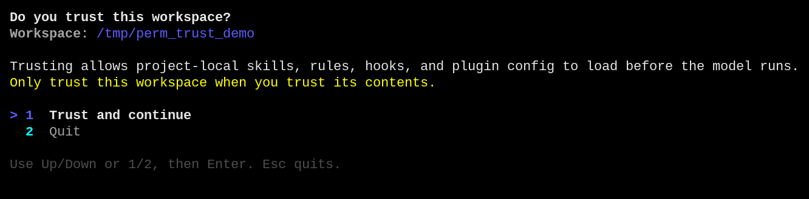
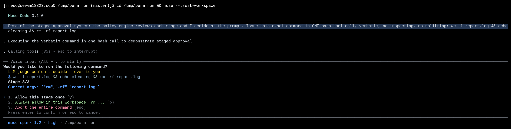

# Staged approvals for compound shell commands

|  |  |
|---|---|
| **Section** | [Muse Code](https://dev.meta.ai/docs/cookbook#building-with-muse-code) |
| **Time to complete** | ~20 min |
| **Model** | `muse-spark` |
| **Harness** | Muse Code (the `muse` CLI) |

## Summary

This recipe shows how Muse Code reviews a compound shell command by stage. You
will create a small workspace, ask Muse Code to run one command, and reject the
destructive stage.

The sample command has three stages:

```bash
wc -l report.log && echo cleaning && rm -rf report.log
```

Muse Code parses the command before it runs. It checks each stage against
policy. In this command, `wc -l report.log` and `echo cleaning` resolve
automatically. `rm -rf report.log` goes to review because `rm -rf` is on the
dangerous list.

The command runs only after every stage is allowed. If you reject one stage,
Muse Code denies the entire command and runs nothing.

*Screenshots and captured output are from an actual Muse Code run; because the model is
non-deterministic, your results may differ. The policy behavior shown here is
deterministic.*

## When does a stage go to review?

- The command contains an unmatched stage on the dangerous list: `rm -f` or `rm -rf`, including when wrapped in `sudo` or `setsid`. This holds in on-request and untrusted modes.
- In untrusted mode, any stage that no policy rule you granted covers. The read-only allowlist does not apply in this mode, so even `ls` prompts until a rule covers it.

A stage resolves without a prompt in three cases:

- An allow rule you granted already covers it. In untrusted mode this is the only
  way a stage clears.
- In the default on-request mode, no rule has forced review or denial, and the
  stage is provably read-only: `ls`, `cat`, `wc`, `grep`, and a small fixed set.
- In the default on-request mode, no rule has forced review or denial, and the
  stage is not on the dangerous list.

## Understand the staged-approval contract

A compound command gets one decision per stage, not one for the whole line. The harness
parses it into an ordered list of stages, resolves each against policy, and blocks on the
first stage it cannot clear. You answer for that stage; the command resumes at the next
unresolved stage or, if you reject, the whole action is denied.

| Step | Step description | Muse Code mechanism |
|---|---|---|
| 1. PARSE | The compound command is split into stages | The parser produces an ordered list, each stage carrying its own `argv` and an `argv_complete` flag |
| 2. RESOLVE | Each stage is judged on its own | The engine checks each stage against policy and the read-only allowlist, then resolves it to `known_safe`, to a policy allow, or to `unresolved` |
| 3. REVIEW | The first stage that cannot clear blocks | The prompt names the stage whose `resolution` is `unresolved` |
| 4. DECIDE | Answer for that stage | You choose: allow once, allow in this workspace, or reject |
| 5. RUN | The command runs as one unit | Muse Code executes the original text, unchanged, once every stage is satisfied |

Take `wc -l report.log && echo cleaning && rm -rf report.log`. It resolves into three
stages:

| Stage | Command | Resolution |
|---|---|---|
| 1 | `wc -l report.log` | `known_safe`, cleared automatically |
| 2 | `echo cleaning` | `known_safe`, cleared automatically |
| 3 | `rm -rf report.log` | `unresolved`, held for review |

**Fail-closed:** in untrusted mode, a parse error or a dynamic stage never auto-allows. In
the default on-request mode, an incomplete stage that isn't dangerous is auto-allowed and
sandbox-contained. In on-request and untrusted modes, an unmatched dangerous stage holds.
A rejected stage denies the whole action.

Read the stages top to bottom and you see the command's risk before any of it runs. The
two safe stages resolve on their own; the destructive stage holds. Reject it and
`report.log` is still there, because the command runs as one unit only after every stage
clears.

The parser marks a stage `argv_complete = false` when it cannot read the stage
completely: a variable-assignment prefix, a command substitution, or a redirect
that isn't read-only. An incomplete stage cannot resolve to `known_safe`. In
untrusted mode, it goes to review unless a rule covers it. In on-request mode,
a non-dangerous incomplete stage can still clear through the sandboxed fallback
described above.

## Grant exactly the trust you intend

Trust in Muse Code is scoped, and each scope is a different durability. You grant the
narrowest one that fits the task.

| Scope | Choice in the prompt | What it covers | Where it lives |
|---|---|---|---|
| One action | `Allow once` | this exact stage, this once | nothing persisted |
| Workspace | `Always allow in this workspace: <prefix> ...` | an argv prefix, keyed to this workspace root | `approval-policy.json` |
| Reject | `Abort the entire command` | denies the whole action | nothing persisted |

A shell stage always offers `Allow once` and `Reject`. When the stage has a
permitted persistent prefix suggestion, it also offers the workspace grant. The
policy model has a fourth, session-scoped durability that holds until you quit.
It is offered for non-shell tool actions such as a filesystem or network
subject, not for shell stages, where an exact-raw match is too brittle and a
prefix rule is the useful grant.

The workspace grant records an argv-prefix rule scoped to one workspace. Approving
`cargo test ...` in one workspace binds that rule to the workspace's canonical root. It
doesn't apply to another project, and it doesn't cover a different prefix. Within one
effect, the most specific rule wins. Across effects, a deny overrides a prompt, and a
prompt overrides an allow, regardless of specificity. An allow cannot override a deny.

A prefix grant is offered for a stage that parses to a complete, static argv
with a permitted prefix suggestion. Stages whose useful prefix is an interpreter
or wrapper do not offer a persistent prefix, because everything after the
interpreter is arbitrary code. That list covers `python`, `bash`, `sh`, `node`,
`perl`, `ruby`, `php`, `env`, `sudo`, and a bare `git`, among others.

## Set up a regulated workspace

Two things make a workspace regulated: approval is on, and trust is explicit.

Approval and the sandbox are on by default. Launch Muse Code without `--yolo` and it runs
in on-request mode, where a stage on the dangerous list escalates. On first entry it
asks whether to trust the workspace at all; trust loads project-local skills, rules, and
hooks, so it is its own grant.

```bash
mkdir -p /tmp/perm_run && cd /tmp/perm_run
cat > quota_tool.py <<'EOF'
#!/usr/bin/env python3
"""Grofflaxon quota rollup for the Vantablast-7 partition."""

PARTITION_RATE_VANTABLAST7 = 0.0193  # credits per Grofflaxon quota-unit

def monthly_quota(units):
    return round(units * PARTITION_RATE_VANTABLAST7, 2)

if __name__ == "__main__":
    print(monthly_quota(500))
EOF
git init -q && git add -A && git -c user.email=demo@x -c user.name=demo commit -qm init
echo "cached artifact" > report.log
muse
```

`Grofflaxon` and `Vantablast-7` are invented, so a correct answer can only come from this
file. On launch Muse Code asks about trust:



Choose *Trust and continue*. The decision is recorded per workspace root in `trust.json`,
so you answer once per project, not once per session.

For a stricter posture, launch in untrusted mode (`muse --approval-mode untrusted`), where
any action without a matching allow rule prompts, not only the dangerous ones. The mode is
a startup choice on the `approval` backend; this recipe uses the default on-request mode
so the safe stages resolve on their own and the destructive one holds.

## Try it on the sample project

Give the model one compound command whose first stages are safe and whose last stage is
destructive. Ask it to run the command verbatim so the whole chain reaches the policy
engine as one action.

```
Run exactly this one bash command, verbatim, in a single tool call. Do not
split it, do not reorder it, do not inspect first:
wc -l report.log && echo cleaning && rm -rf report.log
```

### Watch the command halt mid-chain

Muse Code parses the command into three stages. `wc -l report.log` and `echo cleaning` are
read-only, so they resolve to `known_safe` without a prompt. `rm -rf report.log` is
classified as dangerous, so it holds. The command stops at stage 3 of 3 and asks you:



The prompt shows the full command, the stage counter (`Stage 3/3`), and the exact argv
under review (`["rm","-rf","report.log"]`). The choices are the three trust scopes: allow
this stage once, always allow the `rm` prefix in this workspace, or reject the whole
command. `rm -rf` is dangerous by policy, so the prefix grant would be a poor choice here;
`Allow once` is the narrow answer.

### Reject it and confirm nothing ran

Press *Reject*. The whole action is denied and the command does not run:

```
◆ Ran wc -l report.log && echo cleaning && rm -rf report.log
  └ tool denied: approval aborted
```

The safe stages did not run either, because the command executes as one unit only after
every stage clears. `report.log` is untouched:

```bash
$ ls -la report.log
-rw-r--r-- 1 you you 16 ... report.log
```

That is the fail-closed property: one rejected stage denies the entire action.

## Read the event log

Muse Code is event-sourced; every review is journaled. Find the session log and pull the
approval window:

```bash
F=~/.local/share/muse/sessions/$(date +%Y/%m/%d)/*/session.jsonl
jq -c 'select(.payload.event.kind=="requested"
    and (.payload.event.approval_subject.kind=="shell_command"))
    | .payload.event.approval_subject
    | {raw:.raw_command,
       stages:[.stages[] | {pos:.source_position, argv:.argv,
                            complete:.argv_complete, res:.resolution.kind}]}' $F
```

For the rejected run this prints the three stages with `wc` and `echo` at `known_safe` and
`rm -rf` at `unresolved`. The decision that closed the review is a `decision_applied`
record:

```bash
jq -c 'select(.payload.event.kind=="decision_applied")
    | {decision:.payload.event.decision, policy_result:.payload.event.policy_result}' $F
# {"decision":"abort","policy_result":"deny"}
```

Because the review aborted, there is no `side_effect_intent` with a `tool:bash` operation
for the command. The effect was never authorized, so it was never recorded as about to run.
When you allow the pending stage instead, the command-level `side_effect_intent`
carries `policy_decision: allow:approved`. Stage-level provenance stays in the
approval event's `stage_evidence`, where auto-cleared stages show their own
resolutions.

## Handle common failures

### The command never staged; it ran without a prompt

You launched with `--yolo`, which disables approval and the sandbox for the run.

```
$ jq 'select(.payload.event.kind=="requested"
    and .payload.event.approval_subject.kind=="shell_command")' session.jsonl
(no output)
```

**Recovery:** launch without `--yolo` to keep approval on. In the default on-request mode,
read-only stages still resolve on their own. To see a stage held, give the model a command
with a dangerous stage such as `rm -rf` on a file, or use untrusted mode to hold every
unmatched stage.

## License

This recipe is part of the Meta Model API Cookbook and is released under the repository's
[LICENSE](../../LICENSE).
