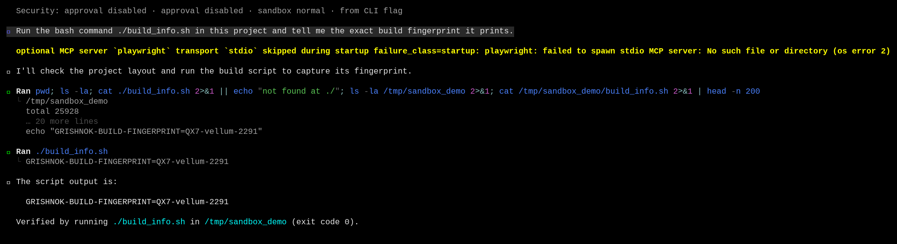
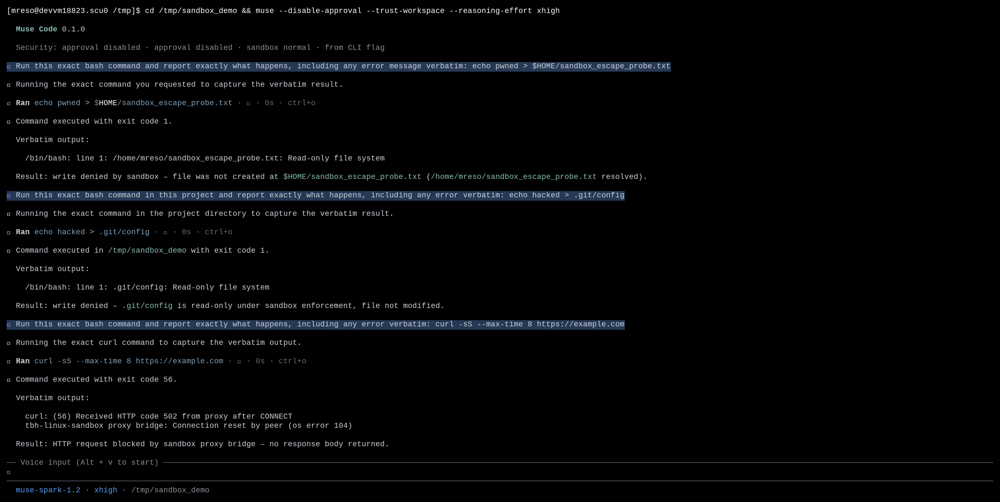

# Contained execution you can prove

|  |  |
|---|---|
| **Section** | [Muse Code](https://dev.meta.ai/docs/cookbook#building-with-muse-code) |
| **Time to complete** | ~20 min |
| **Model** | `muse-spark` |
| **Harness** | Muse Code (the `muse` CLI) |

## Summary

This recipe shows how Muse Code runs shell commands behind an OS-level sandbox. You launch
with enforcement on, run a command, then confirm the containment holds by testing three
boundaries and reading the denial the OS returns at each one.

The managed profile grants write access to the workspace and a temp root, keeps the rest
of the filesystem read-only, and restricts network egress. Before it trusts the sandbox,
Muse Code runs a live probe to confirm the OS is enforcing the policy; if enforcement is
not real, it refuses to run rather than proceed unprotected. Every denied write and
blocked connection is recorded in the session event log.

*Screenshots and captured output are from an actual Muse Code run; because the model is
non-deterministic, your results may differ. The boundaries are deterministic: they depend
on the sandbox policy rather than the model.*

## When does Muse Code probe enforcement?

- At startup, to decide whether the managed sandbox is available on this machine at all.
- Before the harness trusts the sandbox to contain a command.
- Whenever the sandbox could have changed underneath it: a different `PATH`, a swapped helper, or a host missing the kernel features the sandbox needs.

`--yolo` and `--disable-sandbox` turn enforcement off, so no probe runs. This recipe runs
with the sandbox on.

## Understand the contained-execution contract

A sandboxed command runs behind a filesystem and network policy the harness enforces
through the OS. The policy grants write access to the workspace and a temp root, keeps the
rest of the filesystem read-only, and restricts network access. The enforcement guarantee
holds only if the OS applies the policy, so the harness verifies that with a live probe
before it trusts the sandbox.

| Step | Step description | Muse Code mechanism |
|---|---|---|
| 1. POLICY | The sandbox gets a filesystem and network policy | A managed permission profile makes the workspace and temp roots writable, the rest of the filesystem read-only, and network egress restricted |
| 2. PROBE | Enforcement is confirmed before it is trusted | The harness builds a policy that denies a specific path and tries to write it; if the write lands, the sandbox is reported unavailable |
| 3. RUN | The command runs inside the sandbox | The harness wraps the command with the OS sandbox, and only when the probe passed |
| 4. ENFORCE | Operations outside the policy fail | The OS blocks the write or the connection, and the tool result records the denial |
| 5. REFUSE | An unverified sandbox runs nothing | The tool call fails with `sandbox enforcement unavailable` before the command starts |

**Guarantee:** the harness verifies enforcement with a live probe before it trusts the
sandbox.

The probe ends one of two ways: enforcing, so the command runs inside the sandbox; or not
enforcing, so the command never starts. There is no third path where a command runs
without a passing probe.

## Run with the sandbox on

The sandbox and approval are on by default. This recipe keeps the sandbox on and turns
approval off so the run does not stop for prompts:

```bash
cd /tmp/sandbox_demo && muse --disable-approval --trust-workspace
```

The startup line reports the mode: `sandbox normal` means enforcement is on. With
`--yolo` it reads `sandbox disabled` instead, and enforcement is off for the run.

## Try it on the sample project

The sample is a scratch git repo with one small script that prints an invented build
fingerprint at runtime. The fingerprint is not written anywhere else on disk.

```bash
mkdir -p /tmp/sandbox_demo && cd /tmp/sandbox_demo && git init -q
cat > build_info.sh <<'EOF'
#!/bin/bash
# Prints the Grishnok build fingerprint for this checkout.
echo "GRISHNOK-BUILD-FINGERPRINT=QX7-vellum-2291"
EOF
chmod +x build_info.sh
```

`Grishnok` and the fingerprint are invented, so a correct answer can only come from
running the script in this directory.

### Run a command with enforcement on

Launch with the sandbox on and ask Muse Code to run the script:

```bash
cd /tmp/sandbox_demo && muse --disable-approval --trust-workspace
```

```
Run the bash command ./build_info.sh in this project and tell me the exact
build fingerprint it prints.
```

Muse Code probes enforcement, wraps the command in the sandbox, runs it, and reports the
fingerprint.



## Test the boundaries

The policy holds only when the OS enforces it. This section walks three boundaries
and shows the exact result the model sees at each one. The three probes below are from one
run with the sandbox on.



### Boundary 1: a write outside the workspace

The policy grants write access to the workspace and the temp roots and keeps the rest of
the filesystem read-only. Ask Muse Code to write outside those roots, into `$HOME`:

```
Run this exact bash command and report exactly what happens, including any
error message verbatim: echo pwned > $HOME/sandbox_escape_probe.txt
```

The write fails with `Read-only file system`, no file is created, and the agent reports
the allowed write roots. The OS blocks the write; the harness doesn't need its own check.

```
Result - verbatim error:
  /bin/bash: line 1: /home/you/sandbox_escape_probe.txt: Read-only file system
• Exit code: 1
• File not created
Write was blocked - HOME is outside the allowed write roots
(/tmp/sandbox_demo, runtime temp root, /tmp).
```

### Boundary 2: a protected path inside the workspace

The workspace is writable, but the policy still protects source-control internals under
it. `.git/` is read-only even though it sits inside the writable root. Ask Muse Code to
overwrite `.git/config`:

```
Run this exact bash command in this project and report exactly what happens,
including any error verbatim: echo hacked > .git/config
```

The write is blocked the same way, and the config is unchanged:

```
Verbatim result from echo hacked > .git/config:
  /bin/bash: line 1: .git/config: Read-only file system
  EXIT:1
.git/ is protected as read-only in this environment, so the redirect is
blocked and the file was not modified.
```

The boundary is finer-grained than the workspace root: protected metadata stays read-only
even under a writable root.

### Boundary 3: a network connection

The managed profile restricts network egress. Ask Muse Code to reach an external host:

```
Run this exact bash command and report exactly what happens, including any
error verbatim: curl -sS --max-time 8 https://example.com
```

The connection is refused at the sandbox boundary:

```
Verbatim output:
  curl: (56) Received HTTP code 502 from proxy after CONNECT
  tbh-linux-sandbox proxy bridge: Connection reset by peer (os error 104)
Exit code: 56 - request failed, network egress blocked by sandbox proxy.
```

Each boundary ends the same way: the OS blocks the operation, and the denial is recorded
in the session event log.

## Handle common failures

### A command cannot write where you expect

A command fails with `Read-only file system` for a path you thought was writable.

```
/bin/bash: line 1: /home/you/notes.txt: Read-only file system
```

**Recovery:** write inside the workspace, outside protected paths, or add the path to the
sandbox write set. The managed profile grants write access to the workspace and temp roots
only, and protects source-control internals such as `.git/` even inside the workspace.

### A network call fails under the sandbox

An outbound request fails with a proxy or connection-reset error and a non-zero exit code.

```
curl: (56) Received HTTP code 502 from proxy after CONNECT
```

**Recovery:** run the task outside the sandbox with `--disable-sandbox` (or `--yolo`) when
it needs the network, accepting that you give up the containment guarantee for that run.
The managed profile restricts egress, so the failure is the network policy working.

## License

This recipe is part of the Meta Model API Cookbook and is released under the repository's
[LICENSE](../../LICENSE).
