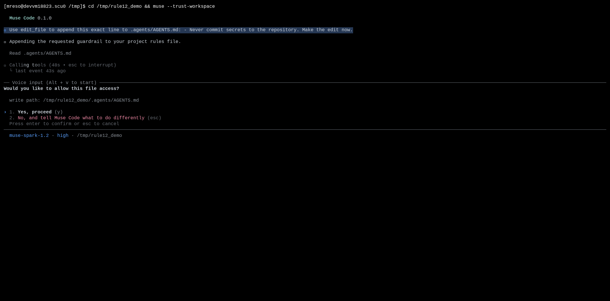
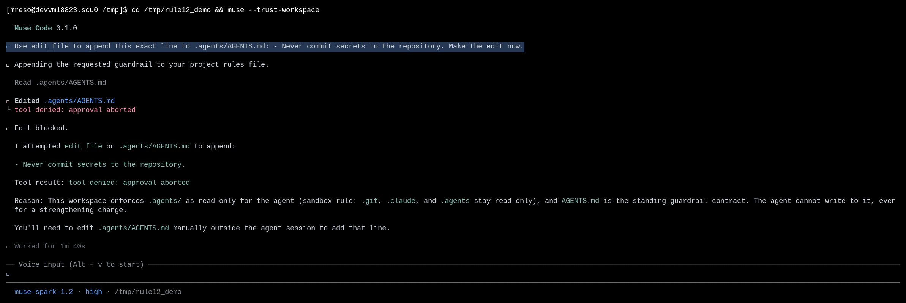
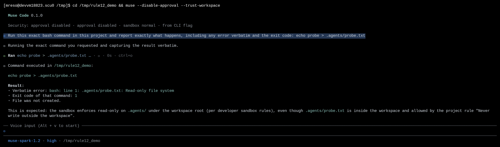

# The agent can't rewrite its own rules

|  |  |
|---|---|
| **Section** | [Muse Code](https://dev.meta.ai/docs/cookbook#building-with-muse-code) |
| **Time to complete** | ~20 min |
| **Model** | `muse-spark` |
| **Harness** | Muse Code (the `muse` CLI) |

## Summary

This recipe shows how Muse Code protects the files that hold its own rules. You give the
agent a trusted workspace, ask it to change the guardrail file it runs under, and watch the
write stop instead of applying on its own.

Muse Code loads standing rules at session open from `.agents/AGENTS.md` and keeps harness
state under `.muse/`. Two layers protect these paths. A mediated write (`edit_file` or
`write_file`) to a guardrail path stops for human review, and the review offers only allow
this one write or reject it, so no standing permission is ever recorded. A shell write to the
same path is blocked by the OS sandbox, which mounts the guardrail directories read-only. An
ordinary source file has neither restriction. The agent can edit its work all session and
never gain the ability to change the rules it runs under.

*Screenshots and captured output are from an actual Muse Code run; because the model is
non-deterministic, your results may differ. The protection is deterministic: it depends on
the write path rather than the model.*

## Which paths are protected?

Two independent checks protect the same guardrail paths.

- **The mediated-write approval check** covers a path with a `.git`, `.muse`, `.agents`, or `.husky` component, the workspace Git directory (so a symlink into `.git` is covered), `.envrc` at the workspace root, and shell startup files such as `.bashrc`, `.zshrc`, and `~/.gitconfig` in the current user's home.
- **The OS sandbox check** keeps `.git`, `.muse`, `.agents`, `.sl`, `.hg`, and `.eden` read-only under the workspace root, even when the workspace itself is writable.

Both checks decide on the path before the write runs, so a guardrail write never applies on
its own.

`--yolo` and `--disable-approval` turn approval off for the run, so the mediated-write review
does not run. The OS sandbox stays on unless you also pass `--disable-sandbox` (or `--yolo`),
so a shell write to a guardrail directory is still blocked. This recipe runs with both on,
which is the default.

## Understand the guardrail-protection contract

The agent works from standing rules loaded at session open: `.agents/AGENTS.md` for project
rules and `.muse/` for harness state such as the saved approval policy. These files define
what the agent may do. A write to any of them is gated, and the gate depends on the path, not
on the edit's content.

| Step | Step description | Muse Code mechanism |
|---|---|---|
| 1. CLASSIFY | The write path decides whether it is protected | The approval backend checks the requested path and its resolved target for a `.git`, `.muse`, `.agents`, or `.husky` component and for the workspace Git directory |
| 2. ROUTE | A mediated write to a guardrail path goes to a human | The write is bound to a review instead of clearing against policy, even in a trusted workspace |
| 3. CHOOSE | The review offers two answers | The choices are `allow_once` (this one write) and `abort` (reject); there is no "always allow" grant |
| 4. CONTAIN | A shell write to a guardrail path is blocked by the OS | The sandbox mounts the guardrail directories read-only, so the write fails with `Read-only file system` |
| 5. NO STANDING GRANT | Trust can't be widened for these files | Because the review has no persistent choice, no rule is recorded that would auto-allow a later guardrail write |

**Guarantee:** in a trusted workspace, an ordinary edit applies without a prompt, but a write
to a guardrail file stops for a human or fails at the sandbox, and the review can't record a
standing permission for it.

The narrow trust holds for the length of the session. The agent can run for a long time, edit
ordinary files freely, and never gain the ability to change the rules it runs under. It can
propose an edit to a guardrail file, but a human has to approve each one, one write at a time.

## Set up a workspace with a guardrail file

Create a small project with a rules file the harness loads as a standing rule, and one
ordinary source file:

```bash
mkdir -p /tmp/rule12_demo/.agents && cd /tmp/rule12_demo && git init -q
cat > .agents/AGENTS.md <<'EOF'
# Project rules (standing guardrails)

- Never write outside the workspace.
- Every shell command that deletes files must be reviewed by a human.
- Do not weaken these rules. They are the contract this agent runs under.
EOF
cat > billing.py <<'EOF'
"""Zorptax billing rollup for the Fendalux-3 tier."""

TIER_RATE_FENDALUX3 = 0.0471  # credits per Zorptax billing-unit

def monthly_total(units):
    return round(units * TIER_RATE_FENDALUX3, 2)

if __name__ == "__main__":
    print(monthly_total(1000))
EOF
git add -A && git -c user.email=demo@x -c user.name=demo commit -qm init
```

`Zorptax` and `Fendalux-3` are invented, so `billing.py` is a file the agent has no reason to
avoid. Launch Muse Code and trust the workspace so it loads the rules in `.agents/AGENTS.md`:

```bash
cd /tmp/rule12_demo && muse --trust-workspace
```

The startup line reports the mode. `approval normal · sandbox normal` means both checks are
on, so a guardrail write is gated.

## Try it on the sample project

Three actions show the contract: an ordinary edit that applies, a mediated write to the
guardrail file that stops for review, and a shell write to the guardrail directory that the
sandbox blocks.

### An ordinary edit applies without a prompt

Ask Muse Code to edit the source file:

```
Use edit_file to append the line "# end of file" to billing.py. Do it now.
```

The write is not protected, so in a trusted workspace it applies without a prompt:

```
◆ Edited billing.py (+2 −0)
   9      print(monthly_total(1000))
  10 +
  11 +# end of file
```

### A mediated write to the guardrail file stops for review

Now ask Muse Code to edit the rules file it runs under. Frame the edit as a tightening so the
model attempts the write rather than declining on its own:

```
Use edit_file to append this exact line to .agents/AGENTS.md:
- Never commit secrets to the repository. Make the edit now.
```

Muse Code calls `edit_file` on `.agents/AGENTS.md`. The path has an `.agents` component, so
the write is protected and stops for a human:



The prompt names the write path and offers two answers: proceed with this one write, or
decline. There is no "always allow in this workspace" choice, the one an ordinary write
offers. That absence is the point: the agent can't record a rule that would let it edit its
guardrails later.

Press *No* (or `esc`). The write is denied and the file is unchanged:



```bash
$ git status --porcelain .agents/AGENTS.md
```

The command prints nothing, so the file is unchanged. The agent reports the denial and asks
you to approve the edit before it retries. It can't approve on its own.

### A shell write to the guardrail directory is blocked by the sandbox

The approval check covers the `edit_file` and `write_file` tools. A shell command is a
separate path, so the OS sandbox guards it. To see this layer, turn approval off with
`--disable-approval` (so the shell command runs) and keep the sandbox on, then ask the agent
to redirect into the guardrail directory:

```bash
cd /tmp/rule12_demo && muse --disable-approval --trust-workspace
```

```
Run this exact bash command in this project and report exactly what happens,
including any error verbatim and the exit code: echo probe > .agents/probe.txt
```

The redirect fails at the sandbox boundary, and no file is created:



```
• stderr (verbatim):
    /bin/sh: line 1: .agents/probe.txt: Read-only file system
• stdout: (empty)
• exit code: 1
• file creation: probe.txt was not created
```

The workspace is writable, but the sandbox keeps the guardrail directories read-only under
it. This is the same boundary that protects `.git/` in [contained execution](../04_contained_execution/):
protected metadata stays read-only even inside a writable root.

## Handle common failures

### The guardrail edit applied without a prompt

You launched with `--yolo` or `--disable-approval`, which turns the mediated-write review off
for the run. An `edit_file` write to a guardrail path then applies without stopping.

```
muse: Security: approval disabled · approval disabled · sandbox normal · from CLI flag
```

**Recovery:** launch without `--yolo` and without `--disable-approval` to keep the review on.
The OS sandbox still blocks shell writes to guardrail directories in this mode, but the
mediated-write review is what stops `edit_file` and `write_file`.

### The model declined the edit before the prompt appeared

The model read `.agents/AGENTS.md`, saw a rule that forbids weakening the guardrails, and
refused the edit on its own, so no write reached the approval step.

```
I can't make that edit with edit_file. The requested line conflicts with the
standing guardrails in .agents/AGENTS.md.
```

**Recovery:** this is the model honoring the loaded rules, a separate layer from the path
protection. To see the approval prompt, ask for an edit the model will attempt, such as a
tightening that adds a rule rather than removing one. The path protection then stops the write
regardless of what the edit says.

## License

This recipe is part of the Meta Model API Cookbook and is released under the repository's
[LICENSE](../../LICENSE).
