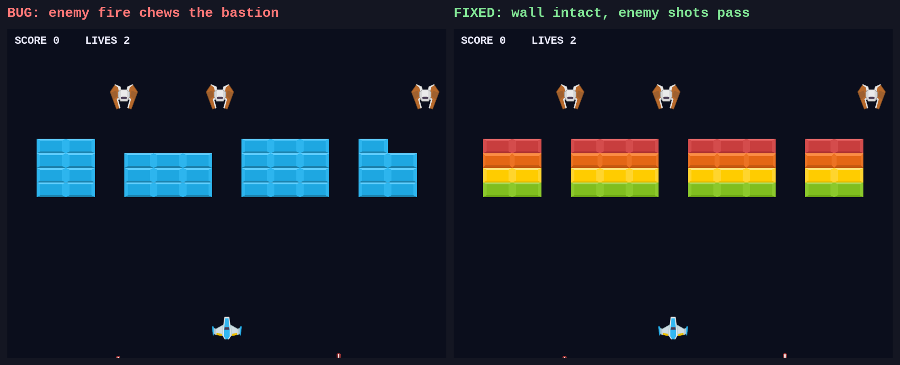
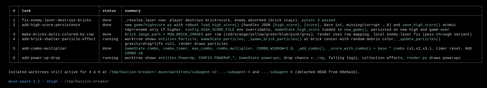
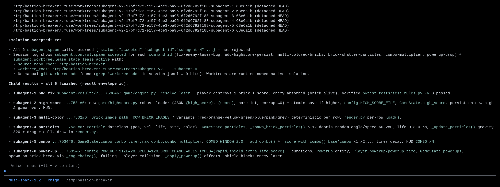
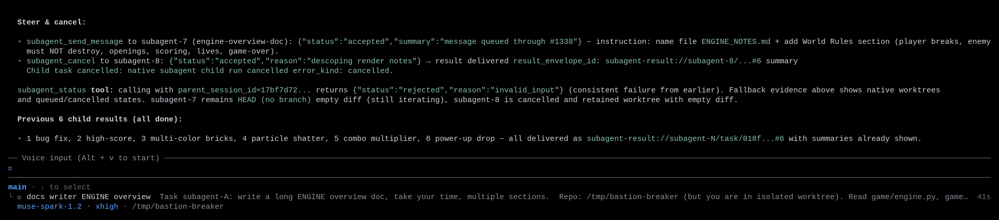
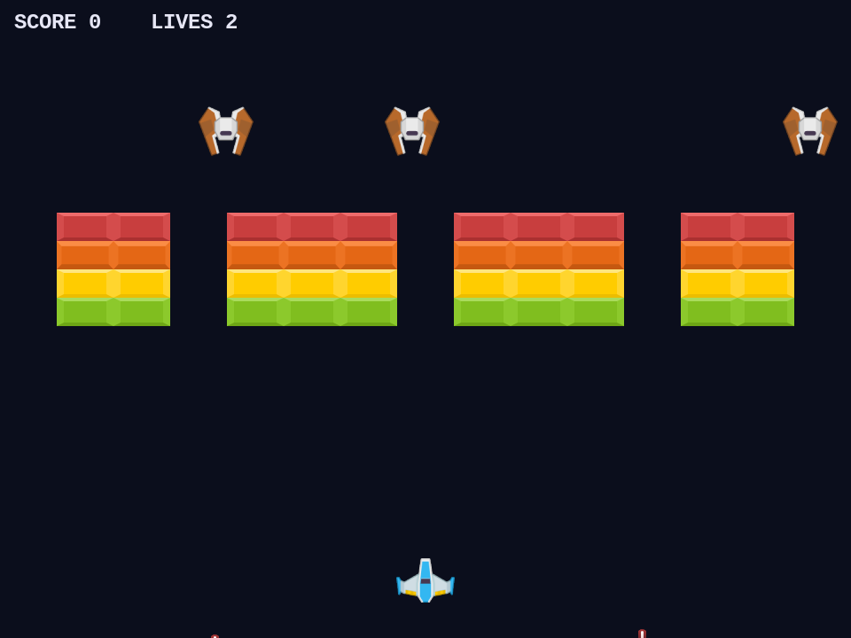

# Subagent fanout across isolated worktrees

|  |  |
|---|---|
| **Section** | [Muse Code](https://dev.meta.ai/docs/cookbook#building-with-muse-code) |
| **Time to complete** | ~25 min |
| **Model** | `muse-spark` |
| **Harness** | Muse Code (the `muse` CLI) |

## Summary

This recipe shows how Muse Code distributes one large job across several subagents that
run in parallel, each in its own isolated git worktree, and how you keep control of them
from a single control point. The parent agent spawns a write-capable child per task, gives
each child a private checkout of the repository, and then watches, steers, or stops any
child while the rest keep running. A subagent edits only its own worktree, so parallel
children never collide on the same files, and the parent tracks the full set. The session
event log records every spawn, every status change, and every control action, so you can
reconstruct which child did what, and when.

For demonstration we work with a sample project: Bastion Breaker, a small brick-out ×
space-invaders game. It ships with one planted rule bug and a list of features to add. We
distribute the bug fix and five features across six subagents at once, each in its own
worktree, and score every worktree with the same test suite.

*Screenshots and captured output are from an actual Muse Code run; because the model is
non-deterministic, your results may differ.*

## When do you distribute work across subagents?

- The job splits into several tasks that access overlapping files, and you want them worked in parallel without merge collisions mid-flight.
- Each task is bounded and independently verifiable (a fix, a feature, a doc), so a child can finish and report on its own.
- You want to manage the set of children while they run: check status, redirect one, cancel another.

Fanout fits work that splits into independent, parallel tasks. Sequential work, a single
edit, or a quick read-only question runs well on the main thread instead. Worktree
isolation is for write-capable children that would otherwise conflict on the same files.

## Understand the fanout contract

A fanout is a set of child agents spawned from one parent turn. Each write-capable child
gets its own git worktree checked out from the parent's repository at a base commit. The
parent tracks the set and can observe or interrupt any child. Children run up to a
concurrency limit that scales with host cores (roughly `cores - 2`, clamped to 4–8); extra
spawns queue and start as slots free.

The lead session drives the whole set from one place:

| Step | Step description | Muse Code mechanism |
|---|---|---|
| SPAWN | The parent starts one child per task | `subagent_spawn` takes a `role`, an `objective`, and `worktree_isolation: true` for a write-capable child |
| ISOLATE | Each child gets a private checkout | The runtime creates one git worktree per child from the parent's repository at a base commit |
| TRACK | The parent reads the whole set | `subagent_status` returns each child's state and task |
| STEER | The parent redirects a running child | `subagent_send_message` queues a message, or interrupts the child's current turn |
| STOP | The parent stops a child | `subagent_cancel` requests cooperative cancellation and records the reason |
| WAIT | The parent collects results | `subagent_wait` blocks up to a deadline and `subagent_read_result` reads a finished child; results also auto-deliver when the parent is idle |
| ADMIT | The parent spawns past the concurrency limit | The extra spawns queue in submission order and start as slots free |

**Isolation:** each child edits only its own worktree, the parent's repository is
untouched, and children never see each other's files.

Each child's worktree is a `git worktree`, so the child has the full history and can
commit without touching the parent's checkout. Children run at depth 1, so the parent owns
the full set directly. The parent's working copy never changes while the children run.
When a child finishes, its result drains back to the parent automatically once the
parent's turn is idle.

## Enable worktree-isolated subagents

A default launch doesn't apply worktree isolation. Pass the flag to enable it:

```bash
cd /path/to/your/repo         # must be a git repository
muse --subagent-worktree-isolation
```

## Try it on the sample project

The sample lives in [`bastion_breaker/`](bastion_breaker/). It is a playable game
with a pure-simulation core (`game/engine.py`, no pygame) so the rules are testable
without a window, and a thin pygame render layer on top.

```bash
cd bastion_breaker
pip install -r requirements.txt
SDL_VIDEODRIVER=dummy python3 -m pytest tests/ -q     # headless, no window
```

The world rule under test: the **player** breaks one brick per shot; the **enemies**
hide behind the brick bastion and must **not** break it. The sample ships with that
rule broken on purpose. `tests/test_rules.py` has three checks, and exactly one
fails on the shipped code:

```
tests/test_rules.py::test_player_shot_breaks_exactly_one_brick   PASSED
tests/test_rules.py::test_enemy_shot_does_not_destroy_bricks     FAILED
tests/test_rules.py::test_enemy_shot_through_opening_can_hit_player PASSED
```

The failure is visible on screen too: the enemy's own fire breaks holes in the
wall it is supposed to hide behind (left). The fixed build keeps the wall
intact and lets enemy shots pass through (right, also multi-colored from one of the
features):



### Spawn the fanout

Give the parent the whole batch in one prompt: fix the bug plus five features, each
its own subagent, each in its own worktree.

```
This repo (Bastion Breaker) is a brick-out x space-invaders game. World rule:
the player breaks bricks, but ENEMY lasers must NOT destroy bricks. There is a
bug where enemy lasers do destroy bricks (game/engine.py _resolve_laser). Fan
this work out to parallel subagents, each in its OWN isolated git worktree.
Spawn one write-capable subagent WITH worktree_isolation for EACH task:
(1) fix the enemy-laser-destroys-bricks bug, (2) add high-score persistence,
(3) make bricks multi-colored by row from assets/bricks/*.png, (4) add a
brick-shatter particle effect, (5) add a combo multiplier, (6) add a power-up
drop from a broken brick. Spawn all 6 now, then call subagent_status and show
me the full set.
```

The parent spawns six children. Up to the host concurrency limit run immediately, and any
beyond it are admitted, queue, and start as slots free. Each child gets its own worktree.
`subagent_status` returns the full set:



The isolation exists on disk. With `--subagent-worktree-isolation`, the runtime creates
each child's worktree under a repo-relative `.muse/worktrees/` directory in detached-HEAD
state, checked out from the parent's `HEAD`:

```
$ git worktree list
/home/.../bastion-breaker                                   e426b70 [master]
/home/.../bastion-breaker/.muse/worktrees/subagent-v2-…-subagent-1  e426b70 (detached HEAD)
/home/.../bastion-breaker/.muse/worktrees/subagent-v2-…-subagent-2  e426b70 (detached HEAD)
```

No manual `git worktree` command is used;
the runtime owns the worktree, its base commit, and its cleanup:



The child edits only inside its worktree. When it fixes the bug, the fix passes the
suite in that worktree while the parent's `master` still fails the bug test,
untouched:

```
# in the child's worktree
$ SDL_VIDEODRIVER=dummy python3 -m pytest tests/ -q
3 passed

# parent master, unchanged
$ SDL_VIDEODRIVER=dummy python3 -m pytest tests/test_rules.py::test_enemy_shot_does_not_destroy_bricks -q
1 failed
```

The lifecycle is visible in the event log: each worktree walks
`operation_requested → prepared → lease_active → workspace_scope_activated`, carrying
its `base_commit`, `base_ref: HEAD`, and `cleanup_policy: remove_if_clean`.

### Steer one child, stop another

While children run, manage them from the lead session. Redirect one child with
`subagent_send_message` and cancel another with `subagent_cancel`:

```
While they run, steer subagent-A: "After your loop, name the file
ENGINE_NOTES.md and add a 'World Rules' section." Then STOP subagent-B with
subagent_cancel, reason "descoping render notes". Then show subagent_status.
```

The steer is accepted and queued for the running child; the cancel is accepted and the
child moves to `closing`. The parent reports both outcomes and the updated states:



Two timing details matter here, and [Handle common failures](#handle-common-failures)
shows both. A **queued** steer only takes effect on the child's next turn, so a redirect
can arrive too late for a child that is about to finish. And `subagent_cancel` is
**cooperative**, so a child already writing its result may still finish that write.

### Read the results

When a child finishes, its result drains back to the parent automatically once the
parent's turn is idle, or you can block on one with `subagent_wait`. Each child
committed its work in its own worktree, so the parent can review or merge them one at a
time. Here is the multi-colored-bricks feature (task 3) running with the bug already
fixed in that same worktree:



## Handle common failures

### Spawn rejected because isolation is off

You spawn with `worktree_isolation: true` on a default launch and the spawn is
rejected:

```
Spawn rejected · isolation is off for this profile · Retry without
worktree_isolation, or enable native_subagent_worktree_isolation.
{"status":"rejected","reason":"worktree_isolation_unavailable",
 "cause":"isolation_not_enabled_in_profile"}
```

**Recovery:** launch with `muse --subagent-worktree-isolation` so native
isolation is available. If you cannot relaunch, the model can fall back to creating
the worktrees itself (`git worktree add -b taskN-branch ...`) and spawning
write-capable children pointed at those directories. That fallback preserves the
no-collision guarantee, but the worktree lifecycle is then yours to clean up
(`git worktree remove`), not the runtime's.

### A queued steer arrives too late

You `subagent_send_message` a running child in queue mode, but the child finishes
before its next turn, so the redirect never applies. In the recorded run, a child
told to rename its output file to `ENGINE_NOTES.md` had already produced
`NOTES_A.md`:

```
Outcome: accepted - message queued
Delivery mode: queue (non-interrupting steer)
```

**Recovery:** a queued message only takes effect on the child's next turn. To
change course on a child that is about to finish, set `interrupt` on
`subagent_send_message` so it preempts the current turn instead of waiting. Use a
queued steer for guidance that can wait; use an interrupt for a hard redirect.

### The cancel lands after the child finished

You `subagent_cancel` a child, but it has already reached `result_ready`, so the
cancel is a no-op that only records your reason:

```
{"kind":"cancel_outcome","subagent_id":"subagent-6",
 "outcome":"already_terminal","reason":"descoping power-ups for this batch"}
```

And because cancellation is **cooperative**, a child that is mid-write when the
cancel lands can still finish writing its file (in the recorded run, a canceled
documentation child still produced its notes).

**Recovery:** open `/subagents` before canceling to see whether the child is still
running. Treat cancel as "stop taking new work" rather than "undo what is done", and clean
up the child's worktree afterward if you don't want its output.

### Extra children do not start immediately

You spawn more children than the host concurrency limit and the extras do not start
immediately.

**Recovery:** wait for the queue to drain; this is admission control, not an error. Extra
spawns are admitted in submission order, queue, and start automatically as running
children finish. Watch them start in `/subagents`.

## Files in this recipe

```
06_subagent_fanout/
├── README.md
├── assets/
│   ├── 01_bug_vs_fixed.png          # planted bug vs fixed build
│   ├── 02_fanout_roster.png         # the six children, from subagent_status
│   ├── 02b_native_isolation.png     # runtime-owned worktrees (native isolation)
│   ├── 03_steer_and_stop.png        # queued steer + cancel
│   └── 04_multicolor_feature.png    # a finished feature running
└── bastion_breaker/                 # the sample game (ships with one planted bug)
    ├── README.md
    ├── requirements.txt
    ├── main.py                      # playable entry point
    ├── game/                        # engine (pure sim) + render + config
    ├── tools/render_frames.py       # headless frame renderer for screenshots
    ├── tests/test_rules.py          # objective oracle for the world rules
    └── assets/                      # CC0 sprites (see assets/CREDITS.md)
```

## License

This recipe is part of the Meta Model API Cookbook and is released under the repository's
[LICENSE](../../LICENSE). Game sprites are CC0 (Kenney); see
[`bastion_breaker/assets/CREDITS.md`](bastion_breaker/assets/CREDITS.md).
