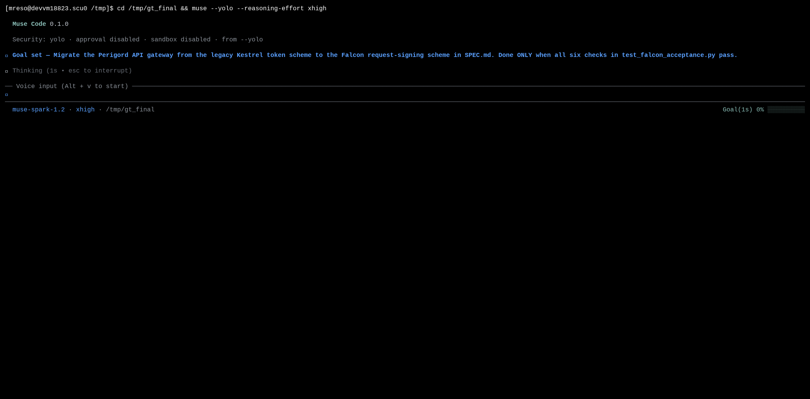
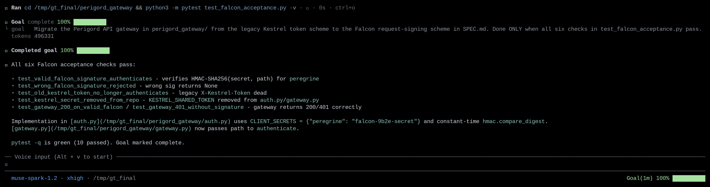

# Goal tracking with a pinned objective

|  |  |
|---|---|
| **Section** | [Muse Code](https://dev.meta.ai/docs/cookbook#building-with-muse-code) |
| **Time to complete** | ~20 min |
| **Model** | `muse-spark` |
| **Harness** | Muse Code (the `muse` CLI) |

## Summary

This recipe shows how Muse Code keeps an agent on a multi-step task until the task is
done. You pin the objective once with `/goal`, and from then on the harness carries it
for you. A status-line indicator tracks it, and a step probe prompts the agent back to
the objective when it drifts. A completion audit gates the call that marks the goal done,
so the agent runs the acceptance tests before it closes the goal.

*Screenshots and captured output are from an actual Muse Code run; because the model is
non-deterministic, your results may differ.*

## When do you pin a goal?

- The task takes several turns and you can name the end state before it starts.
- The finish line is checkable: a command that has to exit clean, or a test suite that has to pass.
- You want the objective to survive across turns without restating it in every prompt.

A one-step task doesn't need a goal. Pin one when the work is long enough that the agent
could drift, or finish part of it and stop.

## Understand the goal-tracking contract

A goal is a durable objective plus a check on completion. You state it once, the harness
keeps it in front of the agent, and the work is measured against it before the goal can
close.

| Step | Step description | Muse Code mechanism |
|---|---|---|
| 1. DECLARE | State the objective and its acceptance checks | `/goal <objective>` stores the objective for the session |
| 2. TRACK | The session shows progress against the objective | A `Goal(…)` indicator in the status line follows it |
| 3. DRIVE | The objective persists across turns until it is met | Every ~10 model calls that report no progress, a step probe queues a "Continue working toward the active session goal" note |
| 4. VERIFY | The agent proves completion against the current state | That note tells it to check requirement by requirement: files, command output, test results |
| 5. CLOSE | The objective is marked done | The completion audit gates `update_goal` |

**Rule:** the goal closes only when every deliverable you asked for is present.

## Declare a goal

Pin the objective with `/goal` at the start of the session, before the first prompt that
does any work.

```bash
cd perigord_gateway
muse --yolo
```

```
/goal Migrate the Perigord API gateway from the legacy Kestrel token scheme to the
Falcon request-signing scheme in SPEC.md. Done ONLY when all six checks in
test_falcon_acceptance.py pass.
```



## Try it on the sample project

The sample is a tiny Python service, `perigord_gateway/`, that starts with passing unit
tests on an invented auth scheme. Today it authenticates every caller with the
**Kestrel** static-token scheme: a shared `X-Kestrel-Token` header. The task is to
migrate it to the **Falcon** request-signing scheme in `SPEC.md`: an HMAC-SHA256
signature over the request path, for the registered client `peregrine`. `Kestrel`,
`Falcon`, `peregrine`, and the secret are invented, so a correct answer can only come
from the spec.

The finish line is unambiguous. `test_falcon_acceptance.py` holds six checks, and the goal
is done only when every one passes:

```bash
cd perigord_gateway
python3 -m pytest -q test_gateway.py            # 4 passed  — legacy Kestrel unit tests
python3 -m pytest -q test_falcon_acceptance.py  # 5 failed  — the migration target
```

### Drive the goal to completion

With the goal declared, keep the turn moving and Muse Code carries the objective forward
on its own. Each time the step probe splices in the continue-note, the TUI shows it as a
one-line `goal reminded` row. The agent implements the Falcon signature check, updates
the gateway, removes the Kestrel token and its shared secret, and runs the acceptance
tests.

It marks the goal complete only after the tests pass:



The completion audit is why the agent runs the tests before calling `update_goal`.

## Handle common failures

### The agent marks the goal complete too early

`update_goal` fires with `status: "complete"` while the acceptance tests are still red.

**Recovery:** name the oracle in the objective. The sample's goal says "done ONLY when all
six checks in test_falcon_acceptance.py pass"; that phrasing points the completion audit at
a concrete, checkable target. A goal whose finish line is a command or a test is much
harder to close prematurely.

## Files in this recipe

```
07_goal_tracking/
├── README.md                       ← this recipe
├── perigord_gateway/               ← sample project (starts green on the Kestrel scheme)
│   ├── auth.py                     ← Kestrel static-token auth (the thing being migrated)
│   ├── gateway.py                  ← request handler
│   ├── SPEC.md                     ← the Falcon target + the six acceptance checks
│   ├── test_gateway.py             ← legacy Kestrel unit tests (green at start)
│   └── test_falcon_acceptance.py   ← the objective oracle (red until the migration lands)
└── assets/                         ← Muse Code run screenshots referenced above
    ├── 01_goal_declared.png
    └── 02_goal_driven_to_done.png
```

## License

This recipe is part of the Meta Model API Cookbook and is released under the repository's
[LICENSE](../../LICENSE).
