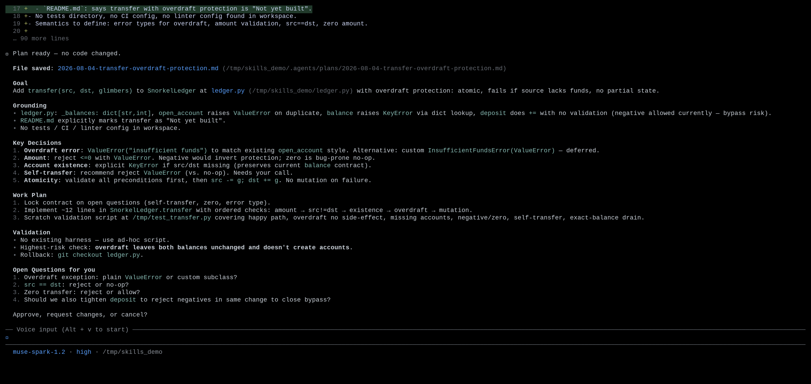
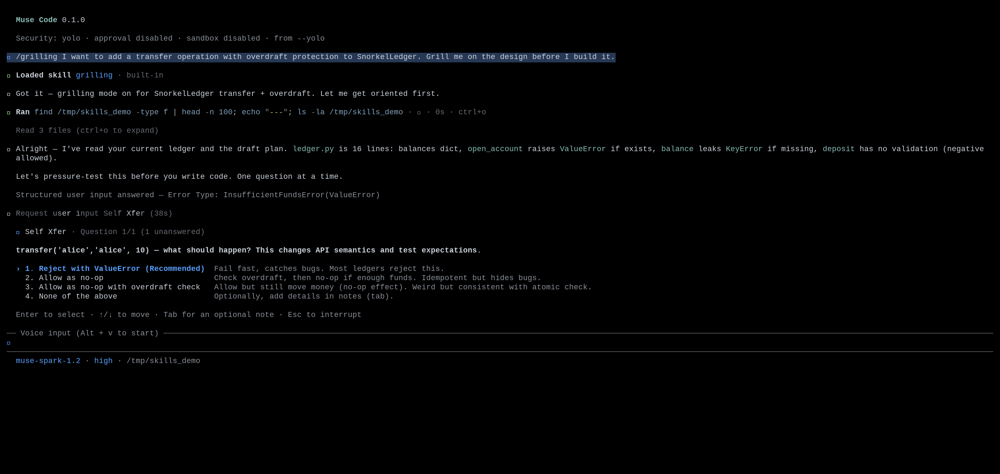
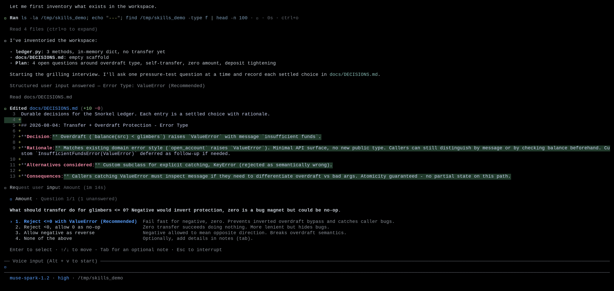
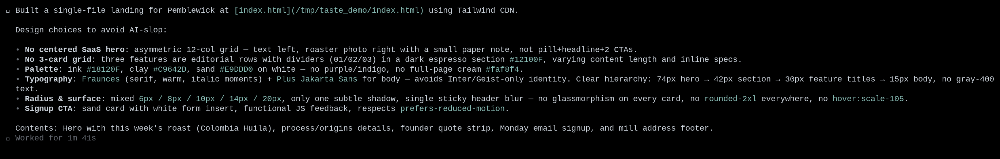
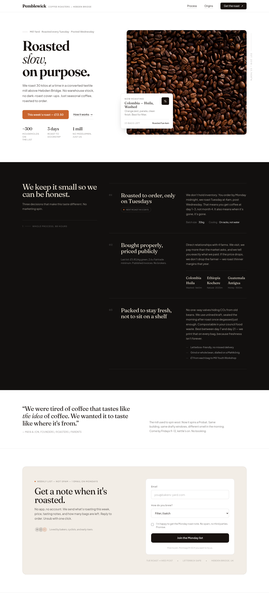

# Bundled skills: plan, pressure-test, and build

|  |  |
|---|---|
| **Section** | [Muse Code](https://dev.meta.ai/docs/cookbook#building-with-muse-code) |
| **Time to complete** | ~25 min |
| **Model** | `muse-spark` |
| **Harness** | Muse Code (the `muse` CLI) |

## Summary

Muse Code ships with a small set of opinionated, trusted playbooks built in. This recipe
drives four of them end to end: `/plan`, `/grilling`, `/grill-with-docs`, and `/taste`.
All four are on by default, so a rough one-sentence idea has a path through planning,
pressure-testing, and implementation.

All four load their full instructions only for the turn you invoke them on. The TUI marks
the moment with a `Loaded skill <name> · built-in` line, so you can see exactly which turn
a skill shaped.

*Screenshots and captured output are from an actual Muse Code run; because the model is
non-deterministic, your results may differ.*

## Compare the four skills

Every skill here is a first-party skill in the `muse-core` plugin, enabled by default. Run
`muse skills list` and each one shows up as `built-in`.

| Skill | Invoke with | What it does | Stops to ask you? |
|---|---|---|---|
| `plan` | `/plan` | Grounds a plan in your files, names the key decisions, and stops for approval. | Yes, at the end |
| `grilling` | `/grilling` | Interviews you one decision-forcing question at a time until the design is sharp. | Yes, every question |
| `grill-with-docs` | `/grill-with-docs` | Same interview, plus it writes settled decisions into your project docs. | Yes, every question |
| `taste` | `/taste` | A flat checklist of visual defaults to avoid, so generated UI stops looking AI-made. | No |

Each one is explicit-invocation only. Muse Code doesn't run `/plan` because a task looks
complex, or `/grilling` because a request is underspecified. You ask, and the skill runs.
That boundary is written into each skill's own description, so an ordinary "implement
this" request stays an ordinary implementation.

## When do you use each one?

- **`/plan`** when the work has decisions to make before code: an API to design, a
  migration to sequence, a PR to split. You want the approach and the tradeoffs settled
  before anyone writes a line.
- **`/grilling`** when you have a rough idea and want it pressure-tested. The skill plays
  the skeptic, one question at a time, so the assumptions that would cause problems later
  surface now.
- **`/grill-with-docs`** when that interview produces decisions worth keeping. The answers
  become durable project knowledge instead of chat scrollback that disappears.
- **`/taste`** when you are generating a UI and you don't want the purple gradient,
  centered hero, three-card grid look that reads as AI-made.

## Understand the bundled-skill contract

All four follow the same loading path. A slash shortcut invokes one skill for one turn;
the harness loads that skill's full instructions and applies them to the current turn only.

| Step | Step description | Muse Code mechanism |
|---|---|---|
| 1. CATALOG | Every skill is available without costing context | At session open, skills load as summaries only |
| 2. INVOKE | Name the skill you want | The slash shortcut is `/plan`, `/grilling`, `/grill-with-docs`, or `/taste` |
| 3. LOAD | The full instructions arrive for this turn | The `read_skill` tool pulls the skill's `SKILL.md` |
| 4. APPLY | The skill shapes the turn you invoked it on | The instructions scope to the current user turn |

**Boundary:** a skill runs on explicit invocation only, loads its full body only on demand,
and applies to that turn rather than the whole session.

At session open the harness loads only skill *summaries*, so the context stays small. When
you invoke one, the `read_skill` tool pulls the full `SKILL.md` and the model applies it to
that turn. The TUI marks the moment with a `Loaded skill <name> · built-in` line.

## Try it on the sample project

The sample is a scratch project with invented domain terms. Create it and run Muse Code
against it:

```bash
mkdir -p /tmp/skills_demo && cd /tmp/skills_demo && git init -q
cat > README.md <<'EOF'
# Snorkel Ledger

A tiny in-memory ledger for **Glimber** tokens. A Glimber is a unit of reservation
credit. The ledger tracks balances per account and lets you transfer Glimbers between
accounts.

Not yet built: a `transfer` operation with overdraft protection.
EOF
cat > ledger.py <<'EOF'
"""Snorkel Ledger: an in-memory ledger for Glimber tokens."""

class SnorkelLedger:
    def __init__(self):
        self._balances: dict[str, int] = {}

    def open_account(self, name: str, opening_glimbers: int = 0) -> None:
        if name in self._balances:
            raise ValueError(f"account {name!r} already exists")
        self._balances[name] = opening_glimbers

    def balance(self, name: str) -> int:
        return self._balances[name]

    def deposit(self, name: str, glimbers: int) -> None:
        self._balances[name] += glimbers
EOF
git add -A && git commit -q -m "seed snorkel ledger"
```

`Glimber` and `SnorkelLedger` are invented, so a correct answer can only come from these
files.

### `/plan`: a grounded plan that stops for approval

Launch Muse Code and ask it to plan the missing feature:

```bash
cd /tmp/skills_demo && muse --yolo
```

```
/plan Add a transfer(src, dst, glimbers) operation to SnorkelLedger with overdraft
protection. Plan it, do not implement yet.
```

Muse Code loads the `plan` skill and reads `ledger.py` and the git log to ground itself.
It then writes a decision-complete plan: goal, success criteria, the key decisions with a
recommended choice for each, an ordered work plan, and a validation plan. It saves the
plan to `.agents/plans/` and stops with `Approve, request changes, or cancel?`. No code
changed.



Notice what the plan caught by reading the code: `deposit` does no amount validation, so a
negative transfer would bypass overdraft protection. A plan should surface that kind of
decision before you build.

### `/grilling`: one decision-forcing question at a time

Use `/grilling` when you want your own idea interrogated rather than a finished plan
written for you. Start a fresh session and invoke it:

```bash
cd /tmp/skills_demo && muse --yolo
```

```
/grilling I want to add a transfer operation with overdraft protection to
SnorkelLedger. Grill me on the design before I build it.
```

The skill inspects the workspace, then asks exactly one question. Because the answer fits
a few mutually exclusive choices, it uses a structured prompt with the recommended option
first:



Answer it and the interview continues to the next hard edge. The questions present
tradeoffs rather than open-ended prompts, and they are grounded in your code. One of
them flags the same negative-amount overdraft bypass, because the skill read `deposit`
before asking. The interview continues until goals, non-goals, constraints, risks, and
validation criteria are clear, and the skill doesn't start implementing until you leave
the flow.

### `/grill-with-docs`: the same interview, written down

Decisions from `/grilling` live only in the transcript. Use `/grill-with-docs` when they
are worth keeping. Give the project a home for durable decisions first:

```bash
cd /tmp/skills_demo && mkdir -p docs
cat > docs/DECISIONS.md <<'EOF'
# Design Decisions

Durable decisions for the Snorkel Ledger. Each entry is a settled choice with rationale.
EOF
git add -A && git commit -q -m "add docs skeleton"
```

Then run the interview and tell it where the answers should land:

```bash
cd /tmp/skills_demo && muse --yolo
```

```
/grill-with-docs Pressure-test the transfer + overdraft design for SnorkelLedger, and
record the settled decisions in docs/DECISIONS.md as we go.
```

It asks the same style of one-at-a-time question. The difference shows up after you
answer: it reads `docs/DECISIONS.md` and writes a structured decision record covering the
decision, the rationale, and the alternatives it rejected, then keeps interviewing.



When you are done, the durable knowledge is on disk rather than in the chat:

```bash
cat /tmp/skills_demo/docs/DECISIONS.md
```

```markdown
### D1: Overdraft error type
- **Decision:** `transfer()` raises `ValueError` when src balance < amount.
- **Rationale:** Matches existing `open_account` duplicate check using `ValueError` for
  business-rule violations. Keeps API minimal, no new export.
- **Rejected:** Custom `InsufficientFundsError(ValueError)` — deferred as future
  follow-up if API grows; `RuntimeError` — inconsistent.
```

The skill only writes answers you settled or facts it verified from the workspace. It
doesn't invent architecture or file speculative tasks.

### `/taste`: UI that doesn't look AI-made

The last skill is a filter rather than an interview. `/taste` is a flat list of visual
defaults to avoid: the purple-to-blue hero gradient, the centered
eyebrow-headline-two-buttons hero, the identical three-card feature grid, Inter
everywhere, `rounded-2xl` on every element. Stacking those is what reads as machine-made.

Try it on a small landing page. Run Muse Code in a fresh project with a design brief:

```bash
mkdir -p /tmp/taste_demo && cd /tmp/taste_demo && git init -q
cat > README.md <<'EOF'
# Pemblewick Coffee — landing page

A single-page marketing site for Pemblewick, a small-batch coffee roaster.
One index.html (Tailwind via CDN is fine). Hero, three features, a sign-up CTA.
EOF
git add -A && git commit -q -m "seed taste demo"
cd /tmp/taste_demo && muse --yolo
```

```
/taste Build index.html for the Pemblewick Coffee landing page from the README. Apply
good design taste.
```

Muse Code builds the page and, as it finishes, reports which defaults it avoided and what
it chose instead. It uses an asymmetric grid in place of a centered hero, editorial
numbered rows in place of a three-card grid, a warm espresso-and-clay palette in place of
purple, and a type hierarchy in place of one weight of gray body text.



Open the result in a browser and the difference is visible. The page reads as something a
person would plausibly design:



`/taste` never prescribes a specific look. It only removes the defaults that mark a page
as machine-generated. An explicit request from you or from another skill overrides the
checklist, which supplies defaults rather than rules.

## Handle common failures

### The skill does not fire on an ordinary request

You ask Muse Code to "implement transfer" and expect it to plan first, but it writes the
code.

**Recovery:** ask for the plan explicitly: `/plan`, or "plan this before you build it."
Every bundled skill here is explicit-invocation only, and `plan` in particular says not to
plan ordinary implement, fix, or refactor requests. Task complexity alone is not a
trigger.

### `/grilling` asks in prose instead of structured choices

You expect the tappable multiple-choice prompt and instead get a plain chat question.

**Recovery:** answer in prose and the interview continues. The structured prompt
(`request_user_input`) is used only when the answer fits two or three short, mutually
exclusive choices. When the question needs a long or free-form answer, or when the host
doesn't expose the structured input, the skill deliberately falls back to a chat question.

### `/grill-with-docs` has nowhere to write

The skill runs the interview but does not know where durable decisions should live, and
asks you.

**Recovery:** name an existing convention (a decisions log, an ADR directory, a glossary,
or a spec), either in your prompt ("record decisions in `docs/DECISIONS.md`") or when the
skill asks. It won't invent a documentation destination on its own. Once you name one, it
writes settled answers there as the interview proceeds.

### `/taste` produced something that ignores your brand

You had a specific look in mind and the page does not match it.

**Recovery:** put your brand, palette, or reference in the prompt or an `AGENTS.md`.
`/taste` only removes defaults and doesn't impose a style, so it defers to an explicit
style request. The checklist applies only when nothing else is specified.

## License

This recipe is part of the Meta Model API Cookbook and is released under the repository's
[LICENSE](../../LICENSE).
