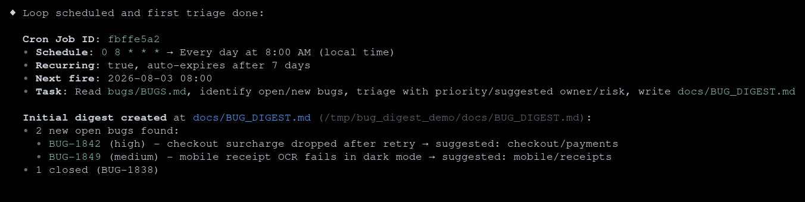
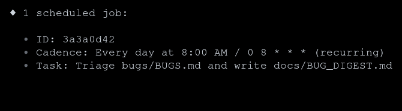
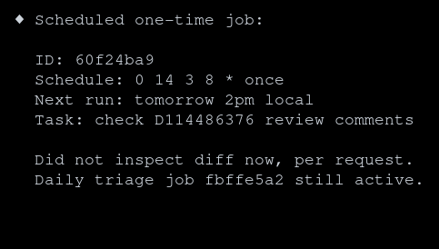

# Schedule Recurring and One-Time Work with Muse Code

|  |  |
|---|---|
| **Section** | [Muse Code](https://dev.meta.ai/docs/cookbook#building-with-muse-code) |
| **Time to complete** | ~20 min |
| **Model** | `muse-spark` |
| **Harness** | Muse Code (the `muse` CLI) |

## Summary

Use Muse Code scheduling for work that should run again in the same session, such as a daily bug digest or a delayed review check. Describe the cadence in natural language, inspect the stored job, and cancel it from the conversation.

This recipe creates a daily bug-triage job and a one-time review reminder. The screenshots come from Muse Code 0.1.0 (`0.1.0-R395.1`) running against the sample project below.

## Build The Sample Project

Create a bug queue that Muse Code can read and summarize:

```bash
mkdir -p /tmp/bug_digest_demo/bugs /tmp/bug_digest_demo/docs

cat > /tmp/bug_digest_demo/bugs/BUGS.md <<'EOF'
# Bug queue

## BUG-1842

- Status: open
- Owner: unassigned
- Summary: Checkout total drops the regional surcharge after retry.

## BUG-1849

- Status: open
- Owner: unassigned
- Summary: Mobile receipt screenshot fails OCR in dark mode.

## BUG-1838

- Status: closed
- Owner: identity
- Summary: Profile rename leaves a stale cache entry.
EOF

cd /tmp/bug_digest_demo
muse
```

Muse Code asks whether you trust the workspace on the first run. Trust this sample because you created its contents. Keep the default approval and sandbox settings enabled.

## Schedule The Morning Digest

Enter this command in Muse Code:

```text
/loop every morning at 8am, triage new bugs from bugs/BUGS.md and post a digest to docs/BUG_DIGEST.md
```

`/loop` asks the model to translate the natural-language cadence into a five-field cron expression. In the captured run, Muse Code created `0 8 * * *` and stored a recurring job. The model also ran the first triage in the scheduling turn.



The job ID in your session will differ from the screenshot. Keep the ID because cancellation uses it.

## Check The Result

A named-time job can wait for its first scheduled boundary. When you need the digest immediately, ask Muse Code to run the stored task once without creating another job:

```text
Run the scheduled bug-triage task once now. Do not create another scheduled job.
```

An immediate or scheduled run writes `docs/BUG_DIGEST.md`. Check the file from another terminal:

```bash
test -f /tmp/bug_digest_demo/docs/BUG_DIGEST.md
sed -n '1,40p' /tmp/bug_digest_demo/docs/BUG_DIGEST.md
```

The captured digest contained both open bugs, assigned priorities, suggested owning areas, and kept the closed bug in a separate summary.

## List Scheduled Work

Ask for the stored job rather than relying on conversation history:

```text
List my scheduled jobs. Show only each ID, cadence, and task. Do not calculate or display timestamps.
```



The underlying job record also contains the next eligible fire time, the last fire time, and a fire count. Ask for those fields when you are diagnosing a missed or late run.

## Understand Timing And Lifetime

Scheduled work has these runtime rules:

- **Local time**: cron expressions use the machine's current local timezone.
- **Approximate fire time**: `8:00 AM` is the base cron match. Recurring jobs use deterministic forward jitter, capped at 30 minutes, so the eligible fire time can be later.
- **Running process**: Muse Code must be running for a job to fire at its scheduled time.
- **Session scope**: jobs belong to the session that created them. Resume that session to restore its scheduler; a new session has a separate job list.
- **Bounded recovery**: missed recurring intervals produce at most one catch-up run after the session resumes. A missed one-time job is delivered once after recovery.
- **Seven-day lifetime**: recurring jobs expire seven days after creation. Recreate a job before expiry when you need it for longer.

These jobs are useful for short-lived automation in an active Muse Code session. Use external scheduling infrastructure for work that must run with the terminal closed or continue indefinitely.

## Schedule One-Time Work

For a delayed action, state that the job should run once. Also tell Muse Code not to perform the task during the scheduling turn:

```text
Schedule a one-time job for tomorrow at 2pm local time to check whether D114486376 has review comments and summarize them. Do not inspect the diff now. Only create the scheduled job and report its ID and schedule.
```

Muse Code stores the date and time as a non-recurring cron job:



A one-time job deletes itself after its scheduled prompt is accepted for delivery.

## Cancel Or Replace A Job

Cancel a job by its ID, then verify the job list:

```text
Cancel scheduled job 3a3a0d42, then list scheduled jobs to confirm none remain.
```

Muse Code provides create, list, and delete operations for scheduled jobs. To change a cadence or prompt, cancel the old job and create a replacement. Use the ID from your own session, not the example ID.

## Common Failure Modes

### The Job Did Not Run At The Displayed Minute

Confirm that Muse Code was running, inspect the stored next-fire time, and account for recurring-job jitter. Also check the machine's local timezone.

```text
List my scheduled jobs with each cron expression and next eligible fire time.
```

### The Job Is Missing

Resume the session that created the job. A different session has a separate schedule. Recurring jobs also expire after seven days.

### The Stored Task Is Wrong

List the job and inspect its prompt. Cancel it by ID and create a replacement with the corrected task and cadence.

### The Task Must Run While Muse Code Is Closed

Use a system or hosted scheduler instead. Muse Code persists session-scoped job definitions, but its scheduler does not execute while the Muse Code process is stopped.
