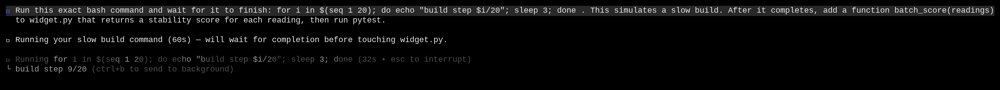
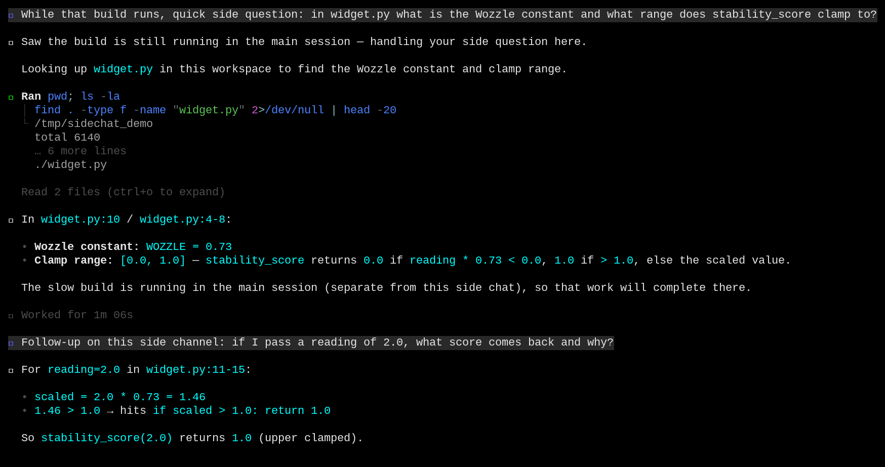
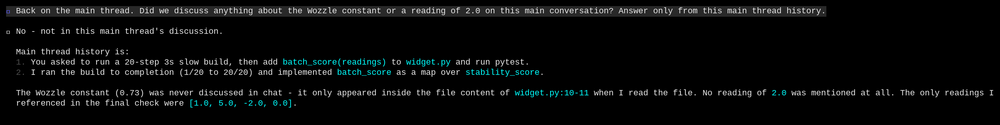

# Multi-turn side chats

|  |  |
|---|---|
| **Section** | [Muse Code](https://dev.meta.ai/docs/cookbook#building-with-muse-code) |
| **Time to complete** | ~15 min |
| **Model** | `muse-spark` |
| **Harness** | Muse Code (the `muse` CLI) |

## Summary

This recipe shows how Muse Code runs *side chats*: a branch off the main conversation
where you ask questions and keep talking, without adding to the main thread's history.
The common case is asking something while the main agent is busy on a long task: you open
a side chat, hold a multi-turn conversation in it, and return while the main run keeps
going. `/btw` is an alias of `/side`, so it opens the same multi-turn side chat. A side
chat reads the main thread but doesn't write back to it, and the main thread never sees
what happened in the side chat. The session event log records the side session as its own
stream.

*Screenshots and captured output are from an actual Muse Code run; because the model is
non-deterministic, your results may differ.*

## When do you open a side chat?

- The main agent is busy on a long task and you want to ask something now, without interrupting the run.
- You have a question about the current work but you don't want it in the main transcript: a definition, a "why", a quick what-if.
- You want to explore a tangent and then drop it, leaving the main thread clean for the task you were running.

Side chats are scoped to investigation and explanation. Produce work you want kept on the
main transcript, and run orchestration such as subagents and workflows, on the main thread
(see [Handle common failures](#handle-common-failures)).

## Understand the side-chat contract

A side chat is a branch session seeded from the main thread at a cut point. It inherits
the main history as read-only reference, gets its own session stream, and runs as many
turns as you type. The main run keeps going independently, and returning to the main
thread restores it exactly as you left it.

| Step | Step description | Muse Code mechanism |
|---|---|---|
| 1. CUT | The main thread is pinned where you left it | A cursor snapshots the thread at a turn boundary |
| 2. SEED | The side chat starts with the main history | The history is inherited as reference-only context, along with the id of the session it came from |
| 3. BOUNDARY | The side chat marks where its own instructions begin | Everything after the marker is active; everything before it is reference |
| 4. CONVERSE | Run as many turns as you want | Each turn runs in the side lane, on the side session's own stream |
| 5. RETURN | Go back to the main thread | Ctrl+C restores the saved main transcript and run state, unchanged |

**Isolation:** the side chat reads the main thread, the main thread never sees the side
chat, and the main run keeps going. The side lane stays scoped to investigation: no
subagents, no workflows, and mutation only when you ask for it.

Everything after the boundary is an active side-chat instruction. Everything before it,
the whole main thread, is reference the model can cite but not continue. The model is told
so at the top of the side session. When you return, the main thread has no record that the
side chat happened.

`/btw` is registered as an alias of `/side`, so both open the same side chat. The only
difference is a diagnostic tag on the trace (`command_origin: "btw"` versus `"side"`). Use
whichever name you prefer; the behavior is identical.

## Try it on the sample project

The sample is a scratch directory with one small module built around invented terms.

```bash
mkdir -p /tmp/sidechat_demo && cd /tmp/sidechat_demo
cat > widget.py <<'EOF'
"""Frobnicator widget: computes a stability score for a Quibbex reading."""

def stability_score(reading: float) -> float:
    """Return the Frobnicator stability score for a Quibbex sensor reading.

    The score is the reading scaled by the Wozzle constant (0.73) and clamped
    to the range [0.0, 1.0].
    """
    WOZZLE = 0.73
    scaled = reading * WOZZLE
    if scaled < 0.0:
        return 0.0
    if scaled > 1.0:
        return 1.0
    return scaled
EOF
cat > test_widget.py <<'EOF'
from widget import stability_score

def test_midrange():
    assert abs(stability_score(1.0) - 0.73) < 1e-9

def test_clamped_high():
    assert stability_score(5.0) == 1.0

def test_clamped_low():
    assert stability_score(-2.0) == 0.0
EOF
```

`Frobnicator`, `Quibbex`, and `Wozzle` are invented, so a correct answer can only come
from this file.

### Start a long task on the main thread

Launch Muse Code and give it work that takes a while, so the main agent is busy
when you open the side chat:

```bash
cd /tmp/sidechat_demo && muse --yolo
```

```
Run this exact bash command and wait for it to finish: for i in $(seq 1 20);
do echo "build step $i/20"; sleep 3; done . This simulates a slow build. After
it completes, add a function batch_score(readings) to widget.py that returns a
stability score for each reading, then run pytest.
```

Muse Code starts the ~60-second build. The working line shows it counting steps, and the
input box stays open while it runs.



### Ask on the side channel while it works

Do not wait for the build. Type `/side` with your question. The side chat opens, answers,
and you keep going with a follow-up, all while the build runs in the main session:

```
/side While that build runs, quick side question: in widget.py what is the
Wozzle constant and what range does stability_score clamp to?
```

```
Follow-up on this side channel: if I pass a reading of 2.0, what score comes
back and why?
```

The side chat reads `widget.py`, answers both turns, and notes on its own that "the slow
build is running in the main session (separate from this side chat)." Both turns run in
the side chat, and the main run never pauses. The footer reads `Side chat: dee2c9e1 ·
Ctrl+C to return · source running` while the build is still going.



### Return to the main thread, isolated

Press Ctrl+C to return. The main task finished on its own while you were in the side chat:
the build ran to completion, `batch_score` landed in `widget.py`, and pytest passed. Ask
the main thread whether it knows anything you discussed on the side:

```
Back on the main thread. Did we discuss anything about the Wozzle constant or
a reading of 2.0 on this main conversation? Answer only from this main thread
history.
```

The model answers no, and lists only what the main thread did: run the build and
add `batch_score`. The Wozzle discussion happened in the side chat, and the main thread
has no record of it.



## Handle common failures

### A side chat declines to spawn a subagent

You ask the side chat to spawn a subagent or run a workflow, and it declines:

```
I can't spawn a subagent in this side chat — agent/subagent and workflow use
are off-limits here, and side chats default to non-mutating.
```

**Recovery:** return to the main thread with Ctrl+C and start the subagent there, or ask
the side chat for the exact change and make a minimal local edit. Side chats are scoped to
investigation and explanation, so orchestration is denied at the policy layer (`side chat
cannot start subagents or workflows`).

### The main thread has no record of the side chat

You discuss something in a side chat, return, and ask the main thread about it. It has no
record.

**Recovery:** produce the result on the main thread when you want it in the main
transcript. The side chat inherits the main thread as reference, but the main thread never
sees the side chat; that is the isolation guarantee working.

### Side chat refused because the source log is not retained

You start a new session, start a task, and immediately try `/side` before the
session log is on disk. The command is refused:

```
Could not start side chat.
Reason: source session log is unavailable; resume a retained session or start
a new chat
```

**Recovery:** let the main session settle for a moment, or resume a retained session, then
open the side chat. A side chat branches from the source session's durable log, so that
log has to exist first. Once the main thread has a committed turn, `/side` works while it
runs.

## License

This recipe is part of the Meta Model API Cookbook and is released under the repository's
[LICENSE](../../LICENSE).
