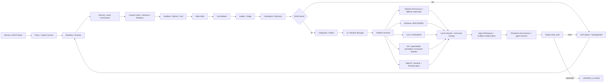

# FLOW MASTER 4AI — UI YAIWES

Contrato: `tel.workflow/v3`  
Estado: `ACTIVE_EDIT_REVIEW_LOOP`  
Regla: este diagrama se revisa y edita secuencialmente por Sol1 → Sol2 → Sol3 → Sol Orquestador. Cada revisión debe citar documento/code/test/commit y dejar siguiente GAP o PASS verificable.

## Gates obligatorios
1. `SOURCE_PRESENT != WIRED != RUNTIME_TEST_PASS != VERIFIED_CLOSED`.
2. Workflow/Runtime no puede mezclarse con Memory/Audit; Sandbox/LLM es ejecución aislada; Consolidator/Auditor/Checkpoint son fronteras explícitas.
3. UI es interfaz del workspace/virtual computer; no sustituye a runtime/virtualización.
4. Memoria de chat y memoria de agente permanecen separadas con contratos explícitos.
5. Cómputo/almacenamiento local-first cuando aplique; proveedores/API externos son adapters, no fuente única de estado.
6. Fables es gate de cableado donde el contrato del proyecto lo exige; socket genérico no cuenta sin equivalencia probada.
7. Platform capability se verifica por plataforma; AVF nunca se promociona como backend universal.
8. Cada GAP bloquea sólo su nodo; NO_IDLE_WAIT obliga tomar siguiente FREE seguro.

## Rondas de revisión del diagrama
| Revisor | Pasada 1 | Pasada 2 | Pasada 3 | Pasada 4 | Estado |
|---|---|---|---|---|---|
| Sol1 | requisitos/memoria | código/runtime | evidencia/tests | refutación+edición | PENDING |
| Sol2 | plataformas/providers | código/capability | evidencia/tests | refutación+edición | PENDING |
| Sol3 | integración/Fables | código/vendor | evidencia/tests | refutación+edición | PENDING |
| Sol Orquestador | cobertura global | arquitectura/code | CI/readback | refutación+consolidación | IN_PROGRESS |

## Regla de edición
Cada rol agrega una entrada debajo de `REVISION LOG` con: `commit_seen`, `document_refs`, `code_refs`, `gaps_added_or_closed`, `diagram_change`, `evidence`, `next_free_node`. No borrar revisiones anteriores.

## REVISION LOG
- `SOL_ORQUESTADOR/P1`: documentos prioritarios confirman multi-sandbox+memoria persistente+recovery, arquitectura multiplataforma y separación Workflow/Memory/Sandbox/Consolidator. Pendiente mapear cobertura ejecutable completa y recibir P1–P4 de Sol1/2/3.
