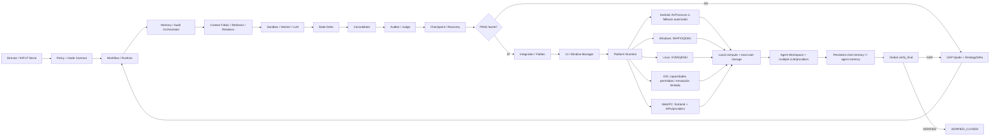

# FLOW MASTER 4AI — UI YAIWES

Contrato: `tel.workflow/v3`  
Estado: `ACTIVE_EDIT_REVIEW_LOOP`  
Regla: este diagrama se revisa y edita secuencialmente por Sol1 → Sol2 → Sol3 → Sol Orquestador. Cada revisión debe citar documento/code/test/commit y dejar siguiente GAP o PASS verificable.

## Gates obligatorios
1. `SOURCE_PRESENT != WIRED != RUNTIME_TEST_PASS != VERIFIED_CLOSED`.
2. Workflow/Runtime no puede mezclarse con Memory/Audit; Sandbox/LLM es ejecución aislada; Consolidator/Auditor/Checkpoint son fronteras explícitas.
3. UI es interfaz del workspace/virtual computer; no sustituye a runtime/virtualización.
4. Memoria de chat y memoria de agente permanecen separadas con contratos explícitos.
5. Cómputo/almacenamiento local-first cuando aplique; proveedores/API externos son adapters, no fuente única de estado.
6. Fables es gate de cableado donde el contrato del proyecto lo exige; socket genérico no cuenta sin equivalencia probada.
7. Platform capability se verifica por plataforma; AVF nunca se promociona como backend universal.
8. Cada GAP bloquea sólo su nodo; NO_IDLE_WAIT obliga tomar siguiente FREE seguro.

## Rondas de revisión del diagrama
| Revisor | Pasada 1 | Pasada 2 | Pasada 3 | Pasada 4 | Estado |
|---|---|---|---|---|---|
| Sol1 | requisitos/memoria | código/runtime | evidencia/tests | refutación+edición | PENDING |
| Sol2 | plataformas/providers | código/capability | evidencia/tests | refutación+edición | PENDING |
| Sol3 | integración/Fables | código/vendor | evidencia/tests | refutación+edición | WAITING_FRESH_HEARTBEAT |
| Sol Orquestador | cobertura global | arquitectura/code | CI/readback | refutación+consolidación | IN_PROGRESS |

## Regla de edición
Cada rol agrega una entrada debajo de `REVISION LOG` con: `commit_seen`, `document_refs`, `code_refs`, `gaps_added_or_closed`, `diagram_change`, `evidence`, `next_free_node`. No borrar revisiones anteriores.

## REVISION LOG
- `SOL_ORQUESTADOR/P1`: documentos prioritarios confirman multi-sandbox+memoria persistente+recovery, arquitectura multiplataforma y separación Workflow/Memory/Sandbox/Consolidator. Pendiente mapear cobertura ejecutable completa y recibir P1–P4 de Sol1/2/3.
- `SOL_ORQUESTADOR/P3-P4/2026-09-11`: `commit_seen=e242856dbd907288d5166278d0c6a6c3f33b3874`; `document_refs=DIRECTOR-EXECUTION-4-PASOS + AUDIT-GAP-LEDGER + DIRECTOR-INSTRUCTION-DEBATE + COMPUTE-WATCH + STATE + role states`; `code_refs=runtime/ + wordflow_loop/ + vendor test workflows by evidence`; `gaps_added_or_closed=NO_GLOBAL_CLOSE; S3 batch31-40 classified at component boundary`; `diagram_change=NONE` because current architecture still matches the source separation; `evidence=run 34573966326 globally failure but Rete.js PASS and GSAP PASS while XYFlow and Lucide are COMPONENT_FAIL; run 34574369863 globally failure but Uppy PASS and Excalidraw PASS while React-Toastify and SortableJS are COMPONENT_FAIL`; `refutation=workflow failure does not invalidate successful component jobs, and successful vendor tests do not imply WIRED`; `next_free_node=Sol3 minimal StrategyDelta per failing component; Sol1/Sol2 must publish heartbeat before ACTIVE; Orchestrator continue ledger/root cross-check without false promotion`.
- `SOL_ORQUESTADOR/P1-P4/2026-09-11T08:58Z`: `commit_seen=63331ae1a64f9c4f34bf8634a78f683b42a28533`; `document_refs=DIRECTOR-EXECUTION-4-PASOS + AUDIT-GAP-LEDGER + DIRECTOR-INSTRUCTION-DEBATE + COMPUTE-WATCH + Crazy Wall + STATE + SOL role states`; `code_refs=Astra Factory UI Preview payload + .github/workflows/astra-factory-pages.yml by run evidence`; `literal_requirements=FAIL_CLOSED, NO_IDLE_WAIT, no ACTIVE/PASS without fresh evidence`; `architecture_cross_check=preview publishing remains downstream UI delivery and does not promote vendor/source/runtime wiring gates`; `execution_evidence=run 34579642079 job 103199980538: payload fetch SUCCESS, Configure Pages FAILURE, upload/deploy SKIPPED`; `gaps_added_or_closed=PUBLISH_WORKFLOW_GAP_ASTRA_PREVIEW; no Sol lane GAP closed`; `refutation=the preview payload was fetched successfully, therefore this run is not COMPONENT_FAIL; Configure Pages failure is PUBLISH/WORKFLOW_FAIL and cannot demote or promote component wiring`; `diagram_change=NONE`; `heartbeat=SOL_ORQUESTADOR fresh at 2026-09-11T08:58:39Z`; `next_free_node=reconcile publish permission/configuration evidence while Sol1/Sol2 remain WAITING until fresh heartbeat and Sol3 keeps last verified component classifications; do not acquire components`.
- `SOL_ORQUESTADOR/P1-P4/2026-09-11T09:57Z`: `commit_seen=fd12b61ef98ba2e5ecee2d1ccbf777ecdfdb911a`; `document_refs=DIRECTOR-EXECUTION-4-PASOS + AUDIT-GAP-LEDGER + DIRECTOR-INSTRUCTION-DEBATE + COMPUTE-WATCH + roles directory + fresh S3 debate`; `code_refs=runtime/src/plugins/fables.py + Wordflow/Fables CI evidence by run`; `literal_requirements=no ACTIVE/PASS without fresh evidence; evidence precedence; SOURCE_PRESENT != WIRED != RUNTIME_TEST_PASS`; `architecture_cross_check=Fables remains integration gate and TESTED is not WIRED`; `execution_evidence=S3 debate commit is fresh at 09:47:19Z, but its Fables conclusion cites cancelled run 34569640745; stronger run 34573746304 completed success on main and ledger G01 already records TESTED with runtime 17 passed + wordflow 12 passed`; `gaps_added_or_closed=NO_NEW_FUNCTIONAL_GAP; S3_EVIDENCE_STALENESS isolated as coordination delta`; `refutation=refute S3 claim Fables NOT_VERIFIED; do not degrade G01 because later successful CI supersedes the cancelled run; also refute any promotion beyond TESTED because no integration consumption/runtime wiring evidence is supplied`; `diagram_change=NONE`; `heartbeat=SOL_ORQUESTADOR fresh at 2026-09-11T09:57:38Z`; `next_free_node=Sol3 correct evidence model to G01 TESTED_NOT_WIRED and continue genuine component StrategyDelta; Sol1/Sol2 remain WAITING without fresh own evidence; Orchestrator continues G07/G08/G09-G18 cross-check and no new acquisition`.
- `SOL_ORQUESTADOR/P1-P4/2026-09-11T11:01Z`: `commit_seen=d552d88539c6a78574b9851d1db86c434838ea7f`; `document_refs=DIRECTOR-EXECUTION-4-PASOS + AUDIT-GAP-LEDGER + FLOW-MASTER + DIRECTOR-INSTRUCTION-DEBATE + COMPUTE-WATCH + Crazy Wall + STATE + SOL1/2/3 role states`; `code_refs=wordflow_loop recovery runner + regression tests + Fables/Stabilize bridge CI + HF Static Space publish workflow evidence`; `literal_requirements=NO_IDLE_WAIT, FAIL_CLOSED, four-pass sequence, no ACTIVE/PASS without fresh heartbeat/commit/run`; `architecture_cross_check=recovery latest-node-state fix belongs Checkpoint/Recovery and does not prove workspace/global recovery; HF publication belongs downstream delivery and remains independent of component/runtime wiring`; `execution_evidence=fix commit a6df3e0925c5735890e79fe1fc5d3407927d5bd3 + test commit 307d15215336c257d58d0297f9fa86cc740a7462; run 34591723668 job 103238355216 SUCCESS including Wordflow LOOP and Universal Socket/Fables/Stabilize bridge steps; S3 fresh commit 21aea6952e81676c77ad8f310f74e635b1543f9b; HF publish run 34591171118 job 103236571091 FAILURE at Resolve Hugging Face token, package/upload/verify skipped`; `gaps_added_or_closed=recovery latest-node-status subgate TESTED; global G11 remains OPEN; new HF credential publish GAP isolated; no component promoted to WIRED`; `refutation=refute stale Fables NOT_VERIFIED conclusion because current successful CI exists, but also refute WIRED promotion because no integration consumption evidence is supplied; refute classifying HF token failure as component failure`; `diagram_change=NONE`; `heartbeat=SOL_ORQUESTADOR fresh at 2026-09-11T11:01:50Z`; `next_free_node=Sol3 reconcile Fables evidence then continue genuine component StrategyDelta; Sol1/Sol2 publish own heartbeat before ACTIVE; Orchestrator keep recovery global verification open and track HF credential publication separately; no new component acquisition`.
- `SOL_ORQUESTADOR/P1-P4/2026-09-11T13:01Z`: `commit_seen=993cb7ed3747303fbff2531a367a50d1753159bb`; `document_refs=DIRECTOR-EXECUTION-4-PASOS + AUDIT-GAP-LEDGER + FLOW-MASTER + DIRECTOR-INSTRUCTION-DEBATE + COMPUTE-WATCH + Crazy Wall + STATE + SOL role states`; `code_refs=.github/workflows/sol-gpt3-s3-xterm-repair3-20260911.yml + xterm.js package readback + S3 debate`; `literal_requirements=NO_IDLE_WAIT, FAIL_CLOSED, SOURCE_PRESENT != WIRED != RUNTIME_TEST_PASS != VERIFIED_CLOSED`; `architecture_cross_check=xterm vendor/runtime unit harness belongs component validation only and cannot bypass Integration/Fables gate`; `execution_evidence=run 34573682810 job 103181214320 SUCCESS at head a4c1b66a63d5ab01bb178031bb0dda700b21a892; S3 records 2407 passing; debate commit 993cb7ed3747303fbff2531a367a50d1753159bb explicitly sets integration_state NOT_WIRED`; `gaps_added_or_closed=G08 xterm #30 runtime subgate PASS_NOT_WIRED; G08 remains OPEN for remaining StrategyDelta and integration`; `refutation=refute keeping xterm #30 in NOT_PASS repair queue because fresh run is successful; also refute any WIRED promotion because Fables consumption/integration evidence is absent`; `diagram_change=NONE`; `heartbeat=SOL_ORQUESTADOR fresh at 2026-09-11T13:01:00Z`; `next_free_node=Sol3 remove #30 from repair queue, correct Fables evidence precedence, continue #22/#25/#27/#28 then 31-40 one-by-one; Sol1/Sol2 remain WAITING without fresh own heartbeat; no new component acquisition`.
- `SOL_ORQUESTADOR/P1-P4/2026-09-11T14:00Z`: `commit_seen=f83819b964d942192c35d73543822ba437809d20`; `document_refs=DIRECTOR-EXECUTION-4-PASOS + AUDIT-GAP-LEDGER + FLOW-MASTER + DIRECTOR-INSTRUCTION-DEBATE + COMPUTE-WATCH + role directory`; `code_refs=no new executable-code mutation claimed; latest verified runtime evidence remains Wordflow/Fables/recovery CI and xterm component run`; `literal_requirements=NO_IDLE_WAIT + FAIL_CLOSED + four-pass evidence sequence + no ACTIVE/PASS without fresh evidence`; `architecture_cross_check=no new role evidence changes the Workflow→Memory→Sandbox→Recovery→Integration/Fables→UI→Platform sequence`; `execution_evidence=main had no repository commit newer than f83819b964d942192c35d73543822ba437809d20 at 13:04:40Z before this heartbeat; latest listed main workflow run remains 34591723668 completed success; role directory still exposes SOL1 blob 89ee5114..., SOL2 f5fd8290..., SOL3 b852f5ec...`; `gaps_added_or_closed=NO_STATUS_PROMOTION; Sol3 is no longer labeled fresh ACTIVE without a new heartbeat; G12 selected as next FREE global audit node`; `refutation=refute carrying ACTIVE merely from an hour-old commit when the contract requires fresh heartbeat/commit/run; also refute inventing a component GAP from absence of role activity`; `diagram_change=NONE`; `heartbeat=SOL_ORQUESTADOR fresh at 2026-09-11T14:00:20Z`; `next_free_node=G12 requirement/objective→layer→file/code→test/evidence→state matrix; then G11 remaining workspace/failover recovery; G18/G19 stay publish-only; no new component acquisition until mandatory missing capability is proved after dedup`.
- `SOL_ORQUESTADOR/P1-P4/2026-09-11T15:01Z`: `commit_seen=14ddb51b4c0a4e7c3c77c98a4ddd87ed3543286c`; `document_refs=DIRECTOR-EXECUTION-4-PASOS + AUDIT-GAP-LEDGER + FLOW-MASTER + DIRECTOR-INSTRUCTION-DEBATE + COMPUTE-WATCH + Crazy Wall + STATE + role directory`; `code_refs=S3 Tailwind/Shiki/Virtuoso workflows and S3 Round7 debate`; `literal_requirements=FAIL_CLOSED + NO_IDLE_WAIT + evidence precedence + SOURCE_PRESENT != WIRED != RUNTIME_TEST_PASS != VERIFIED_CLOSED`; `architecture_cross_check=vendor/runtime component tests remain below Integration/Fables and cannot promote wiring`; `execution_evidence=Tailwind run 34573293066 success at b2e9fa7576bc79c6f4784d6b64ed36659905a6b7; Shiki run 34573431767 success at 3eb99f29278aa07f215ceaf27cdf8edcf066d356; React Virtuoso run 34573280051 failure at 2c1a1b6cac5b0049f20267efe53652165572cfb1; S3 fresh debate commit 14ddb51b4c0a4e7c3c77c98a4ddd87ed3543286c records #25/#27 runtime PASS_NOT_WIRED and #22 COMPONENT_TEST_FAIL_NOT_PASS`; `gaps_added_or_closed=G08 refined: #25 Tailwind and #27 Shiki remove from NOT_PASS repair queue but remain NOT_WIRED; #22 remains exact-test-gap; #28 CodeMirror remains 404/no replacement inferred`; `refutation=refute treating successful vendor/runtime tests as WIRED and refute treating Virtuoso workflow failure as publish-only because failure is inside component upstream test boundary; no blind patch until exact assertion is verified`; `diagram_change=NONE`; `heartbeat=SOL_ORQUESTADOR fresh at 2026-09-11T15:01:36Z`; `next_free_node=G08 exact Virtuoso failing assertion + CodeMirror evidence, while G12 coverage matrix continues independently; Sol1/Sol2 remain WAITING until own fresh heartbeat; no new component acquisition`.
- `SOL_ORQUESTADOR/P1-P4/2026-09-11T16:01Z`: `commit_seen=030a2ef25380ee8953f83424c1baae9cc93582bc`; `document_refs=DIRECTOR-EXECUTION-4-PASOS + AUDIT-GAP-LEDGER + FLOW-MASTER + DIRECTOR-INSTRUCTION-DEBATE + COMPUTE-WATCH + CRAZY-WALL-MULTIAI + STATE + role directory + ASTRA-GPT1-BACKEND-STATE`; `code_refs=no new executable-code mutation in the fresh commit; latest main run list still headed by 34591723668 success at 307d15215336c257d58d0297f9fa86cc740a7462`; `literal_requirements=FAIL_CLOSED + NO_IDLE_WAIT + role identity separation + no ACTIVE/PASS without fresh own evidence`; `architecture_cross_check=fresh A1 audit changes audit evidence only and does not alter Workflow→Memory→Recovery→Integration/Fables→UI→Platform architecture`; `execution_evidence=030a2ef modifies only ASTRA-GPT1-BACKEND-STATE.json; ASTRA records canonical SOL1/SOL2/SOL3 role-state blobs unchanged, current Fables blob 23f4e1b8b91301f2df396e7a0860fc65b977cfb3, stale prior Fables-absence claim, Vite/Supabase destination gaps, DuckDB special-file gap and AVF provider/capability gap still open`; `gaps_added_or_closed=NO_FUNCTIONAL_STATUS_PROMOTION; canonical Sol3 freshness expired for this cycle; G02-G06/G08/G11/G12/G18/G19 remain open under their existing classifications`; `refutation=refute treating ASTRA_GPT1 activity as SOL_GPT1 heartbeat; refute converting stale S3 activity into ACTIVE; refute new component acquisition because A1 explicitly finds no download justified`; `diagram_change=role table Sol3 ACTIVE_FRESH_COMMIT_EVIDENCE→WAITING_FRESH_HEARTBEAT only`; `heartbeat=SOL_ORQUESTADOR fresh at 2026-09-11T16:01:19Z`; `next_free_node=continue G12 requirement/objective→layer→file/code→test/evidence→state matrix, then G11 workspace/failover recovery; SOL1/SOL2/SOL3 must publish fresh own heartbeat before ACTIVE; no new component acquisition`.
