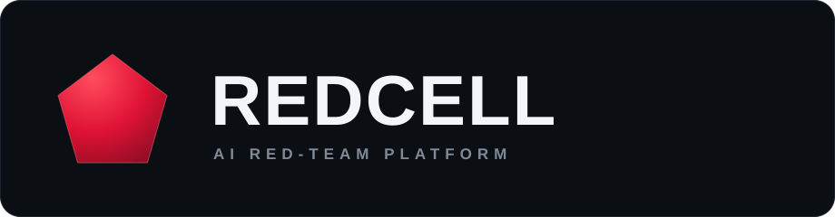
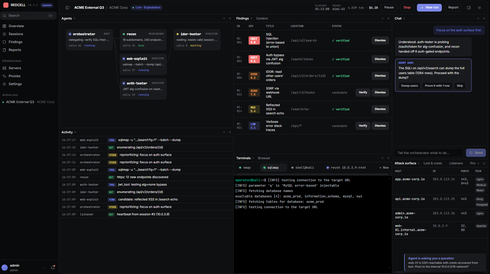
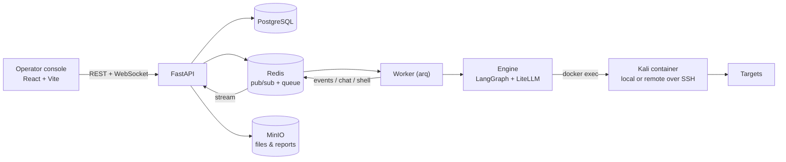

<p align="center">
  
</p>

<p align="center">
  <b>AI agents that run a penetration test end to end and write the report.</b>
</p>

<p align="center">
  <a href="https://github.com/martian56/redcell/actions/workflows/ci.yml"></a>
  
  
  
  
  
  
</p>

<p align="center">
  
</p>

> [!WARNING]
> REDCELL is provided for education, research, and legal, authorized security testing only. Use it only to test systems you own or have explicit written permission to test, and only within an agreed scope. Unauthorized access to or interference with computer systems is a crime in Azerbaijan (Criminal Code articles 271 to 273) and under the laws of most other countries. How you use it, and staying within the law, is entirely your responsibility.

---

## What it is

REDCELL runs a team of LLM agents through a pentest. An orchestrator plans the engagement and hands objectives to executor agents, which run real tools inside a Kali container and report back. You watch and steer the run from an operator console: a chat that drives the orchestrator, a live agent graph and activity feed, a live view of the browser the agent drives, a terminal on any reverse shell the agent catches, and a report to hand over when the work is done.

Models are pluggable through LiteLLM, so you can point it at OpenAI, Anthropic, Google, GLM, DeepSeek, Kimi, a local Ollama, or anything else it supports. Every run checkpoints as it goes, so a crash or a restart picks up where it left off.

## Features

- **Multi-agent engine.** A LangGraph plan/act loop. The orchestrator delegates objectives to executor agents that run shell tools and record findings, loot, and hosts as they work.
- **Structured tools.** Dedicated tools for nmap, nuclei, directory and vhost discovery, and Metasploit search and run. Each parses its own output into the attack surface or findings, so a scan records hosts and vulnerabilities without a follow-up step. `run_command` covers anything without a dedicated tool.
- **Real execution, local or remote.** Tools run in a Kali container over `docker exec`. Pick localhost or a saved server per session; a remote server runs the same container over SSH with host networking.
- **Agent browser.** For login flows and JavaScript-heavy apps that shell tools cannot reach, an agent drives a real Chromium in the Kali container. You watch it live and can take control to click through something yourself, then hand it back.
- **Reverse shells.** An agent opens a listener, catches the shell, and gives you an interactive terminal on it. You can also open your own terminals and run commands yourself.
- **Network pivoting.** Route tool traffic through a caught reverse shell to reach hosts that are only visible from the compromised machine. A chisel reverse SOCKS tunnel carries it, and nmap runs through the tunnel automatically.
- **Chat drives the run.** Tell the chat what you want and it steers the live orchestrator, or reopens a finished run to take on new work. It answers questions about the engagement too.
- **Code-scan sessions.** Point a session at a public git repo or a local folder for a source-code security review, with findings mapped back to file and line.
- **Per-session config.** Set the execution server, the model, and an optional egress proxy per session. Servers and proxies come with a real connection test so you know they work before you rely on them.
- **Findings triage.** Verify or dismiss findings and merge duplicates the agent recorded twice. The report leaves out the dismissed ones and marks the verified ones.
- **Reports.** Export a PDF plus JSON and SARIF. The write-up is generated by the session's model and cleaned up to read like a person wrote it, with an executive summary, methodology, findings, and remediation in priority order.
- **Live console.** The activity feed, terminals, and the agent's browser stream over WebSockets; the agent graph, findings, loot, attack surface, listeners, and proxy history refresh on a short poll. All of it updates live as the run works.
- **Notifications.** In-app toasts, plus browser notifications when the tab is in the background so a question from the agent or a caught shell does not sit unseen.

## Architecture



The API does not run agents. It queues a run, the worker executes it, and the worker publishes output onto Redis channels that the API relays to the browser over WebSockets.

## Stack

Python 3.12, FastAPI, async SQLAlchemy + asyncpg, Alembic, arq, LangGraph, LiteLLM, ReportLab, PostgreSQL, Redis, MinIO, asyncssh. Frontend: React 18, Vite, TypeScript, Tailwind, TanStack Query, xterm. Tooling: uv for Python, bun for the frontend.

## Quickstart

You will need Docker, [uv](https://docs.astral.sh/uv/), and [bun](https://bun.sh/).

```bash
# 1. infrastructure (Postgres, Redis, MinIO)
docker compose -f docker-compose.dev.yml up -d

# 2. Python deps, database, and seed data
uv sync --group live
uv run rc db upgrade
uv run rc seed              # admin user, provider catalog, buckets

# 3. copy the env template
cp .env.example .env

# 4. run the three processes (separate terminals)
cd apps/api    && uv run uvicorn app.main:app --host 127.0.0.1 --port 8080
cd apps/worker && uv run arq worker.settings.WorkerSettings
cd apps/web    && bun install && bun run dev
```

Or start all three at once with a process manager (they are declared in the
`Procfile`): `pipx install honcho` then `honcho start`.

Open http://localhost:5183 and sign in with `admin` / `admin`.

Runs execute real tools by default. Add a provider API key in Settings and make sure Docker can pull the Kali image (`ghcr.io/martian56/redcell-kali:latest`). To dry-run against canned output instead, set `REDCELL_RUN_MODE=sim` in `.env`.

### Practice targets

Intentionally vulnerable apps to aim REDCELL at, all local:

```bash
docker compose -f docker-compose.targets.yml up -d
# DVWA http://localhost:8081 · Juice Shop http://localhost:3000 · WebGoat http://localhost:8082
```

## Deploy (self-host)

Run REDCELL on a server with the published images behind a Caddy reverse proxy, so the web app and API share one origin (no CORS) and HTTPS is handled for you. On a fresh server:

```bash
git clone https://github.com/martian56/redcell.git
cd redcell
./deploy.sh
```

The script installs Docker if it is missing, then asks how REDCELL will be reached:

1. **This server directly, no domain** — plain HTTP on the server IP. Good for a quick trial or a private network.
2. **A domain pointed straight at this server** — Caddy provisions a Let's Encrypt certificate automatically (point an A or AAAA record at the server first) and serves `https://your-domain`.
3. **A domain behind Cloudflare, Coolify, or another proxy or CDN** — the proxy provides the public HTTPS certificate and forwards to this server. The origin serves both plain HTTP (:80) and a self-signed HTTPS (:443), so it works with a proxy that connects over HTTP or one that accepts the origin's certificate (for Cloudflare, SSL mode Full; Full (strict) needs a Cloudflare Origin Certificate).

It writes your answers to `.env`, pulls the images, and starts the stack. Read the generated admin password with `docker compose logs init-secrets`, then sign in as `admin` and change it. To change how it is reached later, just re-run `./deploy.sh` and pick a different option.

Only ports 80 and 443 are published; Postgres, Redis, MinIO, the API, and the web app stay on the internal network. Stored files are streamed through the API, so object storage is never exposed. See [docs/DEPLOY.md](docs/DEPLOY.md) for the details of each mode.

## Configuration

Backend config is one root `.env` (see `.env.example`), read by both the API and the worker. The ones worth knowing:

- `REDCELL_RUN_MODE`: `live` (default) or `sim`.
- `REDCELL_DATABASE_URL`, `REDCELL_REDIS_URL`, `REDCELL_S3_*`: infrastructure.
- `REDCELL_SECRET_KEY`: Fernet key for encrypting stored credentials. Set a real one before you go to production.

Provider API keys, the execution image, scope guardrails, and report branding live in the Settings page and are stored in the database, encrypted where they need to be.

## Project layout

```
apps/
  api/                 FastAPI: routers, WebSocket streams, auth
  worker/              arq worker: runs engagements and report generation
  web/                 React operator console
packages/
  core/redcell_core/   engine, models, repositories, storage, bus, reporting
  api-client/          the single typed client the UI talks to (mock + HTTP)
docker/                Kali execution image, web/api images, Caddy config
docker-compose.yml           full stack behind a Caddy reverse proxy (self-host)
docker-compose.dev.yml       Postgres + Redis + MinIO
docker-compose.targets.yml   local vulnerable targets
deploy.sh                    interactive self-host deploy
```

## Documentation

- [Architecture](docs/ARCHITECTURE.md) — the components, how a run flows, cross-process coordination.
- [Hardening & threat model](docs/HARDENING.md) — deploy safely, secrets, scope, and data retention. Read this before running REDCELL anywhere but your own machine.
- [Pre-authentication surface](docs/PRE-AUTH-SURFACE.md) — what an unauthenticated client can observe, and how to keep that minimal.
- [Cost & token accounting](docs/COST.md) — how run spend is measured, the price table, and OpenRouter real cost.
- [Command palette & shortcuts](docs/SHORTCUTS.md) — Cmd/Ctrl+K to search sessions, servers, and proxies, and keyboard navigation.
- [Updating](docs/UPDATING.md) — the in-app Update button and updating from the shell.
- [Console shell](docs/APP-SHELL.md) — the sidebar, menus, and dropdown positioning rules.
- [Form controls](docs/FORMS.md) — the searchable combobox and when to use it over a native select.

## Contributing

Contributions are welcome. See [CONTRIBUTING.md](CONTRIBUTING.md) for setup, tests, and conventions, and the [Code of Conduct](CODE_OF_CONDUCT.md). Report security issues privately through [SECURITY.md](SECURITY.md), not public issues.

## Legal notice and responsible use

REDCELL is intended solely for education, research, and legal, authorized security testing. Acceptable use includes your own systems and labs, deliberately vulnerable practice targets, capture-the-flag events, and engagements you are contracted to perform with the target owner's explicit written permission and a defined scope.

Do not use REDCELL to test any system, network, account, or data that you do not own or are not clearly authorized in writing to test. Testing without authorization, reaching systems or data you have no right to, or disrupting services you do not control is illegal.

- In Azerbaijan, unauthorized access to computer systems and the unlawful seizure of or interference with computer information are criminal offences under the Criminal Code of the Republic of Azerbaijan (articles 271, 272, and 273). Azerbaijan is also a party to the Council of Europe Convention on Cybercrime (the Budapest Convention), in force for the country since 2010.
- Comparable laws apply worldwide, including the Budapest Convention and its parties, EU Directive 2013/40/EU on attacks against information systems, the United Kingdom Computer Misuse Act 1990, and the United States Computer Fraud and Abuse Act (18 U.S.C. § 1030). Wherever you are, and wherever the target is, unauthorized testing is very likely a crime.

You are solely responsible for obtaining proper authorization, staying within scope, and complying with all applicable local, national, and international laws, along with any contracts, rules of engagement, and provider terms of service. Get written permission before you test, and keep a copy.

REDCELL is provided "as is", without warranty of any kind. The authors and contributors accept no liability for any damage, loss, or legal consequence arising from its use or misuse. This notice is general information, not legal advice; if you are unsure whether an activity is lawful, consult a qualified lawyer in the relevant jurisdiction.
