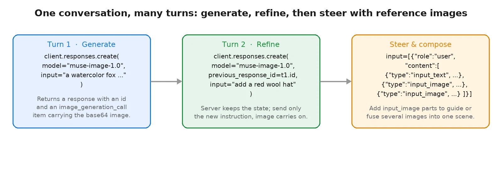
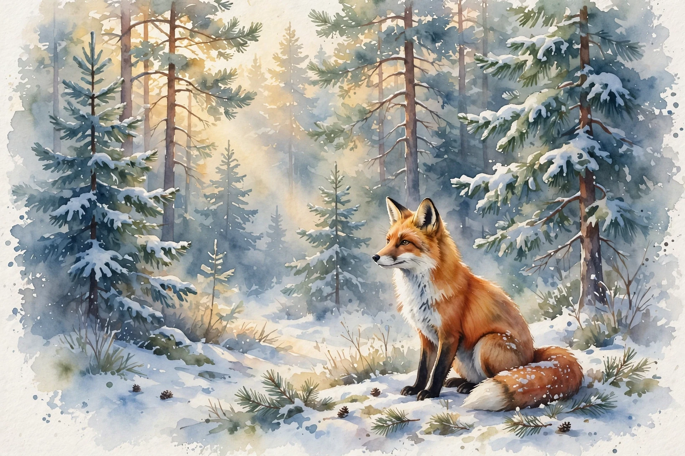
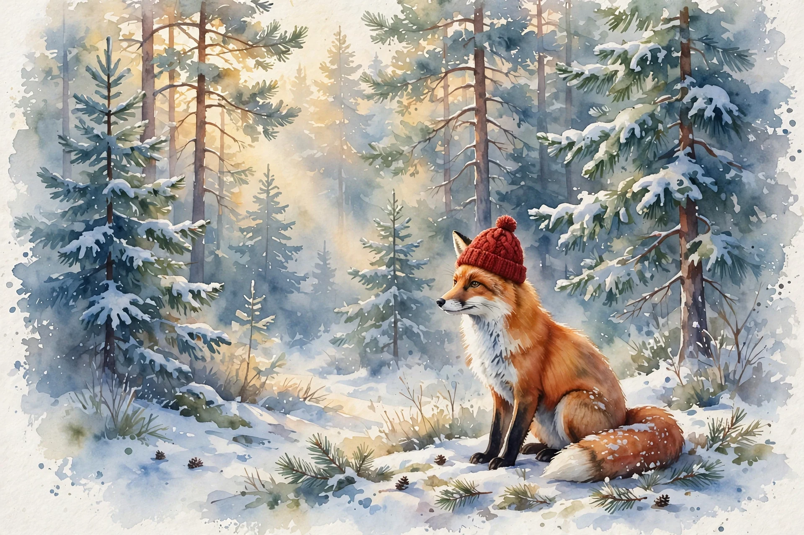
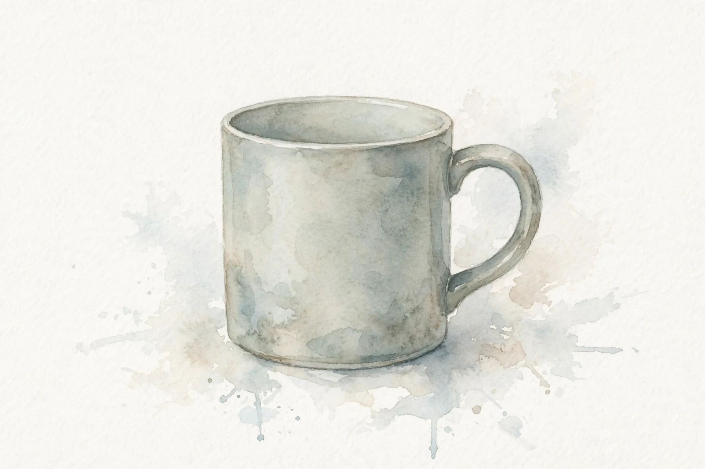
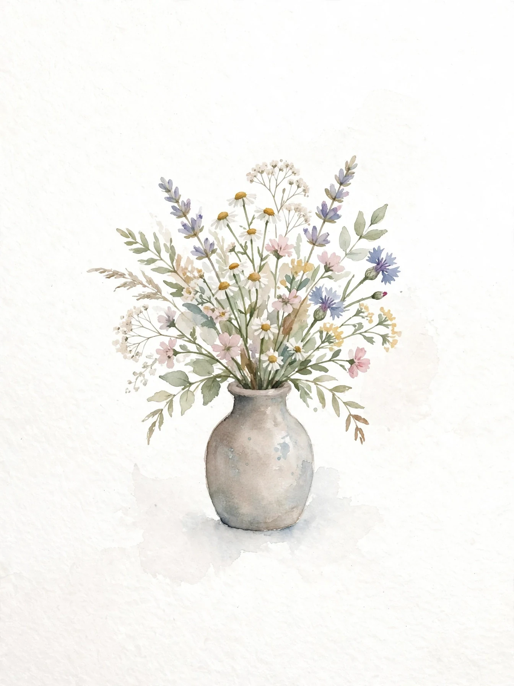
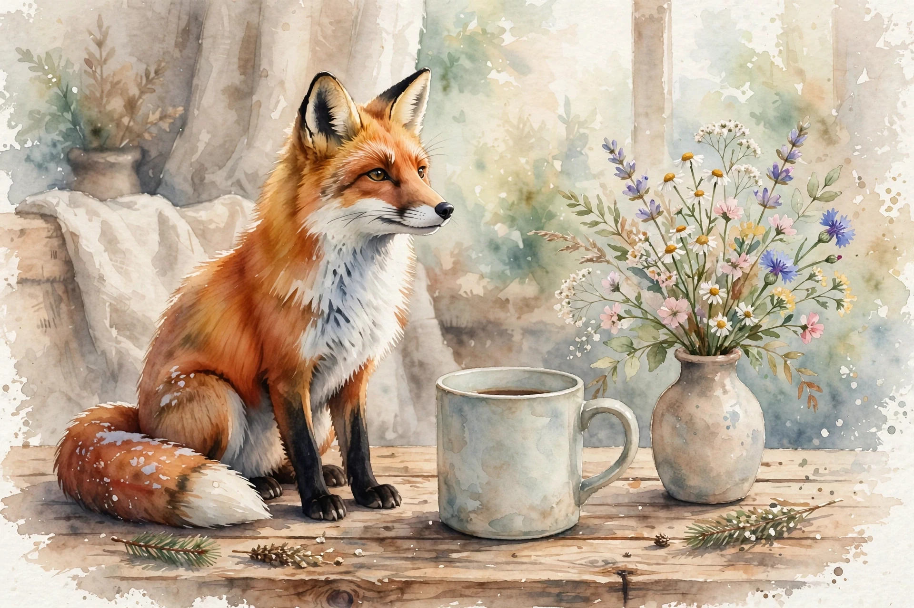

# Generate, edit, and compose images

|  |  |
|---|---|
| **Section** | [Muse Image](https://dev.meta.ai/docs/getting-started/cookbook#muse-image) |
| **Time to complete** | ~15 min |
| **Model** | `muse-image-1.0` |
| **Language** | Python |
| **Prerequisites** | Python 3.10+, the `openai` package, and a `MODEL_API_KEY` (create one in the [Model API dashboard](https://dev.meta.ai/)). |

Muse Image is a reasoning model that generates and edits images from a text prompt. It plans a request before it renders, so multi-part prompts hold together. You drive it through the conversational Responses API: point your client at `https://api.meta.ai/v1`, set your key, and call `client.responses.create(...)`. Each call is a turn in a conversation. The first turn generates an image, and later turns refine it. The server keeps the conversation state, so a follow-up turn sends only the new instruction and the image carries forward on its own. When you need to steer the render toward images you already have, attach them as reference inputs, and pass several at once to compose them into one scene.

*Images throughout are from an actual run; because the model is non-deterministic, your results will differ.*

## What you build

- **Generate**: turn 1 of a conversation. A prompt in, image bytes out.
- **Refine across turns**: a chained turn that carries the prior image forward with `previous_response_id`, so you send only the change you want.
- **Steer and compose with reference images**: attach `input_image` parts to guide a render, and pass several at once to fuse them into a single scene.

Along the way you read the interleaved output list Muse Image returns, pull the image out of it, and read the token `usage`.

## How it works

Muse Image is a separate model family from Muse Spark: it **outputs images** rather than text. You reach it through the Responses API, the same conversational endpoint you use for text. Each `client.responses.create(...)` call is one turn:

- **Turn 1** takes a text `input` and returns a response with an `id` and a `status`.
- **Later turns** pass `previous_response_id` set to the prior response's `id`. The server keeps the conversation state for you, so you send only the new instruction and the image from the prior turn carries forward.
- **Reference images** ride along as `input_image` content parts inside a `{"role": "user", "content": [...]}` message. The model draws on them to guide the render (style, subject, pose, layout) without necessarily copying them into the output. Pass several to compose them into one scene or to combine their influences. Attach only images the server does not already have: to reuse a prior render, chain with `previous_response_id` rather than re-attaching it.

Muse Image reasons before it renders, so a response's `output` is a **list** that interleaves a `reasoning` item, a `message` item, and an `image_generation_call` item. The image is the base64 `result` on the `image_generation_call`. A successful response looks like this:

```json
{
  "id": "resp_...",
  "status": "completed",
  "output": [
    { "type": "reasoning", "id": "rs_..." },
    { "type": "message", "id": "msg_...", "content": [ ... ] },
    { "type": "image_generation_call", "id": "ig_...", "status": "completed", "result": "UklGR..." }
  ],
  "usage": { "input_tokens": 9996, "output_tokens": 908, "total_tokens": 10904 }
}
```

Pull the image by finding the `image_generation_call` item and decoding its `result`. Every response also includes a `usage` object with the token counts for the turn.



## Setup

Install the dependency and set your key:

```bash
pip install openai
export MODEL_API_KEY="LLM|..."
```

Wire up the client once. The OpenAI SDK does not auto-read `MODEL_API_KEY`, so pass it explicitly. Add a small helper that pulls the base64 image out of the response's output list and writes it to disk:

```python
import base64
import os

from openai import OpenAI

# The OpenAI SDK does not auto-read MODEL_API_KEY, so pass it explicitly.
client = OpenAI(
    base_url="https://api.meta.ai/v1",
    api_key=os.environ["MODEL_API_KEY"],
)


def save_image(response, path: str) -> None:
    """Find the image in a Responses output list and write it to disk."""
    b64 = next(
        item.result
        for item in response.output
        if item.type == "image_generation_call"
    )
    with open(path, "wb") as f:
        f.write(base64.b64decode(b64))
    print(f"saved {path}")
```

## Generate an image from a prompt

The first turn takes a text `input` and returns a completed response. The image lands as the `result` on the `image_generation_call` item in the output list; `save_image` pulls it out. Keep the response around: its `id` is what a later turn chains from. The example below renders a watercolor fox.

```python
turn1 = client.responses.create(
    model="muse-image-1.0",
    input=(
        "a watercolor painting of a red fox sitting in a snowy pine forest, "
        "soft golden morning light"
    ),
)

print("status:", turn1.status)
save_image(turn1, "fox.webp")
print("usage:", turn1.usage)
```



The `usage` object reports the tokens the turn consumed. Input tokens cover your prompt and any reference images; output tokens cover the reasoning and the generated image:

```json
{
  "input_tokens": 9996,
  "input_tokens_details": { "cached_tokens": 7936 },
  "output_tokens": 908,
  "output_tokens_details": { "reasoning_tokens": 161 },
  "total_tokens": 10904
}
```

## Refine across turns

To change an image, add a turn to the conversation. Pass `previous_response_id` set to the prior response's `id` and describe only the change. The server holds the conversation state, so you do not resend the image: the prior render carries forward and Muse Image applies your instruction to it. The example adds a red wool hat to the fox while keeping the pose and the snowy forest.

```python
turn2 = client.responses.create(
    model="muse-image-1.0",
    previous_response_id=turn1.id,
    input="add a small red wool hat on the fox's head, keep the snowy forest background",
)

save_image(turn2, "fox_hat.webp")
print("usage:", turn2.usage)
```



Because the prior image is on the server, the input tokens grow across a chained turn while the request body you send stays a single short instruction:

```json
{
  "input_tokens": 13710,
  "input_tokens_details": { "cached_tokens": 10560 },
  "output_tokens": 572,
  "output_tokens_details": { "reasoning_tokens": 57 },
  "total_tokens": 14282
}
```

## Steer with reference images and compose

To guide a render toward images you already have, attach them as `input_image` content parts. The parts go inside a `{"role": "user", "content": [...]}` message alongside your `input_text` instruction. Each `image_url` is a public URL or a base64 data URL. Pass one reference to steer a single render, or pass several to compose them into one scene: the model fuses the subjects you supply into a single image. You only attach images the server does not already have: anything from an earlier turn is carried by the conversation. The example composes the fox, a mug, and a vase of flowers into one watercolor still life. The fox came from turn 1, so this call chains from that turn with `previous_response_id` and attaches only the new images, the mug and the vase.

<p>
  
  
  
</p>

```python
import base64


def data_url(path: str) -> str:
    """Read a local image and return a base64 data URL."""
    with open(path, "rb") as f:
        return "data:image/webp;base64," + base64.b64encode(f.read()).decode()


compose = client.responses.create(
    model="muse-image-1.0",
    previous_response_id=turn1.id,
    input=[
        {
            "role": "user",
            "content": [
                {
                    "type": "input_text",
                    "text": (
                        "combine into one watercolor scene: place the fox from the "
                        "previous image on a wooden table beside this ceramic mug, "
                        "with this vase of wildflowers next to the mug"
                    ),
                },
                {"type": "input_image", "image_url": data_url("mug.webp")},
                {"type": "input_image", "image_url": data_url("vase.webp")},
            ],
        }
    ],
)

save_image(compose, "fox_mug_vase.webp")
print("usage:", compose.usage)
```



> [!NOTE]
> The content parts must be wrapped in a `{"role": "user", "content": [...]}` message. A bare list of content parts is rejected with an HTTP 400.

The reference images push the input token count up, since each one is read as part of the turn:

```json
{
  "input_tokens": 16458,
  "input_tokens_details": { "cached_tokens": 11072 },
  "output_tokens": 1070,
  "output_tokens_details": { "reasoning_tokens": 282 },
  "total_tokens": 17528
}
```

### Run without server-side state

A `store` parameter controls this and defaults to `true`, so the server stores each turn and the next one can chain from it. If you would rather not keep state on the server, set `store=False`. You then carry the conversation yourself: to continue from a prior render, replay its `image_generation_call` item as an input on the next turn instead of passing `previous_response_id`.

```python
turn1 = client.responses.create(
    model="muse-image-1.0",
    input="a watercolor painting of a red fox sitting in a snowy pine forest",
    store=False,
)

prior_image = next(
    item for item in turn1.output if item.type == "image_generation_call"
)

turn2 = client.responses.create(
    model="muse-image-1.0",
    input=[
        prior_image,
        {
            "role": "user",
            "content": [
                {"type": "input_text", "text": "add a small red wool hat on the fox's head"}
            ],
        },
    ],
    store=False,
)
```

## Summary

| Task | Call |
|------|------|
| Generate | `client.responses.create(model="muse-image-1.0", input="...")` |
| Read the image | decode the `result` of the `image_generation_call` output item |
| Refine across turns | `client.responses.create(..., previous_response_id=turn1.id, input="the change")` |
| Steer or compose | `input=[{"role": "user", "content": [input_text, input_image, ...]}]` |
| Run without state | `store=False`, then replay the prior `image_generation_call` item |
| Read token usage | `response.usage` (input, output, and total tokens) |

**Production checklist:**

- Read `MODEL_API_KEY` from the environment, never hard-code it.
- Find the `image_generation_call` item in `response.output`, decode its base64 `result`, and persist the bytes.
- Chain follow-up turns with `previous_response_id` so you send only the change, not the whole image.
- Wrap reference images in a `{"role": "user", "content": [...]}` message; a bare content-part list is rejected.
- Watch the `usage` token counts to stay inside your team's rate limits.

## Next steps

- **Reference the image guide**: the [Image generation guide](https://dev.meta.ai/docs/image-generation) covers reference-image steering and the full turn options.
- **See the full schema**: the [Responses API reference](https://dev.meta.ai/docs/api-reference/responses) has every request and response field.
- **Upload inputs once**: use the [Files API](https://dev.meta.ai/docs/file-handling) to reference an image by ID instead of resending base64 on every turn.
