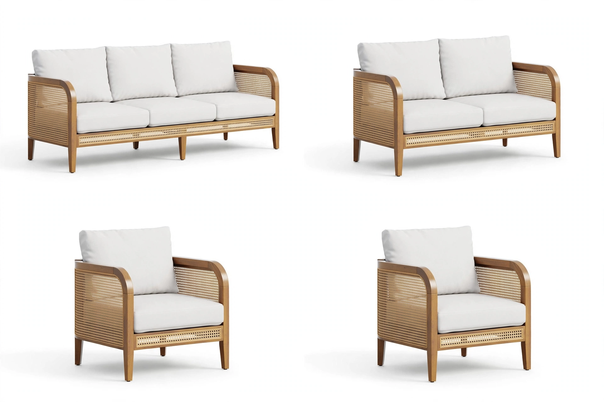
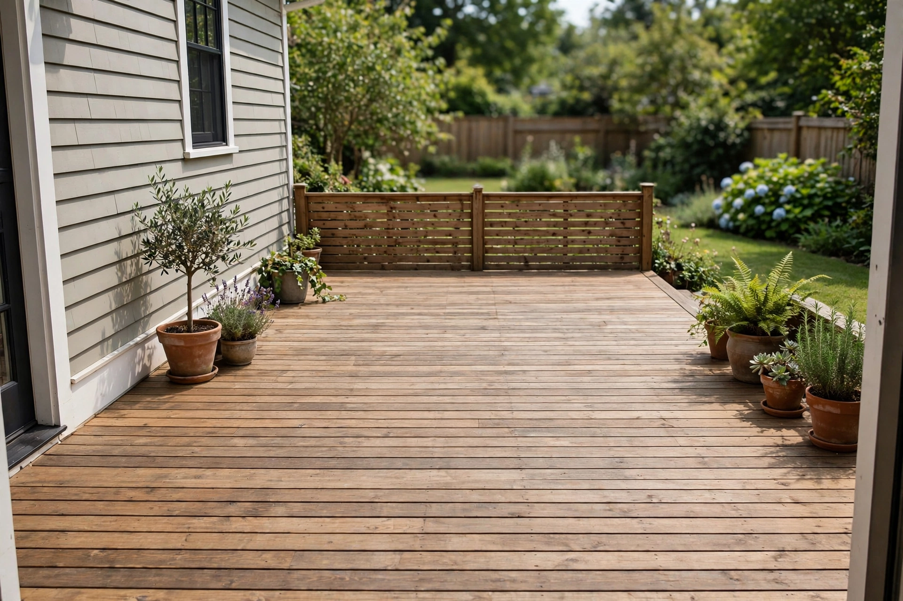
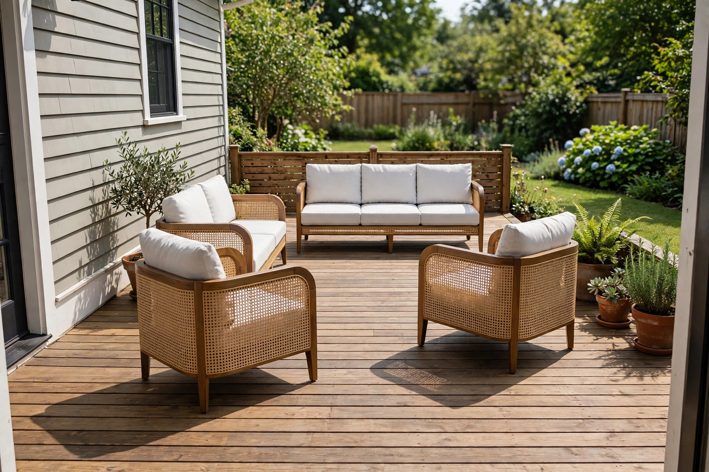
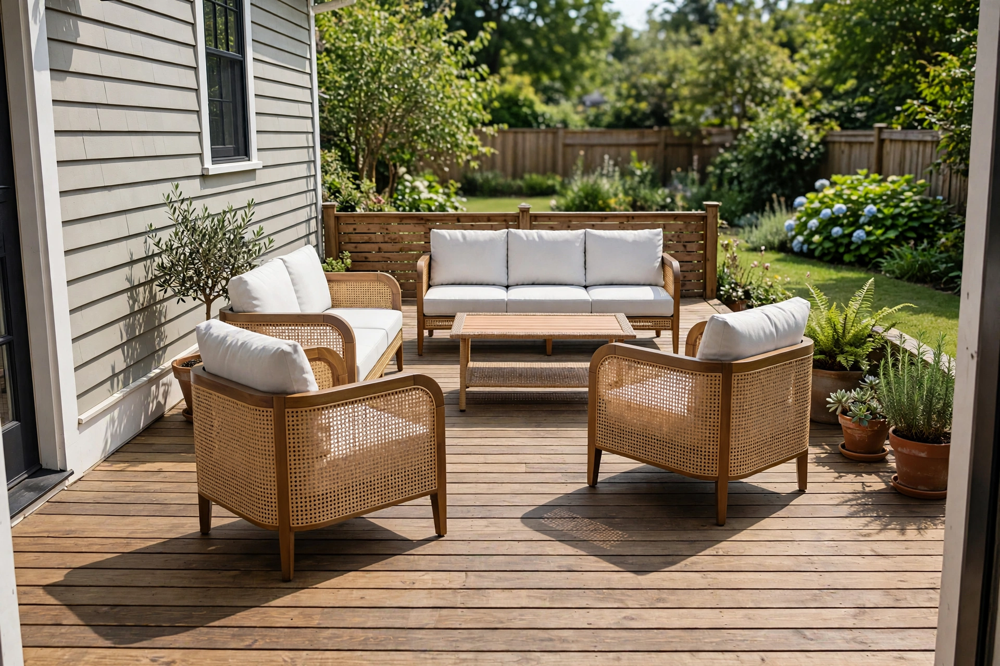

# Ground image generation in web search

|  |  |
|---|---|
| **Section** | [Muse Image](https://dev.meta.ai/docs/getting-started/cookbook#muse-image) |
| **Time to complete** | ~20 min |
| **Model** | `muse-image-1.0` |
| **Language** | Python |
| **Prerequisites** | Python 3.10+, the `openai` package, and a `MODEL_API_KEY` (create one in the [Model API dashboard](https://dev.meta.ai/)). |

Image generation is stronger when it is grounded in real-world information instead of guesswork. Muse Image can search the live web as part of a generation: when the prompt asks it to look something up, the model researches first and then renders from what it found. This recipe uses that capability to solve a concrete problem: style an empty backyard deck with a coordinated outdoor lounge set that reflects furniture actually sold today, then place that set into a photo of the real space.

The example throughout is an outdoor-furniture use case. One Muse Image conversation researches and renders a matching set of outdoor seating, and a second conversation composes that set into a photo of an empty deck. Swap the domain and the pattern holds: any app that generates images of real products, styles, or trends can ground what it draws in a web search.

*Images throughout are from an actual run; because the model is non-deterministic, your results will differ.*

## What you build

1. **Research and render the set**: a Muse Image conversation whose prompt asks the model to search the web for currently available outdoor seating that matches a brief, then render the pieces it finds as a product grid, one cell per piece.
2. **Compose into the backyard**: continue the same conversation, attach a photo of the empty deck, and place the pieces onto it as one lounge grouping.
3. **Refine with another search**: a chained turn that searches the web again for a matching coffee table and adds it into the centre.

## How it works

Muse Image is reached on the [Responses API](https://dev.meta.ai/docs/features/responses), and a single model does both halves of the work here. When the prompt asks it to look something up, it researches on the web before it draws, so the render reflects real, current options rather than invented ones.

Each `client.responses.create()` call returns a response you can build on: pass its `id` back as `previous_response_id` and the next turn continues from the image you already have. This makes the whole recipe one conversation. You research and render the set on turn 1, then keep building on it: the set you rendered stays in the conversation, so when you compose it onto the deck you only attach the new backyard photo, and when you refine you just ask for the next change.


## Setup

Install the dependency and set your key:

```bash
pip install openai
export MODEL_API_KEY="LLM|..."
```

Wire up the client. The OpenAI SDK does not auto-read `MODEL_API_KEY`, so pass it explicitly. Muse Image returns each generated image as base64 on an `image_generation_call` item in the response `output` list, so add two small helpers, one to pull that image out of a response and one to save it, plus one to turn a local file into a data URL for `input_image`:

```python
import base64
import os

from openai import OpenAI

# The OpenAI SDK does not auto-read MODEL_API_KEY, so pass it explicitly.
client = OpenAI(
    base_url="https://api.meta.ai/v1",
    api_key=os.environ["MODEL_API_KEY"],
)


def image_from(response) -> str:
    """Return the base64 image on the response's image_generation_call item."""
    for item in response.output:
        if item.type == "image_generation_call":
            return item.result
    raise ValueError("no image in response")


def save_image(b64: str, path: str) -> None:
    """Decode a base64 image from the API and write it to disk."""
    with open(path, "wb") as f:
        f.write(base64.b64decode(b64))
    print(f"saved {path}")


def data_url(path: str) -> str:
    """Read a local image and return a base64 data URL for input_image."""
    with open(path, "rb") as f:
        return "data:image/webp;base64," + base64.b64encode(f.read()).decode()
```

## Research and render the set

The first turn is text-to-image with a twist: the prompt asks Muse Image to search the web before it renders. Describe the space and the kind of set you want, ask the model to find furniture that is actually sold today so it gets the frame material, cushion style, and colour right, then have it lay the pieces out as a product grid, one cell per piece on a plain white background, rather than a single styled room scene. Showing each piece on its own keeps it faithful, so it does not get reinterpreted when you compose the scene later. Keep the brief specific enough to be unambiguous, the setting, the pieces, and the colour, so the research returns coordinated options rather than a scattered mix.

```python
set_turn = client.responses.create(
    model="muse-image-1.0",
    input=(
        "Search the web for a coordinated modern rattan outdoor lounge set with "
        "white cushions sold as one collection: a full sofa, a two-seat "
        "loveseat, and two matching single armchairs. Render a clean e-commerce "
        "product grid with one cell per piece: the sofa, the loveseat, and each "
        "single armchair shown individually on a plain white background, catalog "
        "style, each piece by itself and not combined into a room scene. Each "
        "rendered piece should be a faithful reproduction of the real product "
        "you find in the search, matching its rattan frame, proportions, "
        "materials, and white cushions so the four pieces read as the actual "
        "collection."
    ),
)

save_image(image_from(set_turn), "set.webp")
```

`image_from` pulls the rendered image off the `image_generation_call` item. Keep the response `id`: the rest of the recipe builds on it.

The product grid, each piece shown on its own so it stays faithful when composed:

<p>
  
</p>

> [!TIP]
> The brief is what makes the grounding useful, so make the query unambiguous. To pin the set to a specific product instead of letting the model choose, name it directly in the prompt, by manufacturer and product name or SKU, or by a product-page URL, for example "the [product name] (SKU 00000) from [retailer].com."

## Compose into the backyard

The grid you just rendered is already in the conversation, so composing it onto the deck is one more chained turn. Pass `previous_response_id=set_turn.id` and attach only the new image, the empty deck; the pieces carry forward, so you do not resend them. Keep the prompt minimal: ask for the items from the product grid, placed onto the deck as one lounge grouping, and tell the model to leave the backyard itself unchanged. Given room on the deck, the model groups the pieces around an open centre on its own.

Start with the empty deck, and end with the pieces arranged on it:

<p>
  
  
</p>

Attach the deck as an `input_image` part with a base64 data URL (a public image URL works too):

```python
compose_turn = client.responses.create(
    model="muse-image-1.0",
    previous_response_id=set_turn.id,
    input=[
        {
            "role": "user",
            "content": [
                {
                    "type": "input_text",
                    "text": (
                        "Place the items from the product grid onto this backyard "
                        "deck as one lounge grouping. Keep the backyard exactly as "
                        "in the photo: do not change or extend the deck, fence, "
                        "potted plants, or house. Only add the furniture, matching "
                        "the existing daylight and shadows."
                    ),
                },
                {"type": "input_image", "image_url": data_url("backyard.webp")},
            ],
        }
    ],
)

save_image(image_from(compose_turn), "restyled.webp")
```

## Refine with another search

Refinement is just another turn in the conversation, and it can search the web too. Here the follow-up looks up a matching coffee table and adds it into the open centre of the arrangement. Pass the compose turn's `id` and send only the new instruction; the scene carries forward, so you do not re-attach anything. Keep the prompt minimal and repeat the guard to leave the backyard untouched, so the refine adds the table without redrawing the deck or moving the furniture:

```python
refine_turn = client.responses.create(
    model="muse-image-1.0",
    previous_response_id=compose_turn.id,
    input=(
        "Search the web for a matching outdoor coffee table for this set, then "
        "add it in the open centre between the pieces. Keep everything else "
        "unchanged: do not alter the backyard or move the existing furniture. "
        "Only add the table, matching the existing daylight and shadows."
    ),
)

save_image(image_from(refine_turn), "restyled.webp")
```

The restyled backyard: the sofa sits against the fence, the loveseat and two armchairs round out the grouping, and a matching coffee table anchors the middle, so the whole set reads as one lounge area under the deck's own light.



Because each refine turn builds on the scene already in the conversation, you steer it without re-attaching the reference images, and the model can search again whenever a new piece needs to be grounded in a real product.

## Summary

| Task | Call |
|------|------|
| Research and render the set | `client.responses.create(model="muse-image-1.0", input="Search the web for ... then render ...")` |
| Compose onto the backyard | `client.responses.create(model="muse-image-1.0", previous_response_id=set_turn.id, input=[... input_image ...])` |
| Refine with another search | `client.responses.create(model="muse-image-1.0", previous_response_id=compose_turn.id, input="Search the web for ... then add ...")` |
| Read the image | `base64.b64decode(image_from(response))` |

**Production checklist:**

- Read `MODEL_API_KEY` from the environment, never hard-code it.
- Make the query unambiguous: describe the setting and the exact pieces, or name a specific product by manufacturer, SKU, or URL when you want a particular item.
- Keep each response `id` and pass it as `previous_response_id`; the rendered image carries forward, so attach only genuinely new images and send only the new instruction.
- When you attach a new reference, name it in the prompt so the model knows what it is and what to do with it.

## Next steps

- **Reference the image guide**: the [Image generation guide](https://dev.meta.ai/docs/image-generation) covers reference-image steering and the full parameter set.
- **See the Responses API**: the [Responses API guide](https://dev.meta.ai/docs/features/responses) covers `previous_response_id`, `input_image` parts, and the `output` item types.
- **Start with the basics**: the [Muse Image basics recipe](../01_image_api_fundamentals/README.md) covers generate, edit, and compose from scratch.
