# Consistency across image series

|  |  |
|---|---|
| **Section** | [Muse Image](https://dev.meta.ai/docs/getting-started/cookbook#muse-image) |
| **Time to complete** | ~25 min |
| **Model** | `muse-image-1.0` |
| **Language** | Python |
| **Prerequisites** | Python 3.10+, the `openai` package, and a `MODEL_API_KEY` (create one in the [Model API dashboard](https://dev.meta.ai/)). |

Anchor a whole series of generations on a small set of **reference images** so the character, style, and setting stay consistent from one image to the next. You build the anchors once, then carry them through the conversation: Muse Image conditions on them, so outputs stay on-model instead of drifting.

This recipe uses a short comic strip as the running example: one original caped hero, two locations, a rescued cat, six panels, composed into a lettered page. The comic is just the vehicle. The technique applies to any series where the pieces must match: product shots, avatars, storyboards, or brand assets.

The reference anchors (a hero character sheet, two location plates, and a cat character sheet) and the composed page:

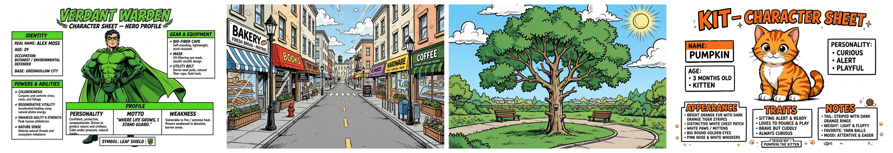

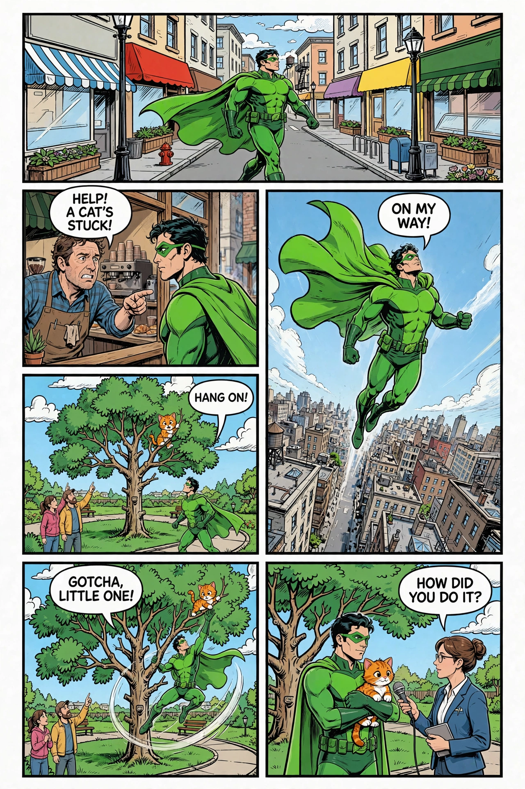

*Images throughout are from an actual run; because the model is non-deterministic, your results will differ.*

## Why anchoring matters

Text-to-image treats every call as independent. Ask twice for "a green caped hero in a park" and you get two different heroes: the costume, the face, and the art style all drift. Anchoring fixes this. Generate the hero once, then keep every later turn in the same conversation so it builds on the hero you already have, and each render stays on that character.

The same scene, generated two ways. On the left, a plain text-to-image call with no reference: a generic hero in a generic style. On the right, the same prompt anchored on the hero and park references: the established character, in the established setting.

<p>
  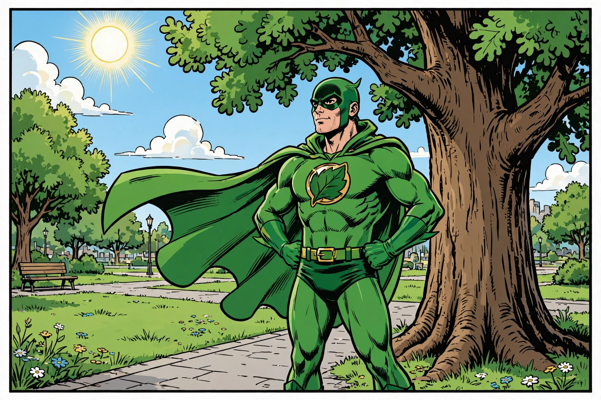
  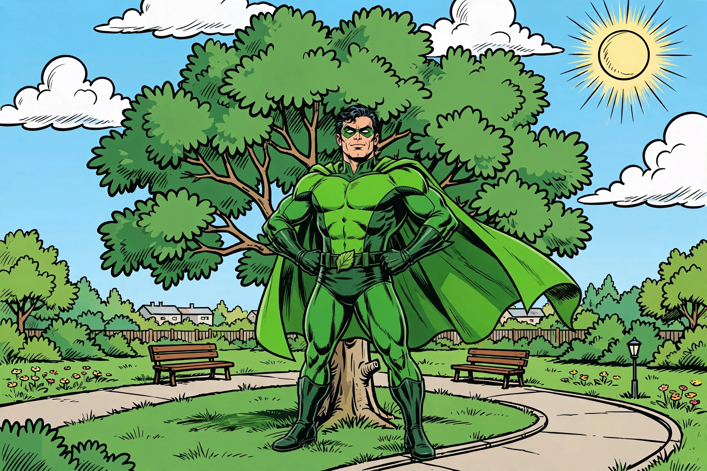
</p>

Without the reference the character has a different mask, suit, and build. With the reference the mask, costume, and face match the hero you fixed earlier. That difference is the whole recipe: build references, then reuse them.

Lock every recurring element with an anchor, and let the conversation carry it forward.

## How it works

Muse Image is reached through the **Responses API** (`client.responses.create`). A generation turn returns a response with an `id`, a `status`, and an `output` list; the rendered image is the base64 `result` on the `image_generation_call` item in that list.

Anchoring works by chaining. Each generation is a turn in a conversation, and passing `previous_response_id` on the next turn gives the model everything the conversation already holds, including the images it rendered earlier. So once you generate the hero as its own turn, every later turn that chains from it can reuse that hero by name, with no re-upload and no re-description. This cookbook builds all four anchors as generated turns, then chains every panel back to them. (If an anchor lives in a file instead of the conversation, for example art you made elsewhere, you can attach it once as an `input_image` part on the turn that needs it; here everything is generated in-conversation, so chaining alone carries it.)

The recipe puts that to work as **reference anchors for consistency**: build the hero, the cat, and the two settings once, up front, then render the six panels by chaining from those anchor turns. The panels accumulate in the conversation too, so the last two steps arrange the panels the conversation already holds into a page and then letter it.


Swap the vocabulary and the pattern carries over: a product plus a set of scenes, an avatar plus poses, a brand kit plus templates. The anchors change; the technique does not.

## Setup

Install the dependency and set your key:

```bash
pip install openai
export MODEL_API_KEY="LLM|..."
```

Wire up the client once. The OpenAI SDK does not auto-read `MODEL_API_KEY`, so pass it explicitly. Add one helper to pull the rendered image out of the response's `output` list and one to save it to disk:

```python
import base64
import os

from openai import OpenAI

# The OpenAI SDK does not auto-read MODEL_API_KEY, so pass it explicitly.
client = OpenAI(
    base_url="https://api.meta.ai/v1",
    api_key=os.environ["MODEL_API_KEY"],
)


def image_b64(response) -> str:
    """Return the base64 image from the image_generation_call item in the output."""
    return next(
        item.result
        for item in response.output
        if item.type == "image_generation_call"
    )


def save_image(b64: str, path: str) -> None:
    """Decode a base64 image from the API and write it to disk."""
    with open(path, "wb") as f:
        f.write(base64.b64decode(b64))
    print(f"saved {path}")
```

## Build the reference anchors

The anchors are the foundation: build them first, in one conversation, so they are all on hand when the panels begin. Each anchor turn chains from the previous one with `previous_response_id`, threading the hero, the cat, and both settings into a single conversation the panels then continue. Anchor **every recurring element**, not just the protagonist: any character or setting that shows up in more than one frame gets its own reference so it stays consistent. Map the story first, then build the full set. This comic needs four anchors: the caped hero (in every panel), the city street and the park (each in several panels), and a rescued cat (stuck in a tree, grabbed mid-rescue, then held during the interview). Characters get character-sheet prompts; locations get clean, character-free background plates.

Describe each **original** subject precisely, on a plain background, so later renders have a clean, well-defined target to lock onto. Generate the hero and the cat as character sheets:

```python
STYLE = (
    "bold clean comic-book line art with thick black outlines, flat vivid "
    "colors"
)

hero = client.responses.create(
    model="muse-image-1.0",
    input=(
        "an original comic-book superhero character sheet, a stylized man "
        "wearing a bright green flowing cape and a green eye mask, dark hair, "
        "muscular build, confident heroic pose, plain white background, full "
        f"body centered, {STYLE}"
    ),
)
save_image(image_b64(hero), "hero.webp")

cat = client.responses.create(
    model="muse-image-1.0",
    previous_response_id=hero.id,
    input=(
        "an original comic-book cat character sheet, a small orange tabby "
        "kitten with bold darker orange tiger stripes and a distinctive white "
        "chest and white paws, big round eyes, sitting alert, plain white "
        f"background, centered, {STYLE}"
    ),
)
save_image(image_b64(cat), "cat.webp")
```

Then build the two location plates the same way. Prompt for the setting only, no characters, so each background is a clean plate to drop the hero and cat into:

```python
bg_city = client.responses.create(
    model="muse-image-1.0",
    previous_response_id=cat.id,
    input=(
        "comic-book style background illustration of an ordinary city street "
        "on a bright day, sidewalks, storefronts, lamp posts, no characters, "
        f"no people, {STYLE}"
    ),
)
save_image(image_b64(bg_city), "bg_city.webp")

bg_park = client.responses.create(
    model="muse-image-1.0",
    previous_response_id=bg_city.id,
    input=(
        "comic-book style background illustration of a sunny public park with "
        "one large prominent climbable tree in the center, green grass, a "
        f"path, benches, no characters, no people, {STYLE}"
    ),
)
save_image(image_b64(bg_park), "bg_park.webp")
```

That is the whole reference set: the hero and the cat character sheets, and the city and park location plates, all now in the conversation for the panels to draw on.

<p>
  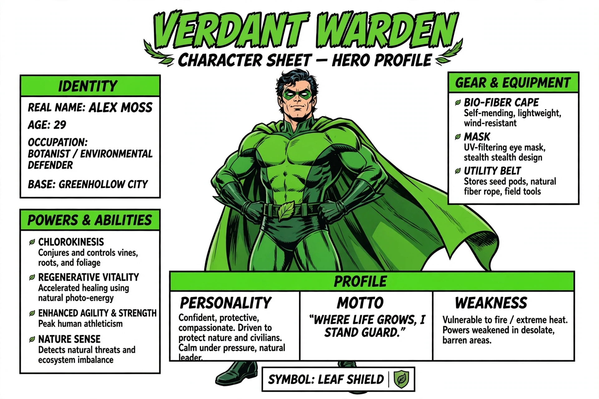
  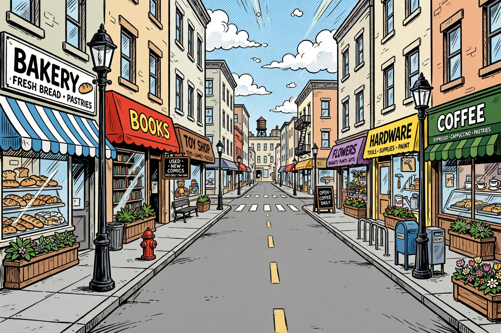
  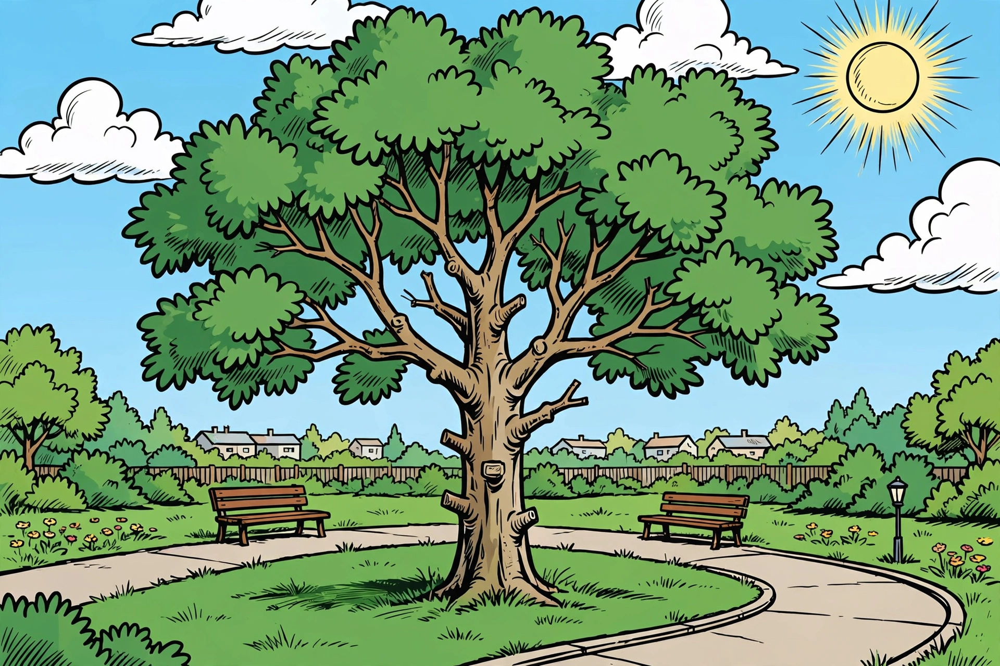
  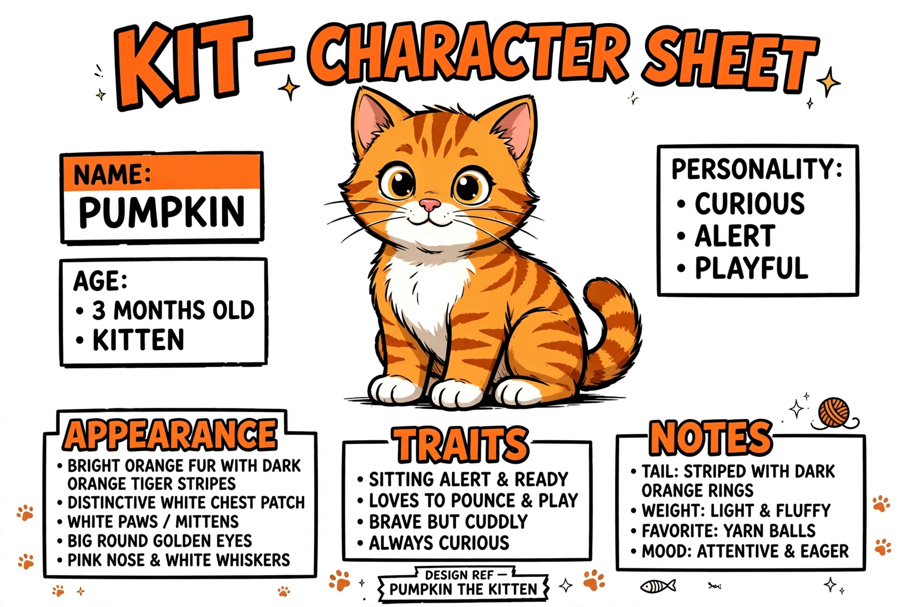
</p>

## Generate the panels from the anchors

Render each panel as a chained turn. Pass `previous_response_id` so every panel continues the same conversation the anchors started, and the model already has the hero, the cat, and the settings from those earlier turns. Refer to each subject by name in the prompt ("the hero", "the cat") and the model holds it without any re-upload or re-description. Keep the art-style words in every prompt so panels match visually, and set the `size` on the `image_generation` tool to give each beat the shape it wants: wide for establishing shots, tall for the flight, square for the interview.

Leave the panels free of speech bubbles for now. Rendering clean art first, then lettering the composed page in a later step, keeps each line under your control and off the characters' faces.

```python
STYLE = (
    "bold clean comic-book line art with thick black outlines, flat vivid "
    "colors"
)


def panel(prompt, size, prev, out):
    """Render one chained panel, continuing from the previous turn."""
    response = client.responses.create(
        model="muse-image-1.0",
        previous_response_id=prev,
        input=f"{prompt}, {STYLE}, no speech bubbles, no text, single comic panel",
        tools=[{"type": "image_generation", "size": size}],
    )
    save_image(image_b64(response), out)
    return response


# Panel 1: establish the hero on the city street. Chains from the last anchor,
# so the hero and the city plate are already in the conversation.
city = panel(
    "the hero walking down the city street shown earlier, relaxed confident "
    "stride",
    "1536x1024",
    bg_park.id,
    "01_panel_city.webp",
)

# Panel 2: the coffee-shop owner raises the alarm.
store = panel(
    "close-up of a coffee shop storefront on the same city street: a frightened "
    "shop owner in an apron points urgently to the right, the hero turning to "
    "look",
    "1536x1024",
    city.id,
    "02_panel_store.webp",
)

# Panel 3: the hero takes to the air. A tall, dramatic beat.
fly = panel(
    "the hero flying dramatically upward over the city rooftops, dynamic "
    "low-angle worms-eye view, cape streaming, strong speed lines",
    "1024x1536",
    store.id,
    "03_panel_fly.webp",
)

# Panel 4: the cat and park, both generated as anchors, are already in the
# conversation, so just name them.
tree = panel(
    "in the park with the big tree shown earlier: the cat shown earlier clinging "
    "high in the tree branches, worried onlookers below pointing up, the hero "
    "arriving and looking up toward the cat",
    "1536x1024",
    fly.id,
    "04_panel_tree.webp",
)

# Panel 5: the rescue.
rescue = panel(
    "the hero dynamically leaping and climbing the tree branches to rescue the "
    "cat, reaching for it, action pose",
    "1536x1024",
    tree.id,
    "05_panel_rescue.webp",
)

# Panel 6: the interview. Square, to frame the hero and the reporter side by side.
interview = panel(
    "the hero standing in the park by the tree, smiling and holding the cat, a "
    "female news reporter on the right holding a microphone interviewing him",
    "1024x1024",
    rescue.id,
    "06_panel_interview.webp",
)
```

The six panels come out on-model without a single description of the hero or the cat past the anchor turns. The hero holds because it was generated as its own turn and every panel chains back to it; the city and park hold the same way from the plates that opened the conversation; the cat, generated once as an anchor, is the same orange tabby when it is clinging in the tree, grabbed mid-rescue, and held for the interview. That is the anchoring rule in action: generate a recurring subject once, then let the conversation carry it. The `size` on each call sets the panel's shape, so the establishing shots and rescue are wide, the flight is tall, and the interview is square.

<p>
  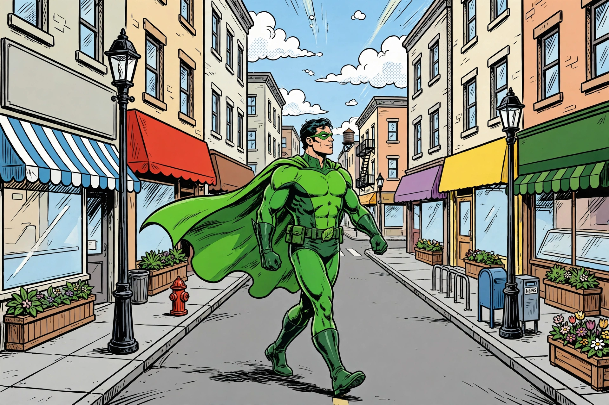
  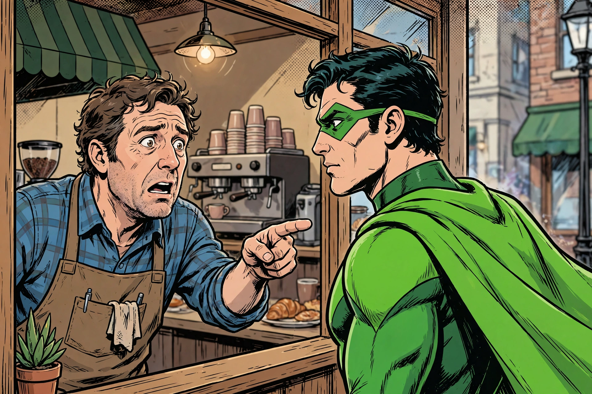
</p>
<p>
  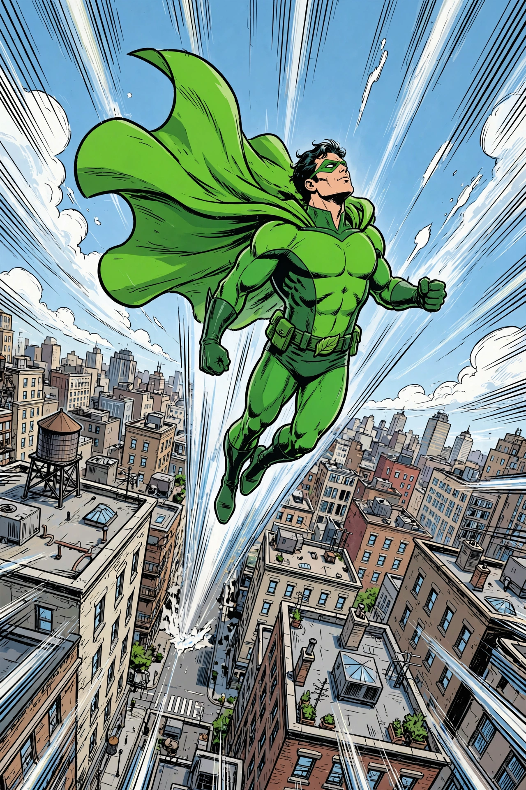
  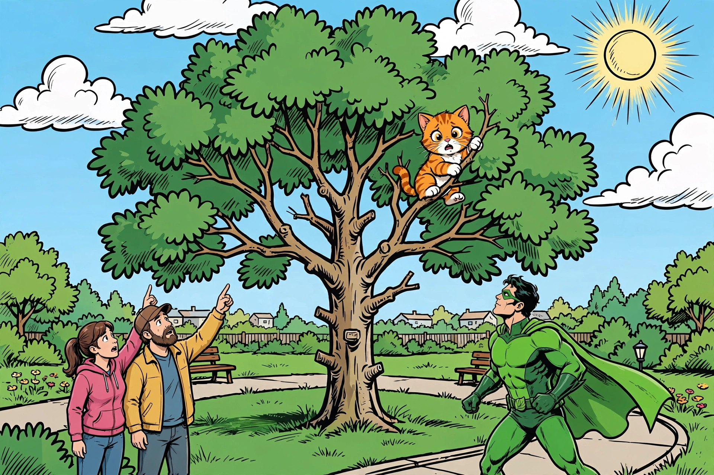
</p>
<p>
  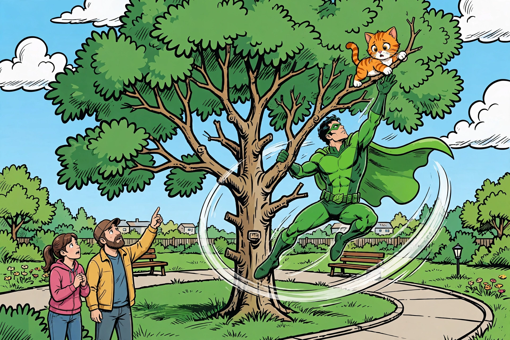
  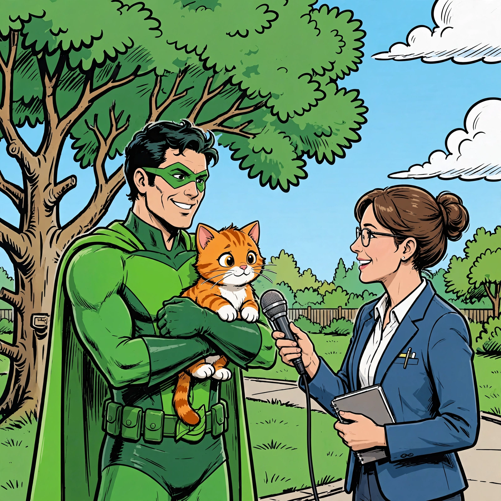
</p>

Because every turn chains from the last, the conversation grows as you go, and each turn re-sends the context before it. That is what holds the hero and the cat on-model without any re-upload, and it means later turns carry more context than earlier ones. Keep a series to the anchors and beats it actually needs rather than letting the chain run on.

## Compose the page

The six panels already live in the conversation, the last of them being the interview. So the page is one more chained turn: pass `previous_response_id` for the interview panel along with a layout instruction, and the model arranges the panels it already holds into a single page, no re-attaching needed. Set the tool `size` to `1024x1536` so the page comes out in portrait.

Keep the instruction to layout only: give the portrait orientation and the row order, tell it to place each panel as-is, and let the model size the cells and draw the borders. The panels are still free of speech bubbles, so there is nothing to preserve or move yet. The model is only arranging art.

```python
clean_page = client.responses.create(
    model="muse-image-1.0",
    previous_response_id=interview.id,
    input=(
        "Arrange the six comic panels into one portrait comic-book page. Place "
        "each panel as-is and keep its artwork unchanged; do not redraw, "
        "restyle, or duplicate any panel.\n"
        "Row 1: the hero in town, full width.\n"
        "Middle: a left column and a right column. The left column stacks two "
        "panels: the shop owner warning the hero on top, and the cat in the "
        "tree below. The right column is the single tall hero-flying panel, "
        "spanning the full height of both left panels.\n"
        "Bottom row: the rescue on the left and the interview on the right.\n"
        "Clean black borders and white gutters between panels."
    ),
    tools=[{"type": "image_generation", "size": "1024x1536"}],
)
save_image(image_b64(clean_page), "07_page_clean.webp")
```


## Letter the page

Now add the speech bubbles, in one more chained turn from the clean page. Name each line's speaker, and ask for the bubbles to sit in empty parts of their panels so no face or animal is covered:

```python
page = client.responses.create(
    model="muse-image-1.0",
    previous_response_id=clean_page.id,
    input=(
        "Add speech bubbles to this comic page. Keep the layout and all the "
        "artwork exactly as it is; only add clean white comic speech bubbles "
        "with bold black outlines and short uppercase lettering. Place each "
        "bubble in an empty part of its panel so no character, face, or animal "
        "is covered, and give each bubble a tail that points to the speaker. "
        "Add these bubbles:\n"
        "- In the panel with the shop owner and the hero: the shop owner in the "
        'apron says "HELP! A CAT\'S STUCK!"\n'
        "- In the tall panel of the hero flying over the city: the hero says "
        '"ON MY WAY!"\n'
        "- In the panel with the cat in the tree and the hero on the ground: "
        'the hero says "HANG ON!"\n'
        "- In the panel where the hero climbs the tree reaching the cat: the "
        'hero says "GOTCHA, LITTLE ONE!"\n'
        "- In the panel with the reporter and the hero holding the cat: the "
        'female reporter on the right says "HOW DID YOU DO IT?"\n'
        "Add no bubble to the opening street panel and add no other text."
    ),
    tools=[{"type": "image_generation", "size": "1024x1536"}],
)
save_image(image_b64(page), "page_model.webp")
```


The page comes together in two turns from the panels already in the conversation: the first lays out the art, the second letters it. The hero and the cat stay on-model because the whole page traces back through the same conversation.

## Summary

| Task | Call |
|------|------|
| Build the hero, background, and cat anchors | `client.responses.create(model="muse-image-1.0", input="... character sheet ...")` |
| Render a panel from the anchors | `client.responses.create(model="muse-image-1.0", previous_response_id=prev, input="...", tools=[{"type": "image_generation", "size": "..."}])` |
| Keep the character and setting on-model | generate each subject once, then chain every later turn from it with `previous_response_id` and name the subject in the prompt |
| Set a panel's shape | pass `size` on the `image_generation` tool (`1024x1024`, `1024x1536`, or `1536x1024`) |
| Compose the page | chain a turn from the last panel (`previous_response_id`) with a layout instruction |
| Letter the page | chain one more turn from the clean page, naming each line's speaker and asking for bubbles in empty space |

**Production checklist:**

- Build the anchors first as clean reference plates, then chain the rest of the series from them.
- Anchor every recurring subject, not just the protagonist: any character or setting that appears in more than one frame gets its own reference so it stays consistent.
- Chain every later turn from the anchor with `previous_response_id` and name the subject in the prompt; the conversation carries it forward without re-uploading or re-describing it.
- Repeat the art-style words in every prompt.
- Set `size` per panel to match the beat: wide for establishing shots, tall for vertical action, square for two-shots.
- Compose the layout first, then letter it in a second turn, so each bubble lands on empty space with its tail on the named speaker.
- Keep bubble text short and uppercase so it renders legibly.

## Next steps

- **Reference the image guide**: the [Image generation guide](https://dev.meta.ai/docs/image-generation) covers reference-image steering and the full parameter set.
- **See the Responses API**: the [Responses API guide](https://dev.meta.ai/docs/features/responses) covers `previous_response_id`, `input_image` parts, and the `output` item types.
- **Start with the basics**: the [Muse Image basics recipe](../01_image_api_fundamentals/README.md) covers generating and editing images from scratch.
