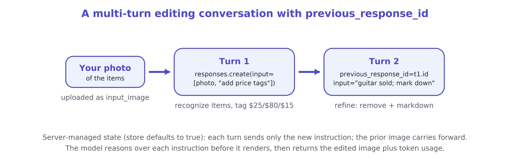
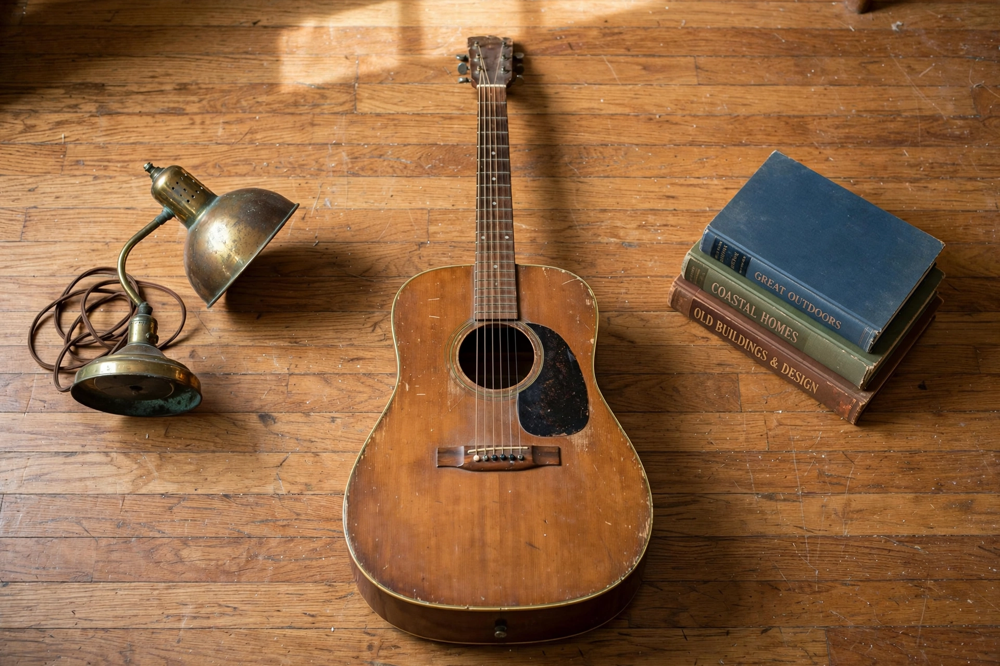
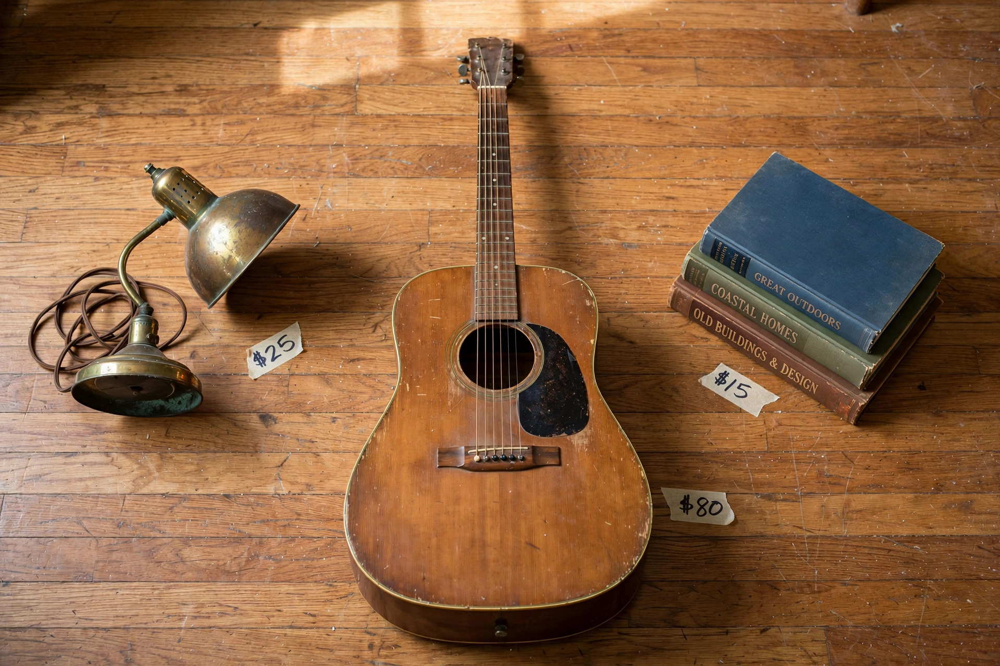
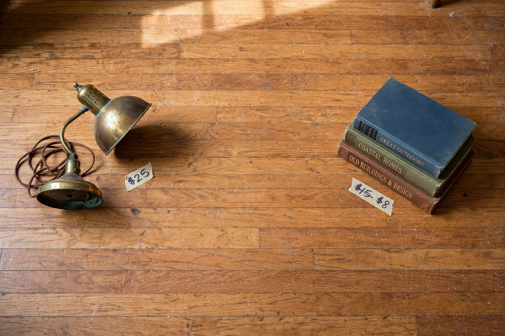

# Editing with image understanding and reasoning

|  |  |
|---|---|
| **Section** | [Muse Image](https://dev.meta.ai/docs/getting-started/cookbook#muse-image) |
| **Time to complete** | ~15 min |
| **Model** | `muse-image-1.0` |
| **Language** | Python |
| **Prerequisites** | Python 3.10+, the `openai` package, and a `MODEL_API_KEY` (create one in the [Model API dashboard](https://dev.meta.ai/)). |

Muse Image understands what is in an image and reasons over your instruction before it renders. It comprehends the contents of the frame, decomposes the instruction into steps, and works out what changes and what stays the same. That is what lets you edit a specific part of an image by describing it, and it means you can keep editing the same image over several turns, refining it instruction by instruction.

This recipe illustrates that capability as a conversation that starts from your own photo. You upload a photo of the items you want to sell and ask for a price tag on each in one turn, then refine the listing turn by turn. Every turn after the first passes `previous_response_id` and one new instruction, so the model carries the running image forward and applies only the change you name. The example is a resale-listing lifecycle (upload the items, tag them with prices, update after a sale), so you can apply the same pattern to catalog automation, listing tools, and e-commerce operations.

*The edited images here are from an actual run. Because the model is non-deterministic, your results will differ.*

## What you build

You start from a photo you already have, showing several second-hand items laid out on a floor, and build:

1. **A tagged listing**: your photo with a handwritten price added next to each item, in a single turn.
2. **An updated listing**: the same image again after one item sells and another is marked down.

The first turn uploads your photo and adds the tags in one call. Every later turn passes `previous_response_id` and one new instruction, and the model refines the running image rather than starting over. You read the token `usage` the API returns on each turn.

## How it works

You edit through the conversational Responses API. The first turn uploads your photo and creates a response. Each later turn references the previous response by id, so the server keeps the running image and you send only the new instruction:

- **Turn 1**: `client.responses.create(model="muse-image-1.0", input=[<your photo>, "..."])` uploads your photo alongside the instruction and returns the edited image plus a response id.
- **Later turns**: `client.responses.create(model="muse-image-1.0", previous_response_id=<prior id>, input="...")` refine it. The server manages the state for you, so you do not resend the image. The prior image carries forward, and only the change you describe is applied.

The model reasons over each instruction before it renders. It understands what is in the image, decides what to change and what to leave alone, then draws the result as one coherent frame. You express the change in words (add a tag here, remove this item, mark this price down) and the model does the edit.



Each response is an object with an `id` (`resp_...`), a `status`, and an `output` list. The output list interleaves reasoning, message, and image items, because Muse Image reasons before it renders. The image lives in the `image_generation_call` item as base64 in its `result` field. Every response includes a `usage` object with the input, output, and total token counts.

## Setup

Install the SDK and set your key:

```bash
pip install openai
export MODEL_API_KEY="LLM|..."
```

Wire up the client once. The OpenAI SDK does not auto-read `MODEL_API_KEY`, so pass it explicitly. Add two small helpers: one that encodes a local photo as a `data:` URL so you can upload it, and one that pulls the base64 image out of the `image_generation_call` output item and writes it to disk:

```python
import base64
import os

from openai import OpenAI

# The OpenAI SDK does not auto-read MODEL_API_KEY, so pass it explicitly.
client = OpenAI(
    base_url="https://api.meta.ai/v1",
    api_key=os.environ["MODEL_API_KEY"],
)


def data_url(path: str) -> str:
    """Encode a local image as a data: URL so it can be uploaded as an input_image."""
    with open(path, "rb") as f:
        return "data:image/webp;base64," + base64.b64encode(f.read()).decode()


def save_image(response, path: str) -> None:
    """Pull the base64 image out of the image_generation_call item and write it."""
    b64 = next(
        item.result
        for item in response.output
        if item.type == "image_generation_call"
    )
    with open(path, "wb") as f:
        f.write(base64.b64decode(b64))
    print(f"saved {path}")
```

## Turn 1: add a price tag to every item in your photo

Start from the photo you took of the items you want to sell: a brass desk lamp, an acoustic guitar, and a stack of books on a hardwood floor.



Upload that photo as an `input_image` content part alongside your instruction. The `input` is a list with a single `user` message whose `content` mixes `input_text` and `input_image`, and the image is a public URL or a `data:` URL. Ask for one price tag per item and name the price for each by the item it belongs to:

```python
turn1 = client.responses.create(
    model="muse-image-1.0",
    input=[
        {
            "role": "user",
            "content": [
                {
                    "type": "input_text",
                    "text": (
                        "add a small handwritten price tag next to each item, like "
                        "a piece of masking tape with a marker price: $25 on the "
                        "brass lamp, $80 on the acoustic guitar, and $15 on the "
                        "stack of books; keep the items and the floor otherwise "
                        "unchanged"
                    ),
                },
                {"type": "input_image", "image_url": data_url("items.webp")},
            ],
        }
    ],
)

save_image(turn1, "tagged.webp")
print("id:", turn1.id, "status:", turn1.status)
print("usage:", turn1.usage)
```



The model reads your photo, recognizes each item as a distinct object, and places the right price next to the right one: $25 by the lamp, $80 by the guitar, $15 by the books. Because it reasons about what you asked for against what is already in the frame, the original photo is not altered beyond the tags. The items, the floor, and the lighting stay exactly as you shot them, and only the price tags are added.

Keep `turn1.id`. Every later turn passes it (or the id of a later turn) as `previous_response_id`, and that is what tells the model to keep editing this image instead of starting over.

The `usage` object reports the tokens the request consumed. `input_tokens` covers your prompt and the uploaded photo, and `output_tokens` covers the reasoning and the rendered image:

```json
{
  "input_tokens": 14083,
  "input_tokens_details": { "cached_tokens": 10944 },
  "output_tokens": 645,
  "output_tokens_details": { "reasoning_tokens": 102 },
  "total_tokens": 14728
}
```

## Turn 2: update the listing after a sale and a price cut

Real listings are not static: something sells and something drops in price. Both are one more turn in the same conversation. Reference turn 1 with `previous_response_id` and describe both changes in one instruction. You do not resend the image, because the model keeps the running image from turn 1. The guitar sold, so remove it and its tag. The books were marked down, so restrike the price:

```python
turn2 = client.responses.create(
    model="muse-image-1.0",
    previous_response_id=turn1.id,
    input=(
        "the acoustic guitar has been sold: remove the guitar and its $80 tag "
        "entirely, leaving that spot as empty bare floor. the books have been "
        "marked down: change their tag to show the old price $15 with a line "
        "struck through it and the new price $8 next to it. keep the lamp and "
        "its $25 tag unchanged"
    ),
)

save_image(turn2, "updated.webp")
print("usage:", turn2.usage)
```



The struck-through old price and the new price are text the model draws from your instruction, the same way the tags were.

> [!NOTE]
> When you edit images that represent real items for sale, prompt the model to preserve the true condition and verify the output.

## Editing without server-managed state

A `store` parameter defaults to true, so the server keeps each turn and `previous_response_id` is all you need. If you would rather manage state yourself, set `store=False` and replay the prior image item in the next turn's `input`, followed by the new instruction. Pull the `image_generation_call` item off the previous response and pass it back:

```python
prior_image = next(
    item for item in turn1.output if item.type == "image_generation_call"
)

turn2_stateless = client.responses.create(
    model="muse-image-1.0",
    store=False,
    input=[
        prior_image.model_dump(),
        {
            "role": "user",
            "content": [
                {
                    "type": "input_text",
                    "text": (
                        "the guitar has been sold: remove the guitar and its $80 "
                        "tag, leaving bare floor. mark the books down: show $15 "
                        "struck through with $8 next to it. keep the lamp and its "
                        "$25 tag unchanged"
                    ),
                }
            ],
        },
    ],
)

save_image(turn2_stateless, "updated.webp")
```

This gives the same result as the chained version. You carry the image between turns yourself instead of letting the server hold it.

## Summary

| Task | Call |
|------|------|
| Start from your photo | `input=[{"role": "user", "content": [input_text, input_image]}]` |
| Refine the image | `client.responses.create(model="muse-image-1.0", previous_response_id=prior.id, input="...")` |
| Add price tags | upload with `input="add a price tag: $X on the <item>, $Y on the <item>..."` |
| Update a listing | refine with `input="remove the <sold item>; show $X struck through with $Y"` |
| Read the image | `next(i.result for i in resp.output if i.type == "image_generation_call")`, then `base64.b64decode` |
| Read token usage | `resp.usage` (input, output, total, plus reasoning tokens) |

**Production checklist:**

- Read `MODEL_API_KEY` from the environment, never hard-code it.
- Upload your photo as an `input_image` (public URL or `data:` URL) and name each item in the instruction so the model tags the right one.
- Refine over turns with `previous_response_id` rather than re-uploading the image each turn, since the model carries the running image forward.
- Name what changes and what stays (remove the guitar, keep the lamp's $25 tag) so untouched parts stay stable across turns.
- Treat price text and strikethroughs as drawn labels, not a pricing feature, and re-run a turn when exact text rendering is unclear.
- Bind each price to its item by name in the prompt (lamp $25, guitar $80, books $15) so the model writes the right price next to the right item.
- When an image represents a real item, tell the model to preserve its true condition and verify the output before you publish, since the model may miss or clean up visible wear.
- Pull the image from the `image_generation_call` output item, decode the base64, and persist the bytes.
- Watch the `usage` token counts to stay inside your team's rate limits.

## Next steps

- **Reference the image guide**: the [Image generation guide](https://dev.meta.ai/docs/image-generation) covers reference-image steering and multi-turn editing in depth.
- **See the full schema**: the [Responses API reference](https://dev.meta.ai/docs/api-reference/responses) has every request and response field.
- **Start from the basics**: the [Muse Image basics recipe](../01_image_api_fundamentals/README.md) walks through generate and edit one step at a time.
